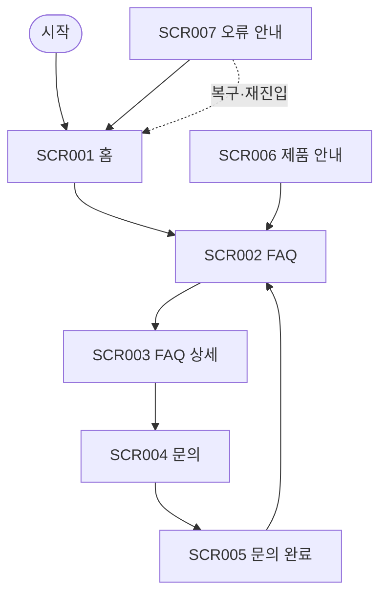

# VC-013 윤가은 사이트맵

## 프로젝트 개요
YOVIA의 그릭요거트 기반 간편 건강식 정보를 검증 FAQ와 고객지원 연결 관점에서 구성한 모바일 우선 반응형 웹 설계다. 가격·영양 수치·효능·판매 정책은 입력에서 확정되지 않아 사실로 만들지 않는다.

## 설계 근거와 핵심 사용자 목표
- **VC013-REQ-001** (높음): 사용법·보관·성분·구매 질문을 검증 답변으로 분류
- **VC013-REQ-002** (높음): 답변으로 해결되지 않는 문제에 책임 있는 문의 경로 제공
- **VC013-REQ-003** (보통 이상): FAQ 검색·필터는 실제 문서량이 충분할 때만 적용
- **VC013-REQ-004** (보통 이상): 중요 알레르기·주의 정보는 접힌 답변에만 숨기지 않음
- **VC013-REQ-005** (보통 이상): 문의 접수·오류·완료 상태와 복귀 행동을 표시
- **VC013-REQ-006** (보류): 승인되지 않은 보관·효능·품질 답변 공개 금지

핵심 여정: **질문 선택 → 검증 답변 → 관련 제품 확인 → 문의**. 근거는 분석 파일의 EVD 및 Site ID 연결을 유지한다.

## 전역 내비게이션 구조
도움말 · FAQ · 문의 · 홈. 현재 위치와 상태는 색상 외 텍스트로 병기한다.

## 계층형 사이트맵
- 1차 **홈** (SCR-001)
  - 2차: 도움말, 제품 안내, 중요 주의 정보
  - 3차: 상태·오류·복구 안내
- 1차 **FAQ** (SCR-002)
  - 2차: 질문 유형, 검증 상태, 중요 주의
  - 3차: 상태·오류·복구 안내
- 1차 **FAQ 상세** (SCR-003)
  - 2차: 답변, 근거 상태, 주의 정보, 관련 제품
  - 3차: 상태·오류·복구 안내
- 1차 **문의** (SCR-004)
  - 2차: 문의 유형, 내용, 개인정보 안내
  - 3차: 상태·오류·복구 안내
- 1차 **문의 완료** (SCR-005)
  - 2차: 접수 상태, 후속 안내
  - 3차: 상태·오류·복구 안내
- 1차 **제품 안내** (SCR-006)
  - 2차: 제품 정의, 사용 맥락, 검증 정보
  - 3차: 상태·오류·복구 안내
- 1차 **오류 안내** (SCR-007)
  - 2차: 오류 설명, 재시도, 대체 문의
  - 3차: 상태·오류·복구 안내

## 페이지별 정의
| 화면 ID | 페이지 | 목적 | 핵심 콘텐츠 | 주요 기능 | 연결 페이지 |
|---|---|---|---|---|---|
| SCR-001 | 홈 | 검증된 도움말과 제품 탐색의 시작점 | 도움말, 제품 안내, 중요 주의 정보 | 도움말 보기 | FAQ |
| SCR-002 | FAQ | 사용법·보관·성분·구매 질문 분류 | 질문 유형, 검증 상태, 중요 주의 | 답변 선택 | FAQ 상세 |
| SCR-003 | FAQ 상세 | 검증 답변과 관련 제품·문의 연결 | 답변, 근거 상태, 주의 정보, 관련 제품 | 문의하기 | 문의 |
| SCR-004 | 문의 | 미해결 문제 접수 | 문의 유형, 내용, 개인정보 안내 | 접수하기 | 문의 완료 |
| SCR-005 | 문의 완료 | 접수 결과와 복귀 행동 안내 | 접수 상태, 후속 안내 | FAQ로 돌아가기 | FAQ |
| SCR-006 | 제품 안내 | FAQ 맥락의 제품 정보 제공 | 제품 정의, 사용 맥락, 검증 정보 | FAQ 보기 | FAQ |
| SCR-007 | 오류 안내 | 실패 원인과 복구 행동 제공 | 오류 설명, 재시도, 대체 문의 | 이전 화면 | 홈 |

## 공통·회원 상태별 영역
- 공통: 본문 바로가기, 헤더, 현재 위치, 상태 메시지, 푸터, 오류 복구.
- 회원 상태: 분석 근거에 회원 기능이 없으므로 로그인을 강제하지 않는다. 개인화·저장 기능은 **HOLD**다.

## 주요 사용자 여정과 예외 페이지
- 정상: 질문 선택 → 검증 답변 → 관련 제품 확인 → 문의
- 예외: 빈 상태·입력 오류·외부 연결 오류에서 재시도, 이전 단계, 홈 복귀를 제공한다.

## 가정·HOLD·제외 항목
- 가정: 화면 간 이동은 로컬 프로토타입 수준이며 실제 API 처리는 하지 않는다.
- HOLD: VC013-REQ-006 — 승인되지 않은 보관·효능·품질 답변 공개 금지
- 제외: 미확정 가격·재고·배송·효능·인증·로그인·결제 정책.

## 링크·중복·도달 가능성 검토
모든 화면은 홈 또는 핵심 여정에서 도달하며 화면 목적은 중복되지 않는다. 예외 상태에는 복구 행동을 연결했다.

## Mermaid
