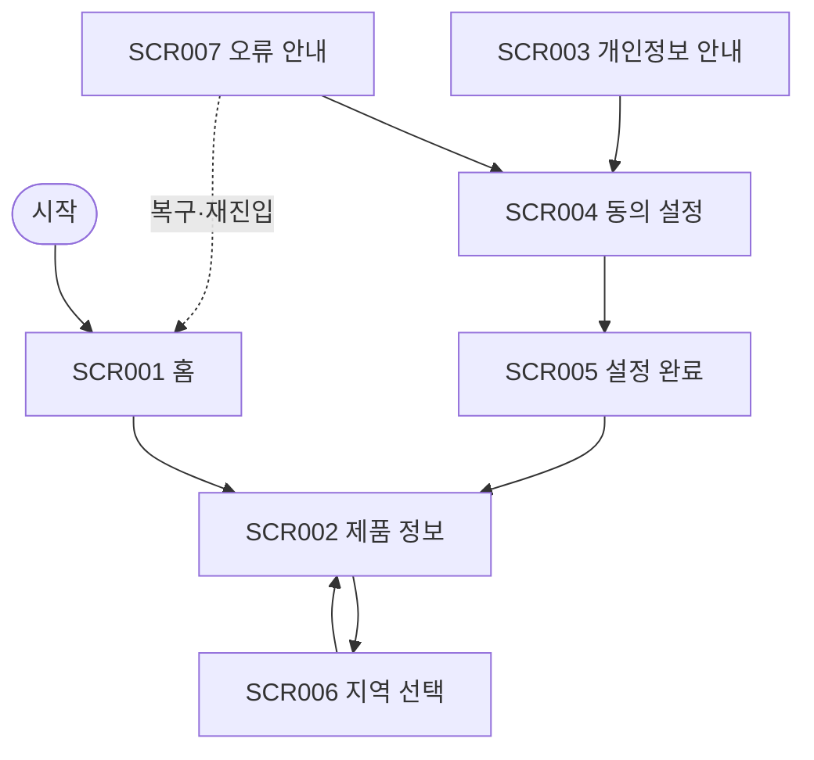

# VC-014 최현우 사이트맵

## 프로젝트 개요
YOVIA의 그릭요거트 기반 간편 건강식 정보를 개인정보 동의와 데이터 최소화 관점에서 구성한 모바일 우선 반응형 웹 설계다. 가격·영양 수치·효능·판매 정책은 입력에서 확정되지 않아 사실로 만들지 않는다.

## 설계 근거와 핵심 사용자 목표
- **VC014-REQ-001** (높음): 수집 항목·목적·필수 여부를 행동 전에 설명
- **VC014-REQ-002** (높음): 비필수 동의 거부 후에도 핵심 제품 정보 접근 유지
- **VC014-REQ-003** (보통 이상): 위치 권한 거부 시 직접 지역 선택 대안 제공
- **VC014-REQ-004** (보통 이상): 동의 상태 확인·변경·철회 경로 후보 제공
- **VC014-REQ-005** (보통 이상): 모바일에서 수락과 거부 선택을 동등하게 이해
- **VC014-REQ-006** (보류): 정책·보관기간·도구 확정 전 준수 문구를 단정하지 않음

핵심 여정: **목적 확인 → 선택 → 핵심 정보 이용 → 설정 변경**. 근거는 분석 파일의 EVD 및 Site ID 연결을 유지한다.

## 전역 내비게이션 구조
제품 정보 · 개인정보 안내 · 동의 설정 · 홈. 현재 위치와 상태는 색상 외 텍스트로 병기한다.

## 계층형 사이트맵
- 1차 **홈** (SCR-001)
  - 2차: 제품 정의, 개인정보 선택 안내
  - 3차: 상태·오류·복구 안내
- 1차 **제품 정보** (SCR-002)
  - 2차: 제품 설명, 사용 정보
  - 3차: 상태·오류·복구 안내
- 1차 **개인정보 안내** (SCR-003)
  - 2차: 수집 목적, 항목, 상태
  - 3차: 상태·오류·복구 안내
- 1차 **동의 설정** (SCR-004)
  - 2차: 필수/선택 구분, 현재 상태
  - 3차: 상태·오류·복구 안내
- 1차 **설정 완료** (SCR-005)
  - 2차: 반영 상태, 다음 행동
  - 3차: 상태·오류·복구 안내
- 1차 **지역 선택** (SCR-006)
  - 2차: 지역 목록, 직접 선택
  - 3차: 상태·오류·복구 안내
- 1차 **오류 안내** (SCR-007)
  - 2차: 오류 설명, 재시도, 설정 유지
  - 3차: 상태·오류·복구 안내

## 페이지별 정의
| 화면 ID | 페이지 | 목적 | 핵심 콘텐츠 | 주요 기능 | 연결 페이지 |
|---|---|---|---|---|---|
| SCR-001 | 홈 | 동의 없이도 핵심 제품 정보 접근 | 제품 정의, 개인정보 선택 안내 | 제품 정보 보기 | 제품 정보 |
| SCR-002 | 제품 정보 | 비필수 동의와 무관한 제품 탐색 | 제품 설명, 사용 정보 | 지역 정보 보기 | 지역 선택 |
| SCR-003 | 개인정보 안내 | 수집 항목·목적·필수 여부 설명 | 수집 목적, 항목, 상태 | 선택 관리 | 동의 설정 |
| SCR-004 | 동의 설정 | 수락·거부·철회를 동등하게 제공 | 필수/선택 구분, 현재 상태 | 설정 저장 | 설정 완료 |
| SCR-005 | 설정 완료 | 변경 결과와 재변경 경로 안내 | 반영 상태, 다음 행동 | 제품 정보로 이동 | 제품 정보 |
| SCR-006 | 지역 선택 | 위치 권한 거부의 직접 선택 대안 | 지역 목록, 직접 선택 | 지역 적용 | 제품 정보 |
| SCR-007 | 오류 안내 | 설정 실패 시 복구 제공 | 오류 설명, 재시도, 설정 유지 | 다시 시도 | 동의 설정 |

## 공통·회원 상태별 영역
- 공통: 본문 바로가기, 헤더, 현재 위치, 상태 메시지, 푸터, 오류 복구.
- 회원 상태: 분석 근거에 회원 기능이 없으므로 로그인을 강제하지 않는다. 개인화·저장 기능은 **HOLD**다.

## 주요 사용자 여정과 예외 페이지
- 정상: 목적 확인 → 선택 → 핵심 정보 이용 → 설정 변경
- 예외: 빈 상태·입력 오류·외부 연결 오류에서 재시도, 이전 단계, 홈 복귀를 제공한다.

## 가정·HOLD·제외 항목
- 가정: 화면 간 이동은 로컬 프로토타입 수준이며 실제 API 처리는 하지 않는다.
- HOLD: VC014-REQ-006 — 정책·보관기간·도구 확정 전 준수 문구를 단정하지 않음
- 제외: 미확정 가격·재고·배송·효능·인증·로그인·결제 정책.

## 링크·중복·도달 가능성 검토
모든 화면은 홈 또는 핵심 여정에서 도달하며 화면 목적은 중복되지 않는다. 예외 상태에는 복구 행동을 연결했다.

## Mermaid
