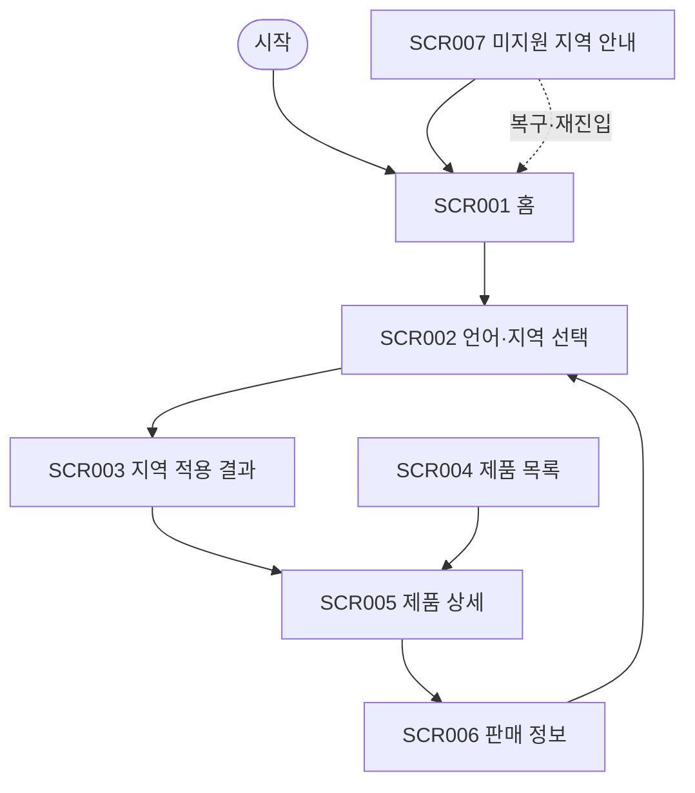

# VC-016 송예진 사이트맵

## 프로젝트 개요
YOVIA의 그릭요거트 기반 간편 건강식 정보를 언어·지역별 정보 일관성 관점에서 구성한 모바일 우선 반응형 웹 설계다. 가격·영양 수치·효능·판매 정책은 입력에서 확정되지 않아 사실로 만들지 않는다.

## 설계 근거와 핵심 사용자 목표
- **VC016-REQ-001** (높음): 공통 브랜드 정의와 지역별 제품·정책 정보를 분리
- **VC016-REQ-002** (높음): 언어·지역 변경 후 현재 제품과 탐색 맥락 유지
- **VC016-REQ-003** (보통 이상): 언어 선택을 국기나 색상만으로 표현하지 않음
- **VC016-REQ-004** (보통 이상): 번역 확장과 혼합 문자를 견디는 모바일 구성
- **VC016-REQ-005** (보통 이상): 지역별 정보에 출처·기준일·적용 범위 표시
- **VC016-REQ-006** (보류): 판매·영양·법정 표시가 확정되지 않은 지역은 공개 보류

핵심 여정: **지역 선택 → 동일 제품 유지 → 지역 정보 확인 → 행동**. 근거는 분석 파일의 EVD 및 Site ID 연결을 유지한다.

## 전역 내비게이션 구조
언어·지역 · 제품 · 판매 정보 · 홈. 현재 위치와 상태는 색상 외 텍스트로 병기한다.

## 계층형 사이트맵
- 1차 **홈** (SCR-001)
  - 2차: 브랜드 정의, 현재 언어·지역
  - 3차: 상태·오류·복구 안내
- 1차 **언어·지역 선택** (SCR-002)
  - 2차: 언어명, 지역명, 적용 범위
  - 3차: 상태·오류·복구 안내
- 1차 **지역 적용 결과** (SCR-003)
  - 2차: 적용 언어·지역, 유지된 제품
  - 3차: 상태·오류·복구 안내
- 1차 **제품 목록** (SCR-004)
  - 2차: 공개 상태, 지역 적용 범위
  - 3차: 상태·오류·복구 안내
- 1차 **제품 상세** (SCR-005)
  - 2차: 공통 정의, 지역별 정보, 기준일
  - 3차: 상태·오류·복구 안내
- 1차 **판매 정보** (SCR-006)
  - 2차: 출처, 기준일, 적용 범위
  - 3차: 상태·오류·복구 안내
- 1차 **미지원 지역 안내** (SCR-007)
  - 2차: 보류 상태, 공통 정보 링크
  - 3차: 상태·오류·복구 안내

## 페이지별 정의
| 화면 ID | 페이지 | 목적 | 핵심 콘텐츠 | 주요 기능 | 연결 페이지 |
|---|---|---|---|---|---|
| SCR-001 | 홈 | 공통 브랜드 정의와 지역 맥락 제공 | 브랜드 정의, 현재 언어·지역 | 언어·지역 변경 | 언어·지역 선택 |
| SCR-002 | 언어·지역 선택 | 텍스트로 언어와 지역 선택 | 언어명, 지역명, 적용 범위 | 선택 적용 | 지역 적용 결과 |
| SCR-003 | 지역 적용 결과 | 현재 맥락 유지 여부 확인 | 적용 언어·지역, 유지된 제품 | 제품 보기 | 제품 상세 |
| SCR-004 | 제품 목록 | 현재 지역에 공개 가능한 제품 탐색 | 공개 상태, 지역 적용 범위 | 상세 보기 | 제품 상세 |
| SCR-005 | 제품 상세 | 공통 사실과 지역 정보를 구분 | 공통 정의, 지역별 정보, 기준일 | 판매 정보 보기 | 판매 정보 |
| SCR-006 | 판매 정보 | 확정된 지역 정보만 안내 | 출처, 기준일, 적용 범위 | 지역 변경 | 언어·지역 선택 |
| SCR-007 | 미지원 지역 안내 | 미확정 지역의 공개 보류와 대안 | 보류 상태, 공통 정보 링크 | 홈으로 이동 | 홈 |

## 공통·회원 상태별 영역
- 공통: 본문 바로가기, 헤더, 현재 위치, 상태 메시지, 푸터, 오류 복구.
- 회원 상태: 분석 근거에 회원 기능이 없으므로 로그인을 강제하지 않는다. 개인화·저장 기능은 **HOLD**다.

## 주요 사용자 여정과 예외 페이지
- 정상: 지역 선택 → 동일 제품 유지 → 지역 정보 확인 → 행동
- 예외: 빈 상태·입력 오류·외부 연결 오류에서 재시도, 이전 단계, 홈 복귀를 제공한다.

## 가정·HOLD·제외 항목
- 가정: 화면 간 이동은 로컬 프로토타입 수준이며 실제 API 처리는 하지 않는다.
- HOLD: VC016-REQ-006 — 판매·영양·법정 표시가 확정되지 않은 지역은 공개 보류
- 제외: 미확정 가격·재고·배송·효능·인증·로그인·결제 정책.

## 링크·중복·도달 가능성 검토
모든 화면은 홈 또는 핵심 여정에서 도달하며 화면 목적은 중복되지 않는다. 예외 상태에는 복구 행동을 연결했다.

## Mermaid
