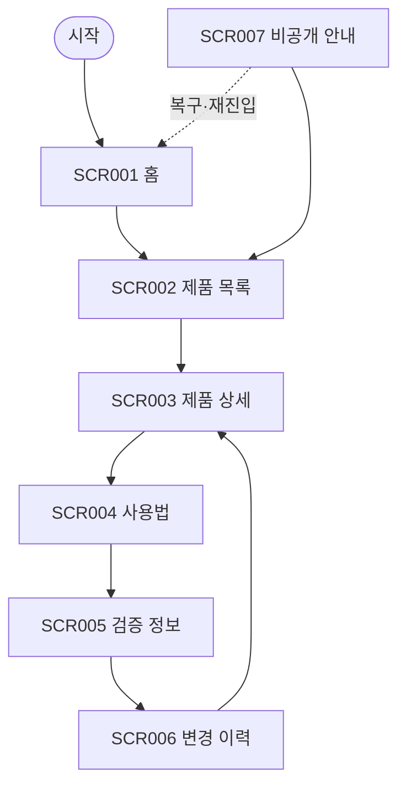

# VC-017 백승아 사이트맵

## 프로젝트 개요
YOVIA의 그릭요거트 기반 간편 건강식 정보를 콘텐츠와 자산 수명주기 관점에서 구성한 모바일 우선 반응형 웹 설계다. 가격·영양 수치·효능·판매 정책은 입력에서 확정되지 않아 사실로 만들지 않는다.

## 설계 근거와 핵심 사용자 목표
- **VC017-REQ-001** (높음): 제품 사실과 핵심 자산을 단일 승인 출처에서 운영
- **VC017-REQ-002** (높음): 실물·렌더·콘셉트 이미지 상태를 명확히 구분
- **VC017-REQ-003** (보통 이상): 콘텐츠별 소유자·기준일·갱신 조건을 관리
- **VC017-REQ-004** (보통 이상): 제품 변경 시 관련 사용법·영양·CTA 연결을 함께 점검
- **VC017-REQ-005** (보통 이상): 모바일에서도 자산 상태와 핵심 사실의 일관성 유지
- **VC017-REQ-006** (보류): 승인되지 않거나 만료된 자산을 공개하지 않음

핵심 여정: **제품 탐색 → 승인 사실 확인 → 자산 상태 확인 → 관련 정보 이동**. 근거는 분석 파일의 EVD 및 Site ID 연결을 유지한다.

## 전역 내비게이션 구조
제품 · 사용법 · 검증 정보 · 홈. 현재 위치와 상태는 색상 외 텍스트로 병기한다.

## 계층형 사이트맵
- 1차 **홈** (SCR-001)
  - 2차: 승인 제품, 최신 갱신 상태
  - 3차: 상태·오류·복구 안내
- 1차 **제품 목록** (SCR-002)
  - 2차: 제품 카드, 자산 상태
  - 3차: 상태·오류·복구 안내
- 1차 **제품 상세** (SCR-003)
  - 2차: 제품 사실, 이미지 유형, 기준일
  - 3차: 상태·오류·복구 안내
- 1차 **사용법** (SCR-004)
  - 2차: 관련 제품, 갱신 조건
  - 3차: 상태·오류·복구 안내
- 1차 **검증 정보** (SCR-005)
  - 2차: 소유자, 기준일, 갱신 상태
  - 3차: 상태·오류·복구 안내
- 1차 **변경 이력** (SCR-006)
  - 2차: 버전, 변경 항목, 관련 콘텐츠
  - 3차: 상태·오류·복구 안내
- 1차 **비공개 안내** (SCR-007)
  - 2차: 비공개 사유, 승인 콘텐츠 링크
  - 3차: 상태·오류·복구 안내

## 페이지별 정의
| 화면 ID | 페이지 | 목적 | 핵심 콘텐츠 | 주요 기능 | 연결 페이지 |
|---|---|---|---|---|---|
| SCR-001 | 홈 | 승인된 제품 사실 중심 진입 | 승인 제품, 최신 갱신 상태 | 제품 보기 | 제품 목록 |
| SCR-002 | 제품 목록 | 승인 상태의 제품만 탐색 | 제품 카드, 자산 상태 | 상세 보기 | 제품 상세 |
| SCR-003 | 제품 상세 | 단일 승인 출처의 핵심 사실 제공 | 제품 사실, 이미지 유형, 기준일 | 사용법 보기 | 사용법 |
| SCR-004 | 사용법 | 제품 버전과 연결된 사용 정보 | 관련 제품, 갱신 조건 | 검증 정보 보기 | 검증 정보 |
| SCR-005 | 검증 정보 | 콘텐츠 근거와 상태 설명 | 소유자, 기준일, 갱신 상태 | 변경 이력 보기 | 변경 이력 |
| SCR-006 | 변경 이력 | 현재·이전 승인 상태 구분 | 버전, 변경 항목, 관련 콘텐츠 | 현재 제품 보기 | 제품 상세 |
| SCR-007 | 비공개 안내 | 만료·미승인 자산의 대체 경로 | 비공개 사유, 승인 콘텐츠 링크 | 제품 목록 | 제품 목록 |

## 공통·회원 상태별 영역
- 공통: 본문 바로가기, 헤더, 현재 위치, 상태 메시지, 푸터, 오류 복구.
- 회원 상태: 분석 근거에 회원 기능이 없으므로 로그인을 강제하지 않는다. 개인화·저장 기능은 **HOLD**다.

## 주요 사용자 여정과 예외 페이지
- 정상: 제품 탐색 → 승인 사실 확인 → 자산 상태 확인 → 관련 정보 이동
- 예외: 빈 상태·입력 오류·외부 연결 오류에서 재시도, 이전 단계, 홈 복귀를 제공한다.

## 가정·HOLD·제외 항목
- 가정: 화면 간 이동은 로컬 프로토타입 수준이며 실제 API 처리는 하지 않는다.
- HOLD: VC017-REQ-006 — 승인되지 않거나 만료된 자산을 공개하지 않음
- 제외: 미확정 가격·재고·배송·효능·인증·로그인·결제 정책.

## 링크·중복·도달 가능성 검토
모든 화면은 홈 또는 핵심 여정에서 도달하며 화면 목적은 중복되지 않는다. 예외 상태에는 복구 행동을 연결했다.

## Mermaid
