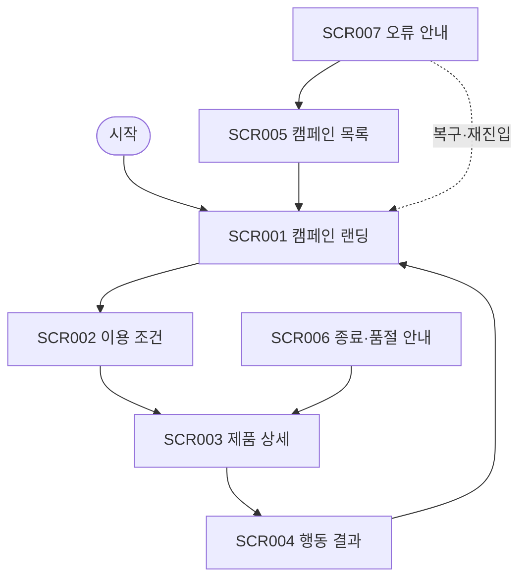

# VC-018 나유찬 사이트맵

## 프로젝트 개요
YOVIA의 그릭요거트 기반 간편 건강식 정보를 캠페인과 상시 제품 경험 연결 관점에서 구성한 모바일 우선 반응형 웹 설계다. 가격·영양 수치·효능·판매 정책은 입력에서 확정되지 않아 사실로 만들지 않는다.

## 설계 근거와 핵심 사용자 목표
- **VC018-REQ-001** (높음): 캠페인 메시지를 검증된 제품 사실과 직접 연결
- **VC018-REQ-002** (높음): 기간·대상·상태·조건을 CTA 전에 명확히 표시
- **VC018-REQ-003** (보통 이상): 종료·품절·오류 시 관련 제품 또는 상시 정보로 연결
- **VC018-REQ-004** (보통 이상): SNS·광고 유입 메시지와 랜딩 첫 화면을 일치
- **VC018-REQ-005** (보통 이상): 모바일 공유·딥링크 후 핵심 맥락과 행동 유지
- **VC018-REQ-006** (보류): 확정되지 않은 할인·재고·효능 캠페인 공개 금지

핵심 여정: **캠페인 유입 → 조건 확인 → 제품 근거 확인 → 핵심 행동**. 근거는 분석 파일의 EVD 및 Site ID 연결을 유지한다.

## 전역 내비게이션 구조
캠페인 · 제품 · 이용 조건 · 홈. 현재 위치와 상태는 색상 외 텍스트로 병기한다.

## 계층형 사이트맵
- 1차 **캠페인 랜딩** (SCR-001)
  - 2차: 캠페인 메시지, 상태, 조건
  - 3차: 상태·오류·복구 안내
- 1차 **이용 조건** (SCR-002)
  - 2차: 조건, 적용 범위, 기준일
  - 3차: 상태·오류·복구 안내
- 1차 **제품 상세** (SCR-003)
  - 2차: 제품 정의, 근거, 관련 캠페인
  - 3차: 상태·오류·복구 안내
- 1차 **행동 결과** (SCR-004)
  - 2차: 처리 상태, 다음 행동
  - 3차: 상태·오류·복구 안내
- 1차 **캠페인 목록** (SCR-005)
  - 2차: 상태 텍스트, 캠페인 카드
  - 3차: 상태·오류·복구 안내
- 1차 **종료·품절 안내** (SCR-006)
  - 2차: 종료 상태, 관련 제품
  - 3차: 상태·오류·복구 안내
- 1차 **오류 안내** (SCR-007)
  - 2차: 유입 맥락, 재시도, 대체 경로
  - 3차: 상태·오류·복구 안내

## 페이지별 정의
| 화면 ID | 페이지 | 목적 | 핵심 콘텐츠 | 주요 기능 | 연결 페이지 |
|---|---|---|---|---|---|
| SCR-001 | 캠페인 랜딩 | 유입 약속과 첫 화면 메시지 일치 | 캠페인 메시지, 상태, 조건 | 조건 확인 | 이용 조건 |
| SCR-002 | 이용 조건 | 기간·대상·상태를 CTA 전에 설명 | 조건, 적용 범위, 기준일 | 제품 근거 보기 | 제품 상세 |
| SCR-003 | 제품 상세 | 캠페인과 검증된 제품 사실 연결 | 제품 정의, 근거, 관련 캠페인 | 핵심 행동 | 행동 결과 |
| SCR-004 | 행동 결과 | 행동 성공·실패와 다음 경로 제공 | 처리 상태, 다음 행동 | 캠페인으로 돌아가기 | 캠페인 랜딩 |
| SCR-005 | 캠페인 목록 | 진행·종료 상태별 캠페인 탐색 | 상태 텍스트, 캠페인 카드 | 캠페인 보기 | 캠페인 랜딩 |
| SCR-006 | 종료·품절 안내 | 종료·품절 시 상시 제품으로 연결 | 종료 상태, 관련 제품 | 제품 보기 | 제품 상세 |
| SCR-007 | 오류 안내 | 딥링크·외부 연결 오류 복구 | 유입 맥락, 재시도, 대체 경로 | 목록으로 이동 | 캠페인 목록 |

## 공통·회원 상태별 영역
- 공통: 본문 바로가기, 헤더, 현재 위치, 상태 메시지, 푸터, 오류 복구.
- 회원 상태: 분석 근거에 회원 기능이 없으므로 로그인을 강제하지 않는다. 개인화·저장 기능은 **HOLD**다.

## 주요 사용자 여정과 예외 페이지
- 정상: 캠페인 유입 → 조건 확인 → 제품 근거 확인 → 핵심 행동
- 예외: 빈 상태·입력 오류·외부 연결 오류에서 재시도, 이전 단계, 홈 복귀를 제공한다.

## 가정·HOLD·제외 항목
- 가정: 화면 간 이동은 로컬 프로토타입 수준이며 실제 API 처리는 하지 않는다.
- HOLD: VC018-REQ-006 — 확정되지 않은 할인·재고·효능 캠페인 공개 금지
- 제외: 미확정 가격·재고·배송·효능·인증·로그인·결제 정책.

## 링크·중복·도달 가능성 검토
모든 화면은 홈 또는 핵심 여정에서 도달하며 화면 목적은 중복되지 않는다. 예외 상태에는 복구 행동을 연결했다.

## Mermaid
