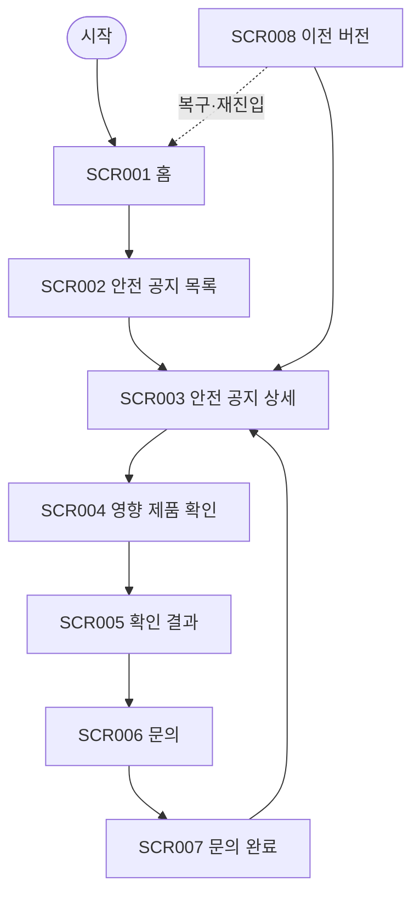

# VC-020 홍준서 사이트맵

## 프로젝트 개요
YOVIA의 그릭요거트 기반 간편 건강식 정보를 품질 이슈와 안전 공지 대응 관점에서 구성한 모바일 우선 반응형 웹 설계다. 가격·영양 수치·효능·판매 정책은 입력에서 확정되지 않아 사실로 만들지 않는다.

## 설계 근거와 핵심 사용자 목표
- **VC020-REQ-001** (높음): 품질·알레르기·보관 이슈를 일반 콘텐츠보다 우선 노출 가능하게 준비
- **VC020-REQ-002** (높음): 영향 제품·범위·기준일·승인 행동을 식별 가능하게 표시
- **VC020-REQ-003** (보통 이상): 공지 갱신 상태와 이전 버전·문의 경로를 연결
- **VC020-REQ-004** (보통 이상): 색상만으로 위험·상태를 전달하지 않음
- **VC020-REQ-005** (보통 이상): 모바일에서 공지→제품 확인→행동 지침 경로를 짧게 유지
- **VC020-REQ-006** (보류): 실제 이슈·승인 절차 없이 리콜 기능이나 문구를 공개하지 않음

핵심 여정: **공지 확인 → 영향 제품 확인 → 행동 지침 → 문의·갱신 확인**. 근거는 분석 파일의 EVD 및 Site ID 연결을 유지한다.

## 전역 내비게이션 구조
안전 공지 · 제품 확인 · 문의 · 홈. 현재 위치와 상태는 색상 외 텍스트로 병기한다.

## 계층형 사이트맵
- 1차 **홈** (SCR-001)
  - 2차: 공지 상태, 제품 탐색
  - 3차: 상태·오류·복구 안내
- 1차 **안전 공지 목록** (SCR-002)
  - 2차: 공지 카드, 상태 텍스트
  - 3차: 상태·오류·복구 안내
- 1차 **안전 공지 상세** (SCR-003)
  - 2차: 범위, 기준일, 행동 지침
  - 3차: 상태·오류·복구 안내
- 1차 **영향 제품 확인** (SCR-004)
  - 2차: 제품 식별 입력, 결과 상태
  - 3차: 상태·오류·복구 안내
- 1차 **확인 결과** (SCR-005)
  - 2차: 결과, 행동 지침, 문의
  - 3차: 상태·오류·복구 안내
- 1차 **문의** (SCR-006)
  - 2차: 공지 참조, 문의 내용
  - 3차: 상태·오류·복구 안내
- 1차 **문의 완료** (SCR-007)
  - 2차: 접수 상태, 갱신 확인
  - 3차: 상태·오류·복구 안내
- 1차 **이전 버전** (SCR-008)
  - 2차: 버전, 변경 사항, 기준일
  - 3차: 상태·오류·복구 안내

## 페이지별 정의
| 화면 ID | 페이지 | 목적 | 핵심 콘텐츠 | 주요 기능 | 연결 페이지 |
|---|---|---|---|---|---|
| SCR-001 | 홈 | 중요 안전 공지를 일반 콘텐츠보다 우선 제시 | 공지 상태, 제품 탐색 | 안전 공지 보기 | 안전 공지 목록 |
| SCR-002 | 안전 공지 목록 | 상태·기준일별 공지 탐색 | 공지 카드, 상태 텍스트 | 공지 상세 | 안전 공지 상세 |
| SCR-003 | 안전 공지 상세 | 영향 범위와 승인 행동 안내 | 범위, 기준일, 행동 지침 | 제품 확인 | 영향 제품 확인 |
| SCR-004 | 영향 제품 확인 | 사용자 제품의 영향 여부 확인 후보 | 제품 식별 입력, 결과 상태 | 확인하기 | 확인 결과 |
| SCR-005 | 확인 결과 | 영향 여부와 다음 행동 제공 | 결과, 행동 지침, 문의 | 문의하기 | 문의 |
| SCR-006 | 문의 | 공지 맥락을 유지한 문의 경로 | 공지 참조, 문의 내용 | 접수하기 | 문의 완료 |
| SCR-007 | 문의 완료 | 접수 상태와 공지 복귀 제공 | 접수 상태, 갱신 확인 | 공지로 돌아가기 | 안전 공지 상세 |
| SCR-008 | 이전 버전 | 공지 갱신 이력을 현재 버전과 연결 | 버전, 변경 사항, 기준일 | 현재 공지 보기 | 안전 공지 상세 |

## 공통·회원 상태별 영역
- 공통: 본문 바로가기, 헤더, 현재 위치, 상태 메시지, 푸터, 오류 복구.
- 회원 상태: 분석 근거에 회원 기능이 없으므로 로그인을 강제하지 않는다. 개인화·저장 기능은 **HOLD**다.

## 주요 사용자 여정과 예외 페이지
- 정상: 공지 확인 → 영향 제품 확인 → 행동 지침 → 문의·갱신 확인
- 예외: 빈 상태·입력 오류·외부 연결 오류에서 재시도, 이전 단계, 홈 복귀를 제공한다.

## 가정·HOLD·제외 항목
- 가정: 화면 간 이동은 로컬 프로토타입 수준이며 실제 API 처리는 하지 않는다.
- HOLD: VC020-REQ-006 — 실제 이슈·승인 절차 없이 리콜 기능이나 문구를 공개하지 않음
- 제외: 미확정 가격·재고·배송·효능·인증·로그인·결제 정책.

## 링크·중복·도달 가능성 검토
모든 화면은 홈 또는 핵심 여정에서 도달하며 화면 목적은 중복되지 않는다. 예외 상태에는 복구 행동을 연결했다.

## Mermaid
