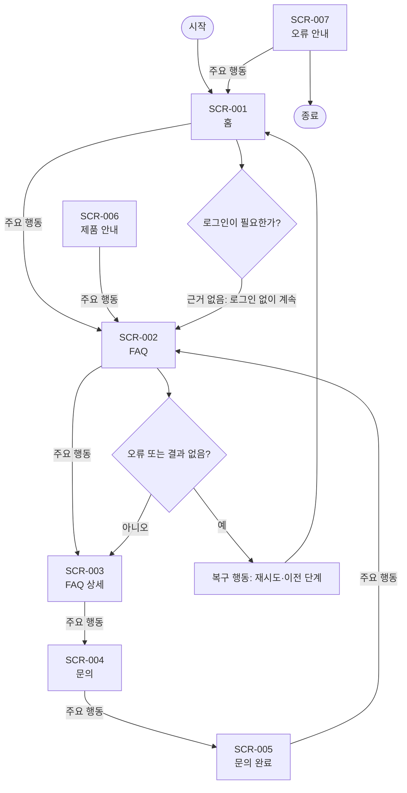

# VC-013 윤가은 서비스 흐름도

## 서비스 흐름 개요
검증 FAQ와 고객지원 연결 목표를 질문 선택 → 검증 답변 → 관련 제품 확인 → 문의 순서로 지원한다.

## 사용자 유형과 시작·종료 조건
- 사용자: 모바일 우선 환경에서 YOVIA 제품 관련 정보를 확인하는 방문자.
- 시작: 직접 URL, 전역 내비게이션 또는 외부 유입.
- 종료: 필요한 정보를 확인하거나 행동 결과와 복귀 경로를 확인한 때.
- 로그인: 근거가 없어 정상 흐름에 포함하지 않는다.

## 핵심 정상 흐름
질문 선택 → 검증 답변 → 관련 제품 확인 → 문의

## 분기·오류·이탈·재진입
- 입력 오류: 필드 인접 오류 문구와 수정 방법을 제공한다.
- 결과 없음: 조건을 완화하거나 이전 화면으로 이동한다.
- 시스템·외부 연결 오류: 재시도와 내부 정보 복귀를 함께 제공한다.
- 이탈·재진입: 공유·뒤로 가기 후 현재 화면의 핵심 맥락을 다시 표시한다.

## 단계별 처리
| 단계 | 사용자 행동 | 시스템 처리 | 화면 | 다음 조건 |
|---|---|---|---|---|
| SCR-001 홈 | 도움말 보기 | 상태를 텍스트로 갱신 | 홈 | FAQ |
| SCR-002 FAQ | 답변 선택 | 상태를 텍스트로 갱신 | FAQ | FAQ 상세 |
| SCR-003 FAQ 상세 | 문의하기 | 상태를 텍스트로 갱신 | FAQ 상세 | 문의 |
| SCR-004 문의 | 접수하기 | 상태를 텍스트로 갱신 | 문의 | 문의 완료 |
| SCR-005 문의 완료 | FAQ로 돌아가기 | 상태를 텍스트로 갱신 | 문의 완료 | FAQ |
| SCR-006 제품 안내 | FAQ 보기 | 상태를 텍스트로 갱신 | 제품 안내 | FAQ |
| SCR-007 오류 안내 | 이전 화면 | 상태를 텍스트로 갱신 | 오류 안내 | 홈 |

## 연결성 및 Requirement 검토
- **VC013-REQ-001** (높음): 사용법·보관·성분·구매 질문을 검증 답변으로 분류
- **VC013-REQ-002** (높음): 답변으로 해결되지 않는 문제에 책임 있는 문의 경로 제공
- **VC013-REQ-003** (보통 이상): FAQ 검색·필터는 실제 문서량이 충분할 때만 적용
- **VC013-REQ-004** (보통 이상): 중요 알레르기·주의 정보는 접힌 답변에만 숨기지 않음
- **VC013-REQ-005** (보통 이상): 문의 접수·오류·완료 상태와 복귀 행동을 표시
- **VC013-REQ-006** (보류): 승인되지 않은 보관·효능·품질 답변 공개 금지

모든 화면명과 ID는 사이트맵 및 화면 목록과 일치한다. 정상 화면은 시작점에서 도달 가능하며 오류 흐름은 복구 후 재진입한다.

## Mermaid
