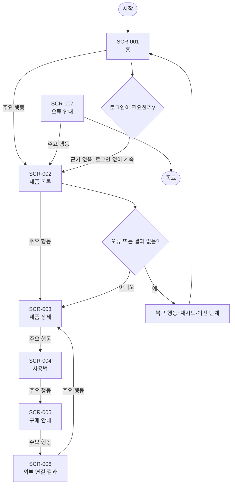

# VC-015 문지호 서비스 흐름도

## 서비스 흐름 개요
모바일 성능과 안정성 목표를 핵심 텍스트 탐색 → 제품 선택 → 상세 확인 → 외부 연결 순서로 지원한다.

## 사용자 유형과 시작·종료 조건
- 사용자: 모바일 우선 환경에서 YOVIA 제품 관련 정보를 확인하는 방문자.
- 시작: 직접 URL, 전역 내비게이션 또는 외부 유입.
- 종료: 필요한 정보를 확인하거나 행동 결과와 복귀 경로를 확인한 때.
- 로그인: 근거가 없어 정상 흐름에 포함하지 않는다.

## 핵심 정상 흐름
핵심 텍스트 탐색 → 제품 선택 → 상세 확인 → 외부 연결

## 분기·오류·이탈·재진입
- 입력 오류: 필드 인접 오류 문구와 수정 방법을 제공한다.
- 결과 없음: 조건을 완화하거나 이전 화면으로 이동한다.
- 시스템·외부 연결 오류: 재시도와 내부 정보 복귀를 함께 제공한다.
- 이탈·재진입: 공유·뒤로 가기 후 현재 화면의 핵심 맥락을 다시 표시한다.

## 단계별 처리
| 단계 | 사용자 행동 | 시스템 처리 | 화면 | 다음 조건 |
|---|---|---|---|---|
| SCR-001 홈 | 제품 보기 | 상태를 텍스트로 갱신 | 홈 | 제품 목록 |
| SCR-002 제품 목록 | 상세 보기 | 상태를 텍스트로 갱신 | 제품 목록 | 제품 상세 |
| SCR-003 제품 상세 | 사용법 보기 | 상태를 텍스트로 갱신 | 제품 상세 | 사용법 |
| SCR-004 사용법 | 구매 경로 보기 | 상태를 텍스트로 갱신 | 사용법 | 구매 안내 |
| SCR-005 구매 안내 | 외부 연결 | 상태를 텍스트로 갱신 | 구매 안내 | 외부 연결 결과 |
| SCR-006 외부 연결 결과 | 제품으로 돌아가기 | 상태를 텍스트로 갱신 | 외부 연결 결과 | 제품 상세 |
| SCR-007 오류 안내 | 목록으로 이동 | 상태를 텍스트로 갱신 | 오류 안내 | 제품 목록 |

## 연결성 및 Requirement 검토
- **VC015-REQ-001** (높음): 핵심 제품 정의·이미지·CTA를 우선 로드 대상으로 지정
- **VC015-REQ-002** (높음): 느린 환경에서도 텍스트와 기본 탐색이 작동
- **VC015-REQ-003** (보통 이상): 제품 이미지에 크기·형식·대체 자산 기준 후보 설정
- **VC015-REQ-004** (보통 이상): 복합 모션은 정보 이해 효과와 성능을 검증한 뒤 적용
- **VC015-REQ-005** (보통 이상): 외부 연결·미디어 실패 시 재시도와 대체 경로 제공
- **VC015-REQ-006** (보류): 실측 전 성능 등급·속도 개선 수치를 공개하지 않음

모든 화면명과 ID는 사이트맵 및 화면 목록과 일치한다. 정상 화면은 시작점에서 도달 가능하며 오류 흐름은 복구 후 재진입한다.

## Mermaid
