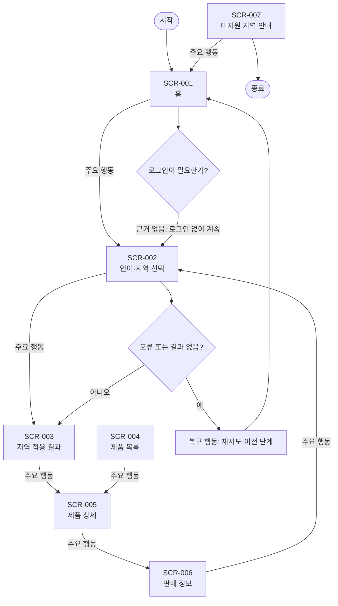

# VC-016 송예진 서비스 흐름도

## 서비스 흐름 개요
언어·지역별 정보 일관성 목표를 지역 선택 → 동일 제품 유지 → 지역 정보 확인 → 행동 순서로 지원한다.

## 사용자 유형과 시작·종료 조건
- 사용자: 모바일 우선 환경에서 YOVIA 제품 관련 정보를 확인하는 방문자.
- 시작: 직접 URL, 전역 내비게이션 또는 외부 유입.
- 종료: 필요한 정보를 확인하거나 행동 결과와 복귀 경로를 확인한 때.
- 로그인: 근거가 없어 정상 흐름에 포함하지 않는다.

## 핵심 정상 흐름
지역 선택 → 동일 제품 유지 → 지역 정보 확인 → 행동

## 분기·오류·이탈·재진입
- 입력 오류: 필드 인접 오류 문구와 수정 방법을 제공한다.
- 결과 없음: 조건을 완화하거나 이전 화면으로 이동한다.
- 시스템·외부 연결 오류: 재시도와 내부 정보 복귀를 함께 제공한다.
- 이탈·재진입: 공유·뒤로 가기 후 현재 화면의 핵심 맥락을 다시 표시한다.

## 단계별 처리
| 단계 | 사용자 행동 | 시스템 처리 | 화면 | 다음 조건 |
|---|---|---|---|---|
| SCR-001 홈 | 언어·지역 변경 | 상태를 텍스트로 갱신 | 홈 | 언어·지역 선택 |
| SCR-002 언어·지역 선택 | 선택 적용 | 상태를 텍스트로 갱신 | 언어·지역 선택 | 지역 적용 결과 |
| SCR-003 지역 적용 결과 | 제품 보기 | 상태를 텍스트로 갱신 | 지역 적용 결과 | 제품 상세 |
| SCR-004 제품 목록 | 상세 보기 | 상태를 텍스트로 갱신 | 제품 목록 | 제품 상세 |
| SCR-005 제품 상세 | 판매 정보 보기 | 상태를 텍스트로 갱신 | 제품 상세 | 판매 정보 |
| SCR-006 판매 정보 | 지역 변경 | 상태를 텍스트로 갱신 | 판매 정보 | 언어·지역 선택 |
| SCR-007 미지원 지역 안내 | 홈으로 이동 | 상태를 텍스트로 갱신 | 미지원 지역 안내 | 홈 |

## 연결성 및 Requirement 검토
- **VC016-REQ-001** (높음): 공통 브랜드 정의와 지역별 제품·정책 정보를 분리
- **VC016-REQ-002** (높음): 언어·지역 변경 후 현재 제품과 탐색 맥락 유지
- **VC016-REQ-003** (보통 이상): 언어 선택을 국기나 색상만으로 표현하지 않음
- **VC016-REQ-004** (보통 이상): 번역 확장과 혼합 문자를 견디는 모바일 구성
- **VC016-REQ-005** (보통 이상): 지역별 정보에 출처·기준일·적용 범위 표시
- **VC016-REQ-006** (보류): 판매·영양·법정 표시가 확정되지 않은 지역은 공개 보류

모든 화면명과 ID는 사이트맵 및 화면 목록과 일치한다. 정상 화면은 시작점에서 도달 가능하며 오류 흐름은 복구 후 재진입한다.

## Mermaid
