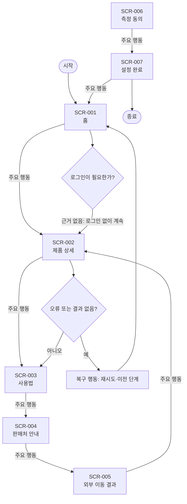

# VC-019 권세아 서비스 흐름도

## 서비스 흐름 개요
최소 측정과 안전한 실험 목표를 목표 선택 → 행동 → 결과 확인 → 동의 범위 내 측정 순서로 지원한다.

## 사용자 유형과 시작·종료 조건
- 사용자: 모바일 우선 환경에서 YOVIA 제품 관련 정보를 확인하는 방문자.
- 시작: 직접 URL, 전역 내비게이션 또는 외부 유입.
- 종료: 필요한 정보를 확인하거나 행동 결과와 복귀 경로를 확인한 때.
- 로그인: 근거가 없어 정상 흐름에 포함하지 않는다.

## 핵심 정상 흐름
목표 선택 → 행동 → 결과 확인 → 동의 범위 내 측정

## 분기·오류·이탈·재진입
- 입력 오류: 필드 인접 오류 문구와 수정 방법을 제공한다.
- 결과 없음: 조건을 완화하거나 이전 화면으로 이동한다.
- 시스템·외부 연결 오류: 재시도와 내부 정보 복귀를 함께 제공한다.
- 이탈·재진입: 공유·뒤로 가기 후 현재 화면의 핵심 맥락을 다시 표시한다.

## 단계별 처리
| 단계 | 사용자 행동 | 시스템 처리 | 화면 | 다음 조건 |
|---|---|---|---|---|
| SCR-001 홈 | 제품 이해 | 상태를 텍스트로 갱신 | 홈 | 제품 상세 |
| SCR-002 제품 상세 | 사용법 확인 | 상태를 텍스트로 갱신 | 제품 상세 | 사용법 |
| SCR-003 사용법 | 판매처 이동 | 상태를 텍스트로 갱신 | 사용법 | 판매처 안내 |
| SCR-004 판매처 안내 | 외부 이동 | 상태를 텍스트로 갱신 | 판매처 안내 | 외부 이동 결과 |
| SCR-005 외부 이동 결과 | 제품으로 돌아가기 | 상태를 텍스트로 갱신 | 외부 이동 결과 | 제품 상세 |
| SCR-006 측정 동의 | 선택 저장 | 상태를 텍스트로 갱신 | 측정 동의 | 설정 완료 |
| SCR-007 설정 완료 | 홈으로 이동 | 상태를 텍스트로 갱신 | 설정 완료 | 홈 |

## 연결성 및 Requirement 검토
- **VC019-REQ-001** (높음): 제품 이해·사용법 확인·판매처 이동을 별도 목표로 정의
- **VC019-REQ-002** (높음): 측정 이벤트를 사용자 목표와 Requirement에 연결
- **VC019-REQ-003** (보통 이상): 동의 상태에 따라 비필수 측정을 제한
- **VC019-REQ-004** (보통 이상): 실험 변형에서도 접근성·사실·브랜드 기준 유지
- **VC019-REQ-005** (보통 이상): 모바일·외부 이동·오류로 인한 흐름 단절을 구분
- **VC019-REQ-006** (보류): 측정 설계 전 전환율·개선 효과를 주장하지 않음

모든 화면명과 ID는 사이트맵 및 화면 목록과 일치한다. 정상 화면은 시작점에서 도달 가능하며 오류 흐름은 복구 후 재진입한다.

## Mermaid
