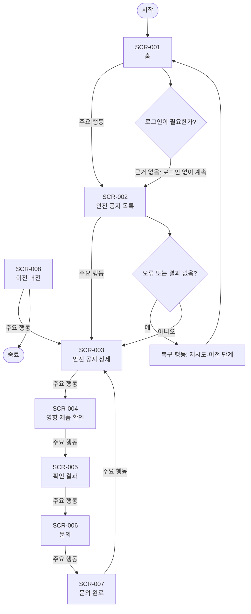

# VC-020 홍준서 서비스 흐름도

## 서비스 흐름 개요
품질 이슈와 안전 공지 대응 목표를 공지 확인 → 영향 제품 확인 → 행동 지침 → 문의·갱신 확인 순서로 지원한다.

## 사용자 유형과 시작·종료 조건
- 사용자: 모바일 우선 환경에서 YOVIA 제품 관련 정보를 확인하는 방문자.
- 시작: 직접 URL, 전역 내비게이션 또는 외부 유입.
- 종료: 필요한 정보를 확인하거나 행동 결과와 복귀 경로를 확인한 때.
- 로그인: 근거가 없어 정상 흐름에 포함하지 않는다.

## 핵심 정상 흐름
공지 확인 → 영향 제품 확인 → 행동 지침 → 문의·갱신 확인

## 분기·오류·이탈·재진입
- 입력 오류: 필드 인접 오류 문구와 수정 방법을 제공한다.
- 결과 없음: 조건을 완화하거나 이전 화면으로 이동한다.
- 시스템·외부 연결 오류: 재시도와 내부 정보 복귀를 함께 제공한다.
- 이탈·재진입: 공유·뒤로 가기 후 현재 화면의 핵심 맥락을 다시 표시한다.

## 단계별 처리
| 단계 | 사용자 행동 | 시스템 처리 | 화면 | 다음 조건 |
|---|---|---|---|---|
| SCR-001 홈 | 안전 공지 보기 | 상태를 텍스트로 갱신 | 홈 | 안전 공지 목록 |
| SCR-002 안전 공지 목록 | 공지 상세 | 상태를 텍스트로 갱신 | 안전 공지 목록 | 안전 공지 상세 |
| SCR-003 안전 공지 상세 | 제품 확인 | 상태를 텍스트로 갱신 | 안전 공지 상세 | 영향 제품 확인 |
| SCR-004 영향 제품 확인 | 확인하기 | 상태를 텍스트로 갱신 | 영향 제품 확인 | 확인 결과 |
| SCR-005 확인 결과 | 문의하기 | 상태를 텍스트로 갱신 | 확인 결과 | 문의 |
| SCR-006 문의 | 접수하기 | 상태를 텍스트로 갱신 | 문의 | 문의 완료 |
| SCR-007 문의 완료 | 공지로 돌아가기 | 상태를 텍스트로 갱신 | 문의 완료 | 안전 공지 상세 |
| SCR-008 이전 버전 | 현재 공지 보기 | 상태를 텍스트로 갱신 | 이전 버전 | 안전 공지 상세 |

## 연결성 및 Requirement 검토
- **VC020-REQ-001** (높음): 품질·알레르기·보관 이슈를 일반 콘텐츠보다 우선 노출 가능하게 준비
- **VC020-REQ-002** (높음): 영향 제품·범위·기준일·승인 행동을 식별 가능하게 표시
- **VC020-REQ-003** (보통 이상): 공지 갱신 상태와 이전 버전·문의 경로를 연결
- **VC020-REQ-004** (보통 이상): 색상만으로 위험·상태를 전달하지 않음
- **VC020-REQ-005** (보통 이상): 모바일에서 공지→제품 확인→행동 지침 경로를 짧게 유지
- **VC020-REQ-006** (보류): 실제 이슈·승인 절차 없이 리콜 기능이나 문구를 공개하지 않음

모든 화면명과 ID는 사이트맵 및 화면 목록과 일치한다. 정상 화면은 시작점에서 도달 가능하며 오류 흐름은 복구 후 재진입한다.

## Mermaid
