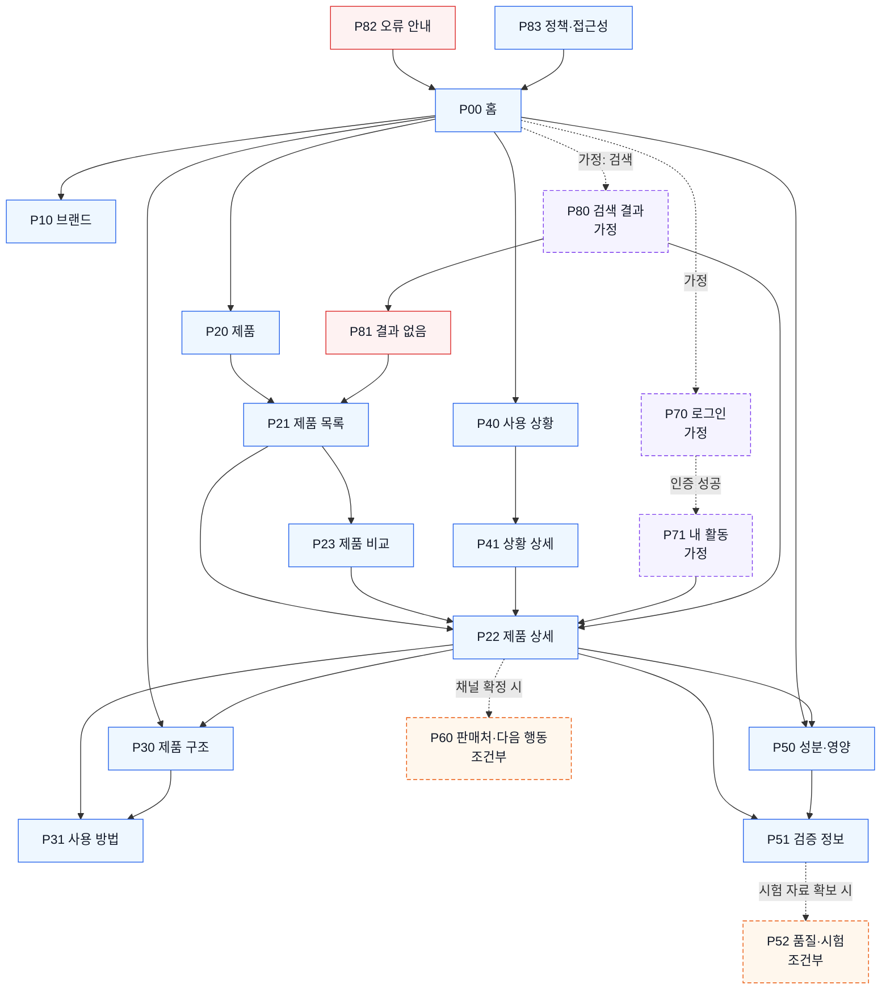

# YOVIA 사이트맵 — VC-001

## 프로젝트 개요

- 입력: `가상 클라이언트 분석 결과/VC_001_서하린.md`
- 핵심 대상: 시간 부족을 겪는 20~30대 직장인·대학생
- 핵심 가치: 그릭요거트 기반 올인원 제품을 빠르게 이해하고, 사용 상황·방법·신뢰 정보를 확인한 뒤 확정된 행동으로 이동
- 설계 원칙: 모바일 우선, 실제 제품 중심, 확정 정보와 미검증 정보 분리, 가격·효능·판매 정책 임의 확정 금지
- 범위 표시: `조건부`는 입력 근거가 확보될 때 활성화하며, `가정`은 요청된 흐름 완결을 위해 추가했으나 사업 확정 사항이 아니다.

## 설계 근거와 핵심 사용자 목표

| 사용자 목표 | 설계 근거 | 대응 영역 |
|---|---|---|
| 첫 화면에서 YOVIA와 제품 가치를 이해 | VC001-REQ-001, 007 | 홈, 브랜드 |
| 파우치·빌트인 스푼·토핑 관계 확인 | VC001-REQ-002, 006 | 제품 상세, 제품 구조, 사용 방법 |
| 자신의 일상 상황과 제품 적합성 판단 | VC001-REQ-003 | 사용 상황, 상황 상세 |
| 원료·영양·알레르기와 근거 확인 | VC001-REQ-004, 008 | 성분·영양, 검증 정보 |
| 확정 옵션 비교와 다음 행동 | VC001-REQ-005, 009, 010 | 제품 목록, 제품 비교, 판매처·다음 행동(조건부) |
| 시험 없는 품질·효능 주장을 피함 | VC001-REQ-011~013 | 검증 정보, 품질·시험(조건부) |

## 전역 내비게이션 구조

- 1차 후보: 홈 / 제품 / 제품 구조 / 사용 상황 / 성분·영양 / 브랜드
- 보조 행동: 제품 비교 / 검증 정보 / 판매처·다음 행동(조건부)
- 공통 영역: 헤더, 현재 위치 안내, 상태 라벨, 푸터, 정책·접근성
- 회원 상태별 영역: 로그인·내 활동은 입력에 없는 기능이므로 `가정`; 비회원 핵심 탐색을 막지 않는다.
- 예외 영역: 검색 결과 없음, 오류 안내. 검색 자체도 `가정`이다.

## 계층형 사이트맵

```text
P00 홈 (1차)
├─ P10 브랜드 (1차)
├─ P20 제품 (1차)
│  ├─ P21 제품 목록 (2차)
│  │  ├─ P22 제품 상세 (3차)
│  │  └─ P23 제품 비교 (3차)
│  ├─ P30 제품 구조 (2차)
│  │  └─ P31 사용 방법 (3차)
│  └─ P60 판매처·다음 행동 (2차, 조건부)
├─ P40 사용 상황 (1차)
│  └─ P41 상황 상세 (2차)
│     └─ P22 제품 상세 (연결)
├─ P50 성분·영양 (1차)
│  ├─ P51 검증 정보 (2차)
│  └─ P52 품질·시험 (2차, 조건부)
├─ P70 로그인 (보조, 가정)
│  └─ P71 내 활동 (보조, 가정)
├─ P80 검색 결과 (보조, 가정)
│  └─ P81 결과 없음 (예외)
├─ P82 오류 안내 (예외)
└─ P83 정책·접근성 (공통)
```

## 페이지 정의

| ID | 깊이·구분 | 페이지 | 목적 | 핵심 콘텐츠 | 주요 기능 | 연결 페이지 |
|---|---|---|---|---|---|---|
| P00 | 1차·공통 시작 | 홈 | 브랜드·제품·상황을 한 흐름으로 이해 | 제품 정의, 실제 제품, 상황 요약, 신뢰 요약 | 주요 영역 진입, 조건부 CTA | P10, P20, P30, P40, P50 |
| P10 | 1차 | 브랜드 | YOVIA 정의와 표현 원칙 설명 | 브랜드 가치, 대상, 확정 상태 | 제품·상황 연결 | P00, P20, P40 |
| P20 | 1차 | 제품 | 제품 탐색 허브 | 제품군·구조·비교 안내 | 하위 영역 이동 | P21, P30, P60 |
| P21 | 2차 | 제품 목록 | 확정 제품 선택지 탐색 | 제품 카드, 상태, 선택 기준 | 필터·정렬(옵션 확정 시), 비교 담기 | P22, P23 |
| P22 | 3차 | 제품 상세 | 제품 구조·정보·행동 통합 확인 | 갤러리, 구조, 사용법, 성분, 검증 상태 | 확대, 상세 펼치기, 비교, 조건부 CTA | P23, P30, P31, P50, P51, P60 |
| P23 | 3차 | 제품 비교 | 확정 옵션 차이 판단 | 비교 카드·속성·상태 | 비교 항목 변경, 상세 이동 | P21, P22 |
| P30 | 2차 | 제품 구조 | 파우치·스푼·토핑 관계 이해 | 실제 이미지, 부품명·역할 | 확대, 부품 라벨 | P22, P31 |
| P31 | 3차 | 사용 방법 | 개봉→섭취→정리 순서 이해 | 단계 이미지, 주의·검증 상태 | 단계 이동 | P22, P30, P40 |
| P40 | 1차 | 사용 상황 | 자신의 일상 맥락 발견 | 출근·등교·이동·업무 카드 | 상황 선택 | P41 |
| P41 | 2차 | 상황 상세 | 상황 문제와 제품 가치 연결 | 상황 장면, 준비·정리 조건 | 관련 제품·사용법 이동 | P22, P31, P40 |
| P50 | 1차 | 성분·영양 | 원료·영양·알레르기 빠른 확인 | 확정 속성, 기준량, 알레르기 | 핵심→상세 펼치기 | P22, P51 |
| P51 | 2차 | 검증 정보 | 출처·기준일·미검증 상태 확인 | 근거 문서, 상태, 금지 주장 | 근거 열기 | P22, P50, P52 |
| P52 | 2차·조건부 | 품질·시험 | 시험 자료 확보 시 조건·결과 공개 | 누수·오염·잔여물·폐기 시험 | 문서 확인 | P51 |
| P60 | 2차·조건부 | 판매처·다음 행동 | 확정 채널로 이동 | 판매처·정책·CTA 목적 | 외부 채널 이동 | P22 |
| P70 | 보조·가정 | 로그인 | 회원 상태 진입 | 인증 입력 | 로그인, 오류 표시 | P71, P82 |
| P71 | 보조·가정 | 내 활동 | 저장한 비교·최근 제품 확인 | 저장 목록 | 상세 재진입 | P22, P23 |
| P80 | 보조·가정 | 검색 결과 | 키워드로 제품·정보 탐색 | 결과 목록 | 검색·필터 | P22, P81 |
| P81 | 예외 | 결과 없음 | 검색 실패 후 재탐색 | 대체 키워드·제품 목록 링크 | 다시 검색 | P21, P80 |
| P82 | 예외 | 오류 안내 | 처리 실패 후 안전한 복귀 | 오류 요약, 재시도 | 재시도·홈 이동 | P00, 이전 화면 |
| P83 | 공통 | 정책·접근성 | 정책과 접근성 정보 제공 | 정책, 접근성 안내 | 문서 이동 | P00 |

## 주요 사용자 여정

1. 탐색: P00 홈 → P40 사용 상황 또는 P21 제품 목록
2. 선택: P41 상황 상세 또는 P23 제품 비교
3. 상세 확인: P22 제품 상세 → P30 제품 구조 / P31 사용 방법 / P50 성분·영양
4. 핵심 행동: P60 판매처·다음 행동(채널 확정 시)
5. 결과 확인: 외부 판매 채널 또는 P22 복귀

## 연결성 검토

- 모든 페이지는 P00 또는 상위 페이지에서 도달 가능하다.
- P52와 P60은 조건부이며 근거·채널이 없을 때 P51·P22의 상태 안내로 대체한다.
- P70·P71·P80은 `가정`이며 제거해도 핵심 비회원 여정이 유지된다.
- P81·P82는 각각 P21·P00으로 복귀 경로가 있어 고립되지 않는다.
- 제품 상세는 P22 하나로 통합해 중복 상세 페이지를 만들지 않았다.

## Mermaid 사이트맵


