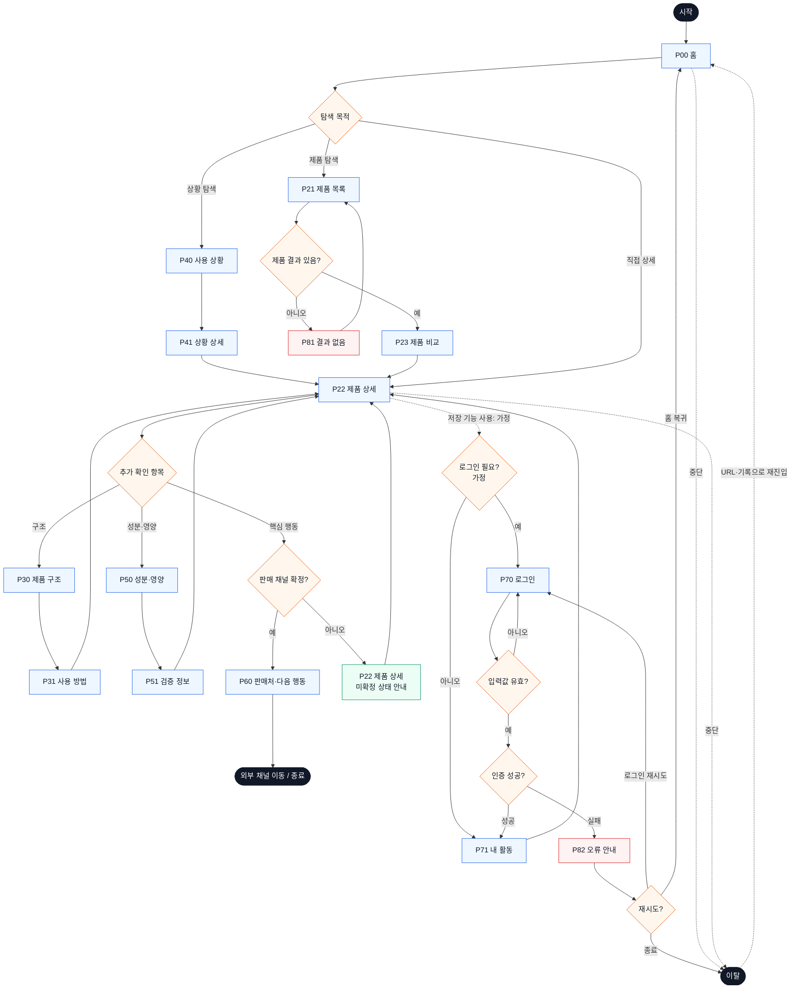

# YOVIA 서비스 흐름도 — VC-001

## 서비스 흐름 개요

- 입력: `가상 클라이언트 설계 결과/사이트맵.md`, `가상 클라이언트 분석 결과/VC_001_서하린.md`
- 정상 흐름: 탐색 → 선택 → 상세 확인 → 핵심 행동 → 결과 확인
- 핵심 원칙: 비회원도 제품 이해·비교·신뢰 확인 가능, 미확정 판매 채널은 상태 안내로 대체, 회원 기능은 `가정`

## 사용자 유형과 시작 조건

| 유형 | 시작 조건 | 주요 목표 |
|---|---|---|
| 신규 비회원 | 검색·SNS·직접 URL로 P00 홈 진입 | YOVIA 정의와 자신에게 맞는 사용 상황 이해 |
| 비교 중심 비회원 | P21 제품 목록 또는 P22 제품 상세 진입 | 확정 제품 차이와 신뢰 정보 확인 |
| 재방문 사용자 | 브라우저 기록·공유 URL로 재진입 | 이전 제품·비교 확인 |
| 회원 사용자 | `가정`: 로그인과 저장 기능이 도입된 경우 | P71 내 활동에서 저장 항목 재진입 |

## 핵심 정상 흐름

1. P00 홈에서 사용 상황 또는 제품 탐색을 선택한다.
2. P40→P41 또는 P21→P23을 통해 제품을 선택한다.
3. P22 제품 상세에서 P30 구조, P31 사용 방법, P50 성분·영양, P51 검증 정보를 확인한다.
4. 판매 채널이 확정되면 P60에서 목적이 명확한 행동을 실행한다.
5. 외부 판매 채널로 이동하거나 P22에 남아 다른 정보를 확인한다.

## 분기·오류·이탈·재진입

- 결과 없음: P21 탐색 결과가 없으면 P81에서 조건을 완화하고 P21로 복귀한다.
- 미확정 행동: 판매 채널이 없으면 P22에서 `NOT_VERIFIED` 상태를 안내하고 행동을 비활성화한다.
- 로그인: 저장 기능 사용 시에만 필요한 `가정`; 입력 오류는 P70 내부 표시, 인증 실패는 P82로 연결한다.
- 이전 단계: 모든 상세·검증 화면은 P22 또는 직전 상위 화면으로 돌아갈 수 있다.
- 이탈: P00·P22에서 이탈할 수 있으며 공유 URL·브라우저 기록으로 재진입한다.

## 단계별 흐름 정의

| 단계 | 사용자 행동 | 시스템 처리 | 화면 | 다음 조건 |
|---|---|---|---|---|
| F01 | 서비스 진입 | 공통 내비게이션과 확정 상태 로드 | P00 홈 | 탐색 목적 선택 |
| F02 | 사용 상황 선택 | 상황 카드 표시 | P40 사용 상황 | 상황 상세 선택 |
| F03 | 상황 맥락 확인 | 관련 제품·사용법 연결 | P41 상황 상세 | P22 이동 |
| F04 | 제품 탐색 | 확정 제품·필터 결과 반환 | P21 제품 목록 | 결과 유무 판단 |
| F05 | 검색 조건 수정 | 대체 조건과 목록 링크 제공 | P81 결과 없음 | P21 복귀 |
| F06 | 제품 비교 | 공통 속성과 상태 정렬 | P23 제품 비교 | P22 선택 |
| F07 | 제품 상세 확인 | 갤러리·구조·신뢰·CTA 상태 표시 | P22 제품 상세 | 추가 확인 분기 |
| F08 | 구조 확인 | 실제 자산·부품 라벨 표시 | P30 제품 구조 | P31 또는 P22 |
| F09 | 단계 확인 | 개봉→섭취→정리 순서 표시 | P31 사용 방법 | P22 복귀 |
| F10 | 성분 확인 | 핵심 정보와 상세 근거 분리 | P50 성분·영양 | P51 이동 |
| F11 | 근거 확인 | 출처·기준일·검증 상태 표시 | P51 검증 정보 | P22 복귀 |
| F12 | 핵심 행동 선택 | 채널 확정 상태 판단 | P22 제품 상세 | P60 또는 상태 안내 |
| F13 | 판매처·행동 확인 | 확정 채널만 제공 | P60 판매처·다음 행동 | 외부 채널·종료 |
| F14 | 저장 선택 | `가정`: 로그인 상태 확인 | P22 제품 상세 | P70 또는 P71 |
| F15 | 로그인 정보 입력 | 필수값·형식 검사 | P70 로그인 | 유효성 판단 |
| F16 | 인증 실패 확인 | 오류 원인과 재시도 제공 | P82 오류 안내 | P70·P00·종료 |
| F17 | 저장 항목 선택 | 저장 목록 반환 | P71 내 활동 | P22·P23 |

## 도달성 검토

- 서비스 흐름에 사용한 모든 화면 이름은 사이트맵과 일치한다.
- P81, P82, 미확정 상태에는 복귀 경로가 있다.
- P60은 조건부이며 비활성 상태에서도 P22 흐름이 끊기지 않는다.
- 로그인 가정을 제거해도 P00→P22→P60의 비회원 핵심 흐름은 유지된다.

## Mermaid 전체 서비스 흐름도

