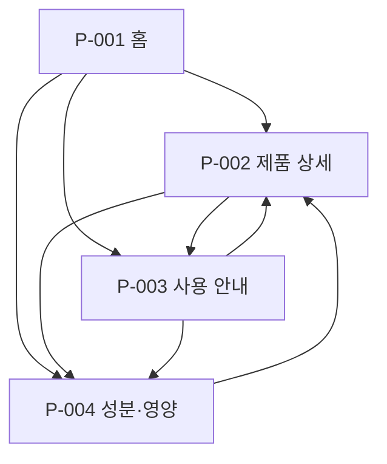

# VC-001 서하린 — 사이트맵

## 프로젝트 개요

YOVIA를 처음 접하는 바쁜 20~30대 사용자가 제품의 정체를 빠르게 이해하고, 구조와 사용법을 확인한 뒤 원료·영양 정보를 검토할 수 있도록 구성한 4화면 정보형 사이트다.

- 입력: `가상 클라이언트 분석 결과/VC_001_서하린.md`
- 설계 상태: 후보 설계
- 범위: 정보 탐색과 이해
- 제외: 제품 비교, 판매처, 로그인, 결제, 구독
- 보류: 가격, 판매 채널, 제품 옵션, 확정 영양 수치, 건강 효능

## 설계 근거와 핵심 사용자 목표

| 사용자 목표 | Requirement | 설계 반영 |
|---|---|---|
| 첫 화면에서 브랜드와 제품을 이해 | `VC001-REQ-001` | 홈에서 제품 정의와 핵심 가치 제시 |
| 실제 패키지 구조를 확인 | `VC001-REQ-002` | 제품 상세의 구조 영역으로 통합 |
| 일상 사용 장면과 순서를 이해 | `VC001-REQ-003`, `VC001-REQ-006` | 사용 안내에서 상황과 단계를 연속 제공 |
| 원료·영양·알레르기를 검토 | `VC001-REQ-004`, `VC001-REQ-008` | 성분·영양 화면에서 출처 및 검증 상태 제공 |

## 전역 내비게이션 구조

1. 홈
2. 제품 상세
3. 사용 안내
4. 성분·영양

모든 화면은 공통 헤더에서 접근할 수 있다. 미확정 항목은 내비게이션이나 독립 화면으로 만들지 않는다.

## 계층형 사이트맵

```text
P-001 홈
├─ P-002 제품 상세
│  ├─ P-003 사용 안내
│  └─ P-004 성분·영양
├─ P-003 사용 안내
│  └─ P-002 제품 상세
└─ P-004 성분·영양
   └─ P-002 제품 상세
```

## 페이지 정의

| ID | 페이지 | 목적 | 핵심 콘텐츠 | 주요 기능 | 연결 페이지 |
|---|---|---|---|---|---|
| P-001 | 홈 | 제품의 정체와 사용 가치를 빠르게 이해 | 제품 정의, 핵심 이미지, 사용 가치, 정보 바로가기 | 핵심 탐색 카드 | P-002, P-003, P-004 |
| P-002 | 제품 상세 | 제품 구조와 특징을 한곳에서 검토 | 제품 구성, 부품 역할, 핵심 특징, 검증 상태 | 구조 설명 전환, 관련 정보 이동 | P-001, P-003, P-004 |
| P-003 | 사용 안내 | 사용 상황과 개봉부터 정리까지의 순서를 이해 | 상황별 사용 가치, 단계별 사용법, 주의사항 | 상황 선택, 단계 전환 | P-001, P-002, P-004 |
| P-004 | 성분·영양 | 원료·영양·알레르기 정보와 근거 상태를 확인 | 원료, 영양, 알레르기, 출처·기준일 | 정보 펼치기, 관련 제품 이동 | P-001, P-002, P-003 |

## 보류 항목

| 항목 | 처리 | 활성화 조건 |
|---|---|---|
| 제품 비교 | 화면을 생성하지 않음 | 실제 옵션과 비교 기준 확인 |
| 판매처 안내 | 화면을 생성하지 않음 | 판매 채널과 적용 제품 확인 |
| 구매 CTA | 노출하지 않음 | 가격·재고·목적지 정책 확인 |

## 연결 검토

- 4개 화면 모두 홈과 공통 내비게이션에서 도달할 수 있다.
- 정보 확인 후 관련 이전 화면으로 돌아갈 수 있다.
- 미확정 기능을 링크나 빈 화면으로 만들지 않았다.
- 중복 페이지와 도달 불가능한 페이지가 없다.

## Mermaid 사이트맵


