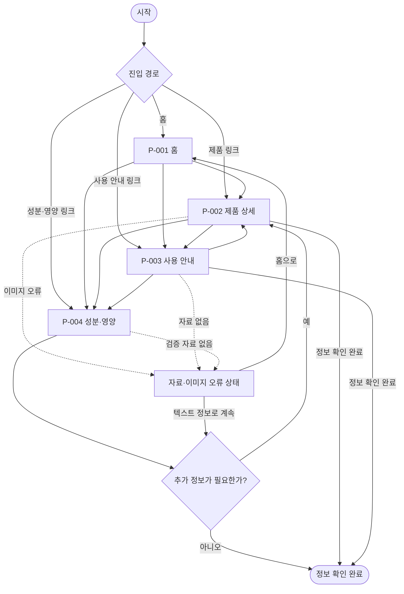

# VC-001 서하린 — 서비스 흐름도

## 서비스 흐름 개요

사용자가 홈 또는 검색·공유 링크로 진입해 제품을 이해하고, 사용 방법과 신뢰 정보를 확인한 뒤 정보 탐색을 완료하는 흐름이다. 구매·로그인 흐름은 확인된 요구가 없어 포함하지 않는다.

## 사용자 유형과 시작 조건

| 사용자 | 시작 조건 | 우선 목표 |
|---|---|---|
| 첫 방문자 | P-001 홈 | 제품의 정체와 핵심 가치 이해 |
| 제품 관심 사용자 | P-002 직접 진입 | 구조와 특징 확인 |
| 사용법 탐색 사용자 | P-003 직접 진입 | 상황별 사용법 확인 |
| 정보 검토 사용자 | P-004 직접 진입 | 원료·영양·알레르기 확인 |

## 핵심 정상 흐름

```text
진입 → 제품 이해 → 사용 안내 확인 → 성분·영양 검토 → 정보 확인 완료
```

사용자는 목적에 따라 사용 안내나 성분·영양으로 바로 이동할 수 있으며, 각 화면에서 제품 상세로 돌아가 맥락을 보완할 수 있다.

## 단계별 흐름

| 단계 | 사용자 행동 | 시스템 처리 | 화면 | 다음 조건 |
|---|---|---|---|---|
| 1 | 홈 또는 직접 링크로 진입 | 현재 위치와 공통 탐색 제공 | P-001~P-004 | 진입 목적 확인 |
| 2 | 제품 정의와 구조 확인 | 확인된 정보와 미확정 상태를 구분 | P-001, P-002 | 사용법 또는 신뢰 정보 선택 |
| 3 | 사용 상황과 단계 확인 | 상황·단계별 설명 제공 | P-003 | 성분·영양 검토 여부 |
| 4 | 원료·영양·알레르기 확인 | 출처·기준일·검증 상태 표시 | P-004 | 추가 탐색 또는 종료 |
| 5 | 관련 화면으로 이동하거나 탐색 종료 | 현재 맥락을 유지 | P-002~P-004 | 종료 |

## 분기·오류·이탈·재진입

| 상황 | 처리 | 복구 대상 |
|---|---|---|
| 직접 링크 진입 | 브랜드 정의, 현재 위치, 공통 탐색 제공 | P-001 또는 관련 화면 |
| 제품 이미지 오류 | 대체 텍스트와 구조 설명 제공 | 현재 화면 |
| 검증 자료 없음 | 수치·효능을 만들지 않고 미확정 상태 표시 | P-002 또는 P-004 |
| 사용 단계 자산 없음 | 텍스트 순서와 확인 필요 상태 제공 | P-003 |
| 탐색 이탈 후 재진입 | URL의 화면으로 복귀하고 맥락 재제공 | 현재 화면 |

## 검토 결과

- 시작점과 정보 확인 종료가 연결된다.
- 사이트맵의 4개 화면만 사용한다.
- 오류는 별도 페이지가 아닌 각 화면의 상태로 처리한다.
- 입력 폼, 로그인, 결제, 제품 비교, 판매처 흐름을 임의 생성하지 않았다.

## Mermaid 전체 흐름도


