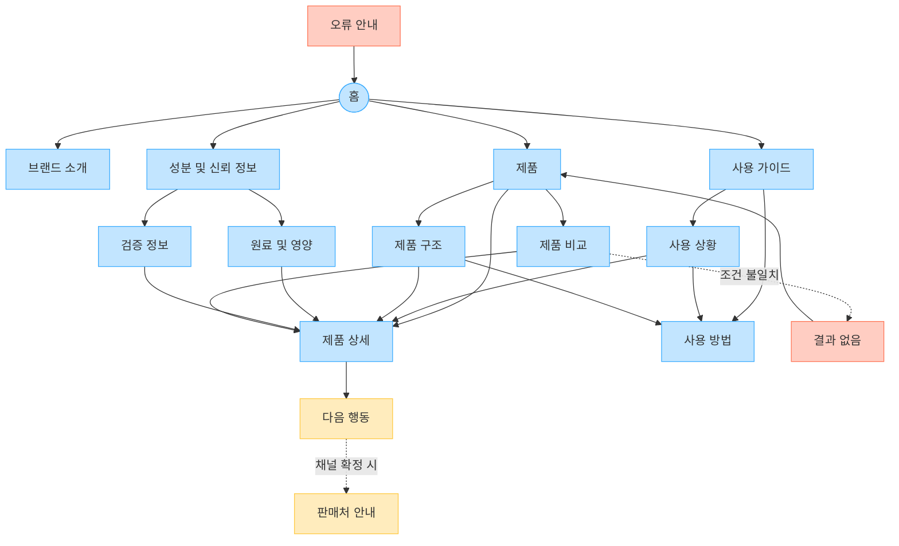

# YOVIA 사이트맵

## 프로젝트 개요

바쁜 20~30대 직장인·대학생이 모바일에서 YOVIA를 그릭요거트 기반 간편 건강식으로 이해하고, 실제 제품 구조와 사용법, 성분·영양 근거를 확인한 뒤 제품 상세와 확정된 행동으로 이동하도록 설계한다. 입력 문서의 13개 요구사항과 MENU 11개, CONTENT 13개, FUNCTION 11개 후보를 모두 반영했다.

판매 채널, 회원 기능, 제품 옵션, 가격, 효능, 시험 결과는 입력에서 확정되지 않았다. 따라서 판매처 안내는 `가정·보류`, 회원 전용 영역은 `미설계`, 미검증 수치·효능은 공개 대상에서 제외한다.

## 설계 근거와 핵심 사용자 목표

| 목표 | 근거 | 설계 반영 |
|---|---|---|
| 첫 화면에서 제품과 일상 편익 이해 | VC001-REQ-001, 003 | 홈에서 제품·상황 진입 제공 |
| 파우치·빌트인 스푼·토핑 관계 이해 | VC001-REQ-002, 006 | 제품 구조와 단계형 사용 방법 연결 |
| 원료·영양·알레르기 및 근거 확인 | VC001-REQ-004, 008 | 원료 및 영양, 검증 정보 분리 |
| 옵션 비교 후 상세 확인 | VC001-REQ-009 | 제품 비교에서 제품 상세로 연결. 옵션은 가정 |
| 모바일에서 확정 CTA로 이동 | VC001-REQ-005, 010 | 상세에서 다음 행동으로 연결. 판매처는 보류 |
| 미검증 주장 차단 | VC001-REQ-011~013 | HOLD 항목은 공개 메뉴에서 제외하고 검증 상태만 제공 |

## 전역 내비게이션 구조

- 공통 GNB: 홈, 브랜드 소개, 제품, 사용 가이드, 성분 및 신뢰 정보
- 공통 유틸리티: 현재 위치, 홈 이동, 이전 화면 이동
- 회원 상태별 영역: 입력에 로그인·회원 요구가 없어 회원/비회원 분리 기능은 설계하지 않음
- 조건부 CTA: 제품 상세의 `다음 행동`; 실제 판매 채널 확정 전에는 판매처 연결 비활성 또는 `준비 중`
- 예외 페이지: 결과 없음, 오류 안내

## 계층형 사이트맵

```text
1차 홈
├─ 1차 브랜드 소개
├─ 1차 제품
│  ├─ 2차 제품 구조
│  ├─ 2차 제품 비교
│  │  └─ 3차 결과 없음 [예외]
│  └─ 2차 제품 상세
│     └─ 3차 다음 행동 [조건부]
│        └─ 3차 판매처 안내 [가정·보류]
├─ 1차 사용 가이드
│  ├─ 2차 사용 상황
│  └─ 2차 사용 방법
├─ 1차 성분 및 신뢰 정보
│  ├─ 2차 원료 및 영양
│  └─ 2차 검증 정보
└─ 1차 오류 안내 [예외]
```

## 페이지 정의

| 깊이 | 페이지 | 목적 | 핵심 콘텐츠 | 주요 기능 | 연결 페이지 |
|---|---|---|---|---|---|
| 1 | 홈 | 제품 정의와 일상 가치를 동시에 이해 | 실제 제품 이미지, 브랜드 정의, 상황 카드 | 1열 탐색, 목적별 CTA | 브랜드 소개, 제품, 사용 가이드, 성분 및 신뢰 정보 |
| 1 | 브랜드 소개 | YOVIA의 정의와 표현 원칙 전달 | 그릭요거트 기반 간편 건강식, 바쁜 일상 가치 | 관련 제품 이동 | 홈, 제품 |
| 1 | 제품 | 제품 탐색 허브 | 실제 제품 카드, 제품군 상태 | 제품 카드, 비교 진입 | 제품 구조, 제품 비교, 제품 상세 |
| 2 | 제품 구조 | 파우치·스푼·토핑 관계 설명 | 실제 패키지, 부품명과 역할 | 갤러리, 확대, 라벨 | 사용 방법, 제품 상세 |
| 2 | 제품 비교 | 확정 옵션 차이 비교 | 상황·속성·옵션 차이 | 비교 카드, 필터 후보 | 제품 상세, 결과 없음 |
| 2 | 제품 상세 | 판단에 필요한 정보를 한곳에 제공 | 구조, 사용 요약, 원료·영양, 상태 | 펼치기, 갤러리, CTA | 원료 및 영양, 검증 정보, 다음 행동 |
| 1 | 사용 가이드 | 상황과 절차 탐색 허브 | 상황·방법 요약 | 카드 탐색 | 사용 상황, 사용 방법 |
| 2 | 사용 상황 | 출근·등교·이동·업무 맥락 제시 | 준비·취식·정리 문제와 가치 | 상황 카드 | 사용 방법, 제품 상세 |
| 2 | 사용 방법 | 개봉·결합·섭취·정리 설명 | 단계별 행동과 상태 | 단계 전환, 이미지 전환 | 제품 구조, 제품 상세 |
| 1 | 성분 및 신뢰 정보 | 확인 가능한 정보 탐색 허브 | 원료·영양·알레르기, 검증 상태 | 상세 펼치기 | 원료 및 영양, 검증 정보 |
| 2 | 원료 및 영양 | 확정 정보 빠른 확인 | 원료, 기준량, 영양, 알레르기 | 요약·상세 펼치기 | 검증 정보, 제품 상세 |
| 2 | 검증 정보 | 출처와 공개 상태 설명 | 출처, 기준일, 범위, CONFIRMED/NOT_VERIFIED | 근거 문서 연결 후보 | 원료 및 영양, 제품 상세 |
| 3 | 다음 행동 | 상세 확인 후 가능한 행동 안내 | 제품 확인·비교·판매처 목적 | 목적별 CTA | 제품 비교, 판매처 안내 |
| 3 | 판매처 안내 | 확정 판매 채널 제공 | 판매처와 이동 안내 | 외부 연결 | 다음 행동 |
| 3 | 결과 없음 | 비교 조건 불일치 복구 | 조건 해제 안내 | 필터 초기화 | 제품, 제품 비교 |
| 1 | 오류 안내 | 접근 실패 복구 | 오류 설명 | 재시도, 홈 이동 | 홈 |

`가정`: 제품 비교 필터의 구체 항목, 판매처 안내, 외부 구매 연결. `HOLD`: 시험 결과, 대체 패키지 공개. 미검증 건강·의료 효능은 페이지와 CTA에서 제외한다.

## Mermaid 사이트맵


