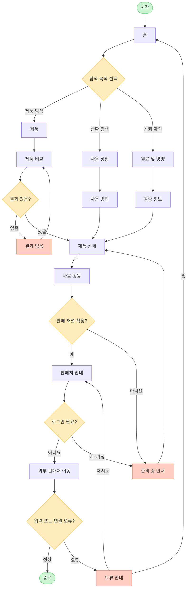

# YOVIA 서비스 흐름도

## 서비스 흐름 개요

핵심 흐름은 `탐색 → 선택 → 상세 확인 → 핵심 행동 → 결과 확인`이다. 제품 비교, 사용 상황, 신뢰 정보의 세 진입 경로가 제품 상세에서 합류한다. 판매 채널은 미확정이므로 조건부로만 연결한다.

## 사용자 유형과 시작 조건

| 사용자 | 시작 조건 | 비고 |
|---|---|---|
| 바쁜 직장인·대학생 | 모바일 또는 데스크톱으로 홈 진입 | 주요 사용자 |
| 비회원 | 로그인 없이 정보 탐색 | 입력 근거에 회원 기능 없음 |
| 회원 | `가정`: 회원 기능이 추가될 경우 | 현재 별도 화면 없음 |

## 핵심 정상 흐름

1. 홈에서 탐색 목적을 선택한다.
2. 제품, 사용 상황, 원료 및 영양 중 하나를 탐색한다.
3. 제품 상세에서 구조·사용·신뢰 정보를 확인한다.
4. 다음 행동에서 비교 또는 판매처 확인을 선택한다.
5. 판매 채널이 확정된 경우 판매처 안내 후 외부 판매처로 이동한다.

## 분기, 오류, 이탈, 재진입

- 로그인 여부: 현재 핵심 흐름은 비회원이다. 로그인 요구는 입력 근거가 없어 `가정` 분기로만 표시한다.
- 입력값 오류: 비교 필터 값이 유효하지 않으면 조건을 초기화하고 제품 비교로 복귀한다.
- 결과 없음: 결과 없음에서 필터를 해제하거나 제품 허브로 이동한다.
- 판매 채널 미확정: 준비 중 안내 후 제품 상세로 돌아간다.
- 외부 연결 오류: 오류 안내에서 재시도하거나 홈으로 이동한다.
- 이전 단계: 모든 정보 화면에서 브라우저 뒤로 가기와 사이트 내 이전 링크를 제공한다.
- 이탈·재진입: URL 직접 재진입을 허용하되 잘못된 경로는 오류 안내로 보낸다.

## 단계별 정의

| 단계 | 사용자 행동 | 시스템 처리 | 화면 | 다음 조건 |
|---|---|---|---|---|
| 1 | 사이트 진입 | 핵심 콘텐츠 표시 | 홈 | 목적 선택 |
| 2A | 제품 선택 | 제품 카드 표시 | 제품 | 비교 또는 상세 선택 |
| 3A | 비교 조건 선택 | 유효성·결과 확인 | 제품 비교 | 결과 있음/없음 |
| 3B | 조건 수정 | 필터 초기화·재조회 | 결과 없음 | 제품 비교 복귀 |
| 2B | 상황 선택 | 상황별 카드 표시 | 사용 상황 | 방법 또는 상세 선택 |
| 3C | 단계 확인 | 단계별 이미지·설명 표시 | 사용 방법 | 상세 이동 |
| 2C | 신뢰 정보 선택 | 확정 정보와 상태 표시 | 원료 및 영양 | 검증 정보 확인 |
| 3D | 출처 확인 | 기준일·범위·상태 표시 | 검증 정보 | 상세 이동 |
| 4 | 제품 판단 | 통합 정보와 CTA 표시 | 제품 상세 | 다음 행동 |
| 5 | 행동 선택 | 채널 상태 확인 | 다음 행동 | 확정/미확정 |
| 6A | 판매처 선택 | 외부 목적지 제공 | 판매처 안내 | 외부 이동 |
| 6B | 돌아가기 | 미확정 상태 안내 | 준비 중 안내 | 제품 상세 |
| 7 | 재시도 또는 홈 | 오류 복구 | 오류 안내 | 판매처 안내/홈 |

## 전체 서비스 흐름도

