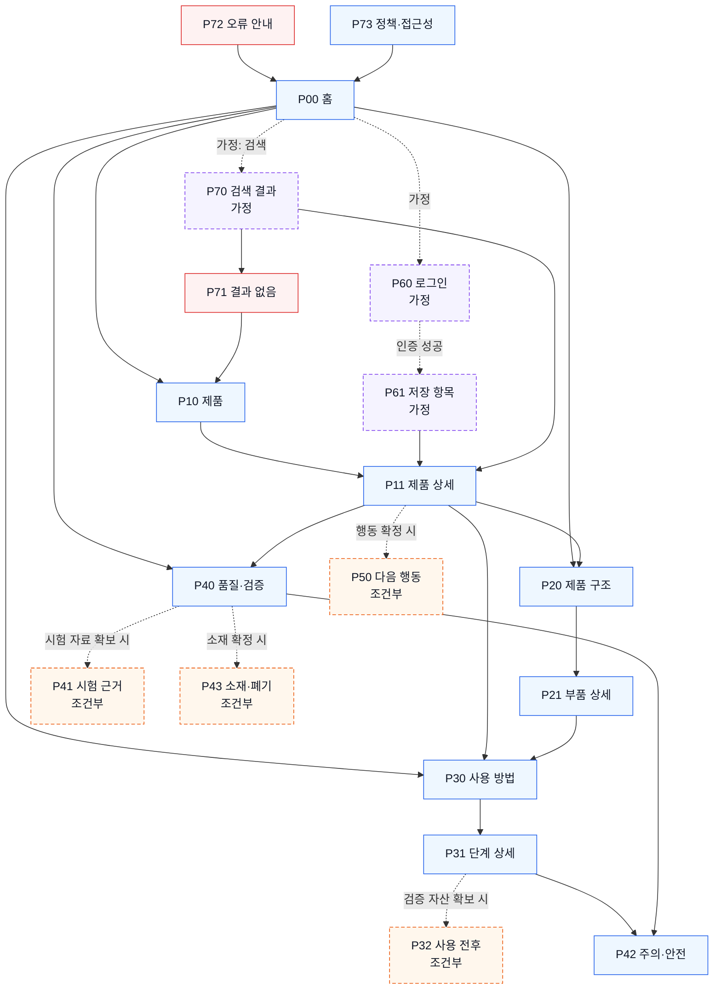

# YOVIA 사이트맵 — VC-002 김도현

## 프로젝트 개요

- 입력: `가상 클라이언트 분석 결과/VC_002_김도현.md`
- 핵심 사용자: 파우치 구조와 개봉·취식·정리 과정을 확인해 사용성을 판단하려는 사용자
- 핵심 가치: 실제 제품 구조, 끊기지 않는 사용 순서, 시험 근거가 있는 품질 표현
- 설계 원칙: 모바일 1열 순서 유지, 실제 제품 중심, 타사 스파웃·캡을 빌트인 스푼으로 오인시키지 않음
- 상태 원칙: 시험·사용 전후·소재·판매 정보는 근거 확보 전 `조건부` 또는 `HOLD`; 회원·검색은 `가정`

## 설계 근거와 핵심 사용자 목표

| 사용자 목표 | 근거 | 대응 영역 |
|---|---|---|
| 파우치·스푼·토핑 관계 이해 | VC002-REQ-001 | 제품 구조, 부품 상세 |
| 개봉→결합→취식→정리 순서 확인 | VC002-REQ-002, 004 | 사용 방법, 단계 상세 |
| 누수·내압·잔여물 주장의 근거 판단 | VC002-REQ-003 | 품질·검증, 시험 근거(조건부) |
| 모바일에서도 라벨·주의사항 확인 | VC002-REQ-004 | 전 화면 공통 1열, 주의·안전 |
| 사용 전후와 정리 부담 판단 | VC002-REQ-005 | 사용 전후(조건부), 소재·폐기(조건부) |
| 대체 구조를 확정 사양과 구분 | VC002-REQ-006 | 품질·검증 상태, 제품 구조 |

## 전역 내비게이션 구조

- 1차 후보: 홈 / 제품 / 제품 구조 / 사용 방법 / 품질·검증
- 보조 후보: 주의·안전 / 다음 행동(조건부)
- 공통 영역: 헤더, 현재 위치, 검증 상태 라벨, 푸터, 정책·접근성
- 회원 상태별: 로그인·저장 항목은 입력에 없는 `가정`; 비회원 핵심 탐색을 제한하지 않음
- 예외: 결과 없음, 오류 안내. 검색은 `가정`

## 계층형 사이트맵

```text
P00 홈 (1차)
├─ P10 제품 (1차)
│  └─ P11 제품 상세 (2차)
│     └─ P50 다음 행동 (3차, 조건부)
├─ P20 제품 구조 (1차)
│  └─ P21 부품 상세 (2차)
├─ P30 사용 방법 (1차)
│  ├─ P31 단계 상세 (2차)
│  └─ P32 사용 전후 (2차, 조건부)
├─ P40 품질·검증 (1차)
│  ├─ P41 시험 근거 (2차, 조건부)
│  ├─ P42 주의·안전 (2차)
│  └─ P43 소재·폐기 (2차, 조건부)
├─ P60 로그인 → P61 저장 항목 (보조, 가정)
├─ P70 검색 결과 → P71 결과 없음 (보조·예외, 가정)
├─ P72 오류 안내 (예외)
└─ P73 정책·접근성 (공통)
```

## 페이지 정의

| ID | 깊이·구분 | 페이지 | 목적 | 핵심 콘텐츠 | 주요 기능 | 연결 페이지 |
|---|---|---|---|---|---|---|
| P00 | 1차·시작 | 홈 | 실제 구조와 핵심 사용 단계로 빠른 진입 | 제품 실물, 구조·단계 요약, 검증 상태 | 주요 영역 이동 | P10, P20, P30, P40 |
| P10 | 1차 | 제품 | 제품 정보 탐색 허브 | 확정 제품·사양 상태 | 상세 이동 | P11 |
| P11 | 2차 | 제품 상세 | 구조·사용·품질 정보를 통합 확인 | 갤러리, 부품, 사용 단계, 검증 요약 | 확대, 상세 이동, 조건부 CTA | P20, P30, P40, P50 |
| P20 | 1차 | 제품 구조 | 파우치·스푼·토핑 관계 이해 | 실제 구조 이미지, 부품 라벨 | 확대·핫스폿 후보 | P11, P21 |
| P21 | 2차 | 부품 상세 | 각 부품의 역할·상태 확인 | 부품명·역할·결합 상태 | 부품 전환 | P20, P30 |
| P30 | 1차 | 사용 방법 | 전체 사용 순서 이해 | 개봉→결합→취식→정리 | 단계 이동 | P31, P42 |
| P31 | 2차 | 단계 상세 | 단계별 행동·제품 상태 확인 | 손–제품 상호작용, 라벨 | 이전·다음 단계 | P11, P30, P32, P42 |
| P32 | 2차·조건부 | 사용 전후 | 검증 자산으로 상태 비교 | 개봉 전후·잔여물·정리 상태 | 전후 비교 | P31, P40 |
| P40 | 1차 | 품질·검증 | 주장과 검증 상태 구분 | 확정·검증 중·미검증·대안 | 근거 펼치기 | P41, P42, P43 |
| P41 | 2차·조건부 | 시험 근거 | 시험 조건·방법·결과·출처 공개 | 누수·내압·잔여물 시험 | 문서 확인 | P40 |
| P42 | 2차 | 주의·안전 | 사용·보관·회피 행동 확인 | 확정 주의사항, 운전 중 취식 제외 | 상세 펼치기 | P30, P40 |
| P43 | 2차·조건부 | 소재·폐기 | 확정 소재와 폐기 방법 안내 | 소재·분리배출·지역 조건 | 지역 조건 확인(가정) | P40 |
| P50 | 3차·조건부 | 다음 행동 | 제품 이해 후 확정 행동으로 이동 | 제품 확인·구매·문의 목적 | 외부 이동 | P11 |
| P60 | 보조·가정 | 로그인 | 저장 기능용 인증 | 인증 입력 | 로그인·오류 | P61, P72 |
| P61 | 보조·가정 | 저장 항목 | 저장 제품·단계 재진입 | 저장 목록 | 상세 이동 | P11, P31 |
| P70 | 보조·가정 | 검색 결과 | 구조·단계·품질 정보 탐색 | 결과 목록 | 검색·필터 | P11, P31, P40, P71 |
| P71 | 예외 | 결과 없음 | 조건 완화·상위 탐색 복귀 | 대체 검색·주요 진입 | 다시 검색 | P10, P70 |
| P72 | 예외 | 오류 안내 | 실패 후 안전한 복귀 | 오류 요약·재시도 | 재시도·홈 | P00, P60 |
| P73 | 공통 | 정책·접근성 | 정책·접근성 정보 제공 | 문서·상태 | 문서 이동 | P00 |

## 주요 사용자 여정

1. 탐색: P00 홈 → P20 제품 구조 또는 P30 사용 방법
2. 선택: P21 부품 상세 또는 P31 단계 상세
3. 상세 확인: P11 제품 상세 → P40 품질·검증
4. 핵심 행동: P50 다음 행동(목적·채널 확정 시)
5. 결과 확인: 외부 채널 또는 P11 복귀

## 연결성 검토

- 모든 화면은 P00 또는 상위 화면에서 도달 가능하다.
- P32·P41·P43·P50은 조건 미충족 시 상위 화면의 상태 안내로 대체한다.
- P60·P61·P70을 제거해도 비회원 핵심 여정은 유지된다.
- P71·P72에는 P10·P00 복귀 경로가 있다.
- 제품 상세·구조·사용 방법을 중복 페이지로 나누지 않고 목적별 단일 페이지로 유지했다.

## Mermaid 사이트맵


