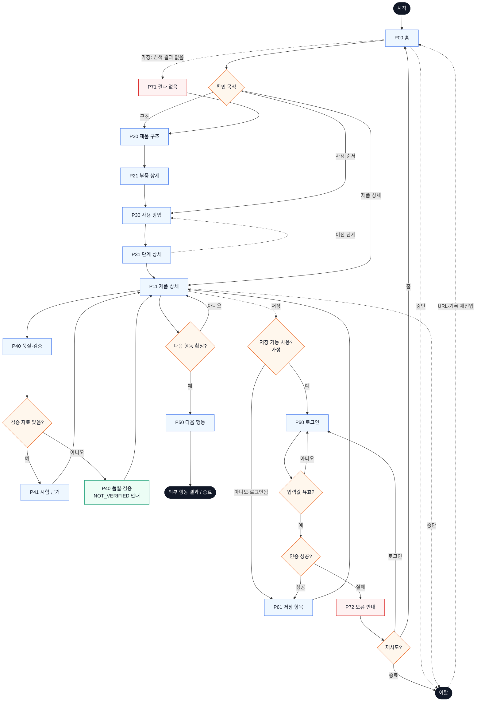

# YOVIA 서비스 흐름도 — VC-002

## 서비스 흐름 개요

- 입력: `가상 클라이언트 설계 결과/사이트맵.md`, `가상 클라이언트 분석 결과/VC_002_김도현.md`
- 핵심 흐름: 탐색 → 구조·단계 선택 → 제품 상세 확인 → 품질 근거 판단 → 확정 행동 → 결과 확인
- 원칙: 시험 자료가 없으면 성능을 단정하지 않고 P40에서 `NOT_VERIFIED`; 로그인은 저장 기능을 위한 `가정`

## 사용자 유형과 시작 조건

| 유형 | 시작 조건 | 목표 |
|---|---|---|
| 구조 확인 사용자 | P00 또는 공유 링크 | 파우치·스푼·토핑 관계 확인 |
| 사용법 확인 사용자 | P30·P31 직접 진입 | 개봉→취식→정리 순서 확인 |
| 품질 검토 사용자 | P11·P40 진입 | 누수·내압·잔여물 근거 유무 판단 |
| 재방문·회원 사용자 | `가정`: 저장 기능 도입 | 저장 제품·단계 재진입 |

## 핵심 정상 흐름

1. P00 홈에서 구조·사용 순서·제품 상세 중 목적을 선택한다.
2. P20→P21 또는 P30→P31에서 부품과 단계를 선택한다.
3. P11 제품 상세에서 전체 정보를 확인하고 P40 품질·검증으로 이동한다.
4. 실제 시험 자료가 있으면 P41, 없으면 P40의 `NOT_VERIFIED` 안내를 확인한다.
5. 행동 목적·채널이 확정된 경우에만 P50으로 이동해 결과를 확인한다.

## 분기·오류·이탈·재진입

- 결과 없음: 가정 검색 결과가 없으면 P71에서 핵심 구조 탐색으로 복귀한다.
- 입력 오류: P60 로그인 필수값·형식 오류는 동일 화면에 연결해 표시한다.
- 인증 오류: 인증 실패는 P72에서 재시도·홈·종료를 선택한다.
- 근거 없음: P41을 빈 화면으로 열지 않고 P40에서 미검증 상태와 필요한 자료를 안내한다.
- 이전 단계: P31에서 P30으로, 모든 상세 화면에서 상위 화면으로 복귀 가능하다.
- 이탈·재진입: 홈·상세에서 이탈 후 URL·브라우저 기록으로 P00에 재진입한다.

## 단계별 흐름 정의

| 단계 | 사용자 행동 | 시스템 처리 | 화면 | 다음 조건 |
|---|---|---|---|---|
| F01 | 서비스 진입 | 핵심 상태·내비게이션 로드 | P00 홈 | 확인 목적 선택 |
| F02 | 제품 구조 선택 | 실제 자산과 라벨 로드 | P20 제품 구조 | 부품 선택 |
| F03 | 부품 확인 | 역할·관계·확정 상태 표시 | P21 부품 상세 | 사용 방법 이동 |
| F04 | 전체 순서 확인 | 단계 목록 표시 | P30 사용 방법 | 단계 선택 |
| F05 | 단계 이동 | 현재 행동·제품 상태 표시 | P31 단계 상세 | 다음·이전·상세 |
| F06 | 제품 정보 통합 확인 | 갤러리·구조·사용·검증 요약 | P11 제품 상세 | 품질 확인 |
| F07 | 품질 주장 확인 | 자료 존재 여부 판단 | P40 품질·검증 | P41 또는 미검증 안내 |
| F08 | 시험 문서 확인 | 조건·방법·결과·출처 표시 | P41 시험 근거 | P11 복귀 |
| F09 | 확정 행동 선택 | 행동 목적·채널 상태 판단 | P11 제품 상세 | P50 또는 상세 유지 |
| F10 | 다음 행동 실행 | 확정 외부 채널 연결 | P50 다음 행동 | 결과·종료 |
| F11 | 저장 선택 | `가정`: 로그인 상태 판단 | P11 제품 상세 | P60 또는 P61 |
| F12 | 로그인 입력 | 필수값·형식 검사 | P60 로그인 | 인증 판단 |
| F13 | 저장 항목 선택 | 저장 목록 반환 | P61 저장 항목 | P11·P31 |
| F14 | 오류 확인 | 재시도·대체 경로 제공 | P72 오류 안내 | P60·P00·종료 |
| F15 | 결과 없음 확인 | 검색 완화·구조 진입 제공 | P71 결과 없음 | P20·P70 |

## 도달성 검토

- 모든 화면 이름은 사이트맵과 일치한다.
- P41·P50 조건이 충족되지 않아도 P40·P11에서 흐름이 계속된다.
- P71·P72는 각각 P20·P00 복귀 경로를 갖는다.
- 로그인 가정을 제거해도 P00→P20/P30→P11→P40→P50 핵심 흐름은 유지된다.

## Mermaid 전체 서비스 흐름도

