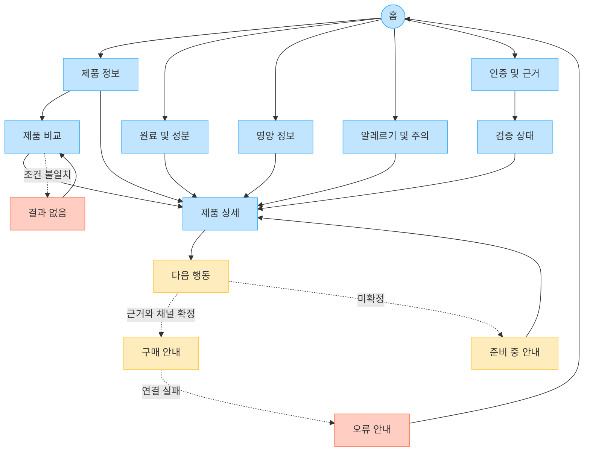

# YOVIA VC-003 사이트맵

## 프로젝트 개요

구매 전 비교 사용자가 YOVIA의 확정 제품 속성, 실제 원료·영양·알레르기 정보, 인증·시험 근거를 모바일에서 단계적으로 확인하도록 설계한다. 친근한 제품·원료 중심 표현을 사용하며, 실제 YOVIA 문서가 없는 수치·인증·건강 및 의료 효능은 구매 유도에 연결하지 않는다.

## 설계 근거와 핵심 사용자 목표

| 사용자 목표 | 근거 | 설계 반영 |
|---|---|---|
| 확정 속성과 원료·영양·알레르기 구분 | VC003-REQ-001 | 각 정보 페이지 분리, 상태 라벨 |
| 수치·인증의 문서 근거 확인 | VC003-REQ-002 | 인증 및 근거→검증 상태 연결 |
| 미검증 효능을 구매 판단에서 배제 | VC003-REQ-003 | NOT_VERIFIED는 행동과 연결 금지 |
| 모바일에서 핵심→상세 확인 | VC003-REQ-004 | 1열 요약, 상세 펼치기 후보 |
| 전문적이되 위협적이지 않은 경험 | VC003-REQ-005 | 제품·원료 중심 이미지, 중립 문구 |
| 검증되지 않은 고도화 기능 보류 | VC003-REQ-006 | QR·배치·미생물 조회 미설계(HOLD) |

## 전역 내비게이션 구조

- 공통 GNB: 홈, 제품 정보, 원료 및 성분, 영양 정보, 알레르기 및 주의, 인증 및 근거
- 공통 유틸리티: 이전 화면, 홈 이동, 현재 위치. 전체 검색·브레드크럼은 `가정`
- 회원 상태별 영역: 로그인·회원 요구가 없어 비회원 탐색만 확정. 회원 화면은 설계하지 않음
- 조건부 영역: 제품 상세의 다음 행동과 구매 안내. CTA 목적·판매 채널은 `가정`
- 예외 페이지: 결과 없음, 준비 중 안내, 오류 안내

## 계층형 사이트맵

```text
1차 홈
├─ 1차 제품 정보
│  ├─ 2차 제품 비교
│  │  └─ 3차 결과 없음 [예외]
│  └─ 2차 제품 상세
│     └─ 3차 다음 행동 [조건부]
│        ├─ 3차 구매 안내 [가정]
│        └─ 3차 준비 중 안내 [예외]
├─ 1차 원료 및 성분
├─ 1차 영양 정보
├─ 1차 알레르기 및 주의
├─ 1차 인증 및 근거
│  └─ 2차 검증 상태
└─ 1차 오류 안내 [예외]
```

## 페이지 정의

| 깊이 | 페이지 | 목적 | 핵심 콘텐츠 | 주요 기능 | 연결 페이지 |
|---|---|---|---|---|---|
| 1 | 홈 | 핵심 확정 정보로 빠른 진입 | 제품 속성, 원료·영양·알레르기 요약 | 1열 탐색, 상태 라벨 | 제품 정보, 원료 및 성분, 영양 정보, 알레르기 및 주의, 인증 및 근거 |
| 1 | 제품 정보 | 확정 제품 속성 탐색 | 락토프리·무가당 등 적용 범위 | 속성별 탐색 후보 | 제품 비교, 제품 상세 |
| 2 | 제품 비교 | 핵심 적합성 비교 | 속성·원료·영양·알레르기 요약 | 비교 카드, 필터 후보 | 제품 상세, 결과 없음 |
| 2 | 제품 상세 | 제품별 사실과 근거 통합 | 확정 속성, 원료, 영양, 주의, 적용 근거 | 아코디언, 정보 전환 후보 | 모든 정보 페이지, 다음 행동 |
| 1 | 원료 및 성분 | 실제 원료와 역할 확인 | 전성분·주요 원료·적용 제품 | 핵심 요약, 상세 펼치기 | 제품 상세, 인증 및 근거 |
| 1 | 영양 정보 | 영양성분과 기준량 확인 | 수치, 단위, 기준량, 기준일 | 모바일 표 대체, 옵션 전환 후보 | 제품 상세, 검증 상태 |
| 1 | 알레르기 및 주의 | 적합성과 회피 정보 확인 | 포함·교차접촉·주의 | 고정 주의, 속성 필터 후보 | 제품 비교, 제품 상세 |
| 1 | 인증 및 근거 | 인증·시험·출처 확인 | 적용 범위, 발급·시험 주체, 기준일 | 근거 문서 연결 후보 | 검증 상태, 제품 상세 |
| 2 | 검증 상태 | 정보 공개 수준 설명 | CONFIRMED·CANDIDATE·NOT_VERIFIED·HOLD | 상태 범례, 공개 통제 | 인증 및 근거, 제품 상세 |
| 3 | 다음 행동 | 검토 후 가능한 행동 선택 | 비교 재확인, 조건부 구매 | 목적별 CTA | 제품 비교, 구매 안내, 준비 중 안내 |
| 3 | 구매 안내 | 확정 채널로 이동 | 판매 채널·도착 정보 | 외부 연결 | 다음 행동, 오류 안내 |
| 3 | 결과 없음 | 비교 조건 복구 | 적용 조건과 해제 안내 | 필터 초기화 | 제품 비교, 제품 정보 |
| 3 | 준비 중 안내 | 미확정 CTA 복구 | 근거·채널 미확정 상태 | 상세 복귀 | 제품 상세, 제품 비교 |
| 1 | 오류 안내 | 경로·연결 실패 복구 | 오류 설명 | 재시도, 홈 이동 | 홈, 구매 안내 |

`가정`: 제품 옵션, 비교 필터 항목, 회원 분기, 구매 채널과 CTA, 전체 검색·브레드크럼. `HOLD`: QR 배치 추적, 미생물 데이터 조회. 미검증 건강·의료 효능은 페이지 및 CTA에서 제외한다.

## Mermaid 사이트맵


