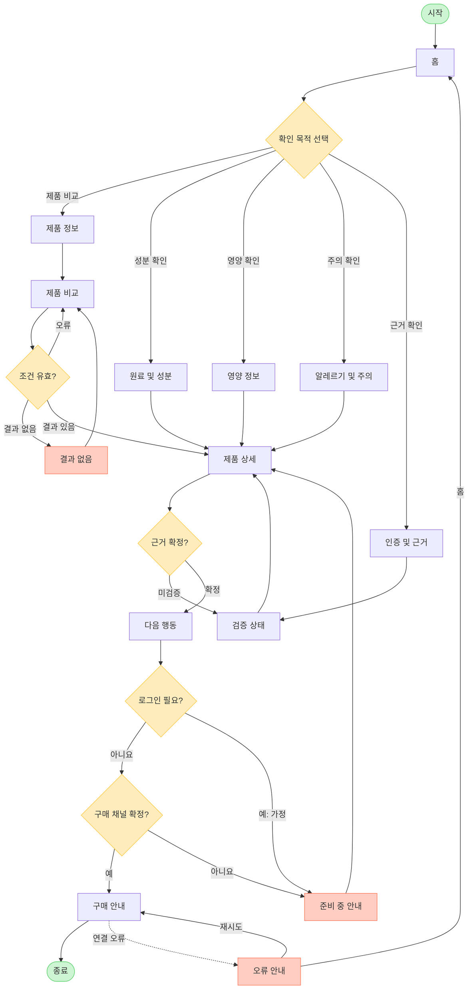

# YOVIA VC-003 서비스 흐름도

## 서비스 흐름 개요

사용자는 홈에서 비교·성분·영양·주의·근거 중 목적을 선택하고, 핵심 요약과 상세 근거를 확인한 뒤 제품 상세에서 판단한다. `탐색 → 선택 → 상세 확인 → 근거 판정 → 핵심 행동 → 결과 확인` 순서를 유지하며 미검증 정보는 구매 행동으로 연결하지 않는다.

## 사용자 유형과 시작 조건

| 사용자 | 시작 조건 | 상태 |
|---|---|---|
| 구매 전 비교 사용자 | 모바일 웹 홈 또는 정보 페이지 직접 진입 | 핵심 사용자 |
| 알레르기·적합성 확인 사용자 | 알레르기 및 주의 진입 | 주의 정보 우선 |
| 비회원 | 로그인 없이 정보 탐색 | 확정 흐름 |
| 회원 | `가정`: 구매 과정에 로그인이 생길 경우 | 현재 화면 미설계 |

## 핵심 정상 흐름

1. 홈에서 확인 목적을 선택한다.
2. 제품 비교 또는 원료·영양·알레르기·근거를 탐색한다.
3. 제품 상세에서 제품별 적용 정보를 확인한다.
4. 검증 상태가 `CONFIRMED`인지 판정한다.
5. 확정 정보만 다음 행동으로 연결한다.
6. 판매 채널이 확정된 경우 구매 안내를 확인하고 종료한다.

## 분기, 오류, 이탈, 재진입 흐름

- 로그인 여부: 비회원 탐색이 기본이며 로그인 요구는 `가정`. 요구될 경우 준비 중 안내로 이동한다.
- 입력값 오류: 허용되지 않은 필터 값은 인라인 오류 후 제품 비교에 머문다.
- 결과 없음: 필터를 초기화하고 제품 비교로 돌아간다.
- 근거 미확정: 검증 상태에서 출처·기준일·범위를 다시 확인하며 CTA로 진행하지 않는다.
- 구매 채널 미확정: 준비 중 안내 후 제품 상세로 복귀한다.
- 연결 오류: 오류 안내에서 구매 안내를 재시도하거나 홈으로 이동한다.
- 이전 단계: 모든 상세 화면에서 이전 링크와 브라우저 뒤로 가기를 지원한다.
- 재진입: 유효 URL 직접 접근을 허용하고 잘못된 경로는 오류 안내로 보낸다.

## 단계별 정의

| 단계 | 사용자 행동 | 시스템 처리 | 화면 | 다음 조건 |
|---|---|---|---|---|
| 1 | 진입·목적 선택 | 핵심 요약 표시 | 홈 | 탐색 목적 |
| 2A | 제품 속성 탐색 | 제품 정보 표시 | 제품 정보 | 비교/상세 |
| 3A | 비교 조건 입력 | 유효성·결과 검사 | 제품 비교 | 오류/없음/있음 |
| 3B | 조건 수정 | 초기화 | 결과 없음 | 제품 비교 |
| 2B | 원료 확인 | 원료·역할 표시 | 원료 및 성분 | 제품 상세 |
| 2C | 영양 확인 | 기준량·단위 표시 | 영양 정보 | 제품 상세 |
| 2D | 주의 확인 | 포함·교차접촉 상태 표시 | 알레르기 및 주의 | 제품 상세 |
| 2E | 근거 확인 | 출처·적용 범위 표시 | 인증 및 근거 | 검증 상태 |
| 3C | 상태 확인 | 공개 수준 판정 | 검증 상태 | 상세/재확인 |
| 4 | 제품별 정보 판단 | 통합 정보 표시 | 제품 상세 | 근거 판정 |
| 5 | 행동 선택 | 채널·로그인 조건 확인 | 다음 행동 | 구매/준비 중 |
| 6A | 구매 목적지 확인 | 확정 채널 제공 | 구매 안내 | 종료/오류 |
| 6B | 대체 행동 선택 | 미확정 상태 안내 | 준비 중 안내 | 상세 복귀 |
| 7 | 재시도·홈 선택 | 오류 복구 | 오류 안내 | 구매 안내/홈 |

## 전체 서비스 흐름도

