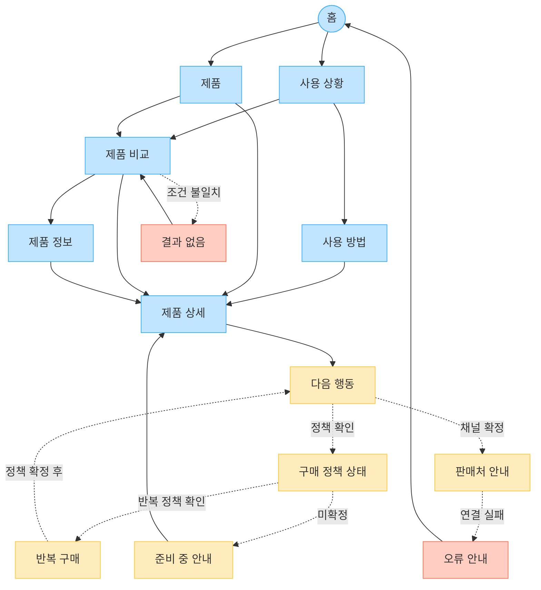

# YOVIA VC-004 사이트맵

## 프로젝트 개요

바쁜 사용자가 출근·등교·업무·수업·운동 사이의 문제를 빠르게 발견하고, YOVIA의 사용 방법과 제품 가치를 확인한 뒤 상황·용도 기준으로 비교하고 확정된 행동으로 이동하는 모바일 우선 구조다. 가격·배송·할인·구독·반복 구매는 정책 근거가 없으므로 확정하지 않는다.

## 설계 근거와 핵심 사용자 목표

| 목표 | 근거 | 반영 |
|---|---|---|
| 일상 상황과 해결 문제를 빠르게 이해 | VC004-REQ-001 | 홈→사용 상황→사용 방법 |
| 모바일에서 이해→비교→행동 | VC004-REQ-002 | 1열 여정, 상세 하단 CTA 후보 |
| 미확정 커머스 약속 배제 | VC004-REQ-003 | 구매 정책 상태 분리 |
| 상황·용도·확정 옵션 비교 | VC004-REQ-004 | 제품 비교와 결과 없음 복구 |
| 목적이 명확한 CTA | VC004-REQ-005 | 제품 비교·제품 확인·판매처 확인 |
| 반복 구매는 정책 확정 후 검토 | VC004-REQ-006 | 반복 구매 `HOLD` |

## 전역 내비게이션 구조

- 공통 GNB: 홈, 사용 상황, 사용 방법, 제품, 제품 비교, 제품 정보
- 공통 유틸리티: 홈·이전 화면 이동. 검색·브레드크럼은 `가정`
- 회원 상태별 영역: 로그인·회원 요구가 없어 비회원 정보 탐색만 확정
- 조건부 영역: 다음 행동, 판매처 안내, 구매 정책 상태, 반복 구매
- 예외 페이지: 결과 없음, 준비 중 안내, 오류 안내

## 계층형 사이트맵

```text
1차 홈
├─ 1차 사용 상황
│  ├─ 2차 사용 방법
│  └─ 2차 제품 비교
│     └─ 3차 결과 없음 [예외]
├─ 1차 제품
│  ├─ 2차 제품 비교
│  ├─ 2차 제품 정보
│  └─ 2차 제품 상세
│     └─ 3차 다음 행동 [조건부]
│        ├─ 3차 판매처 안내 [가정]
│        └─ 3차 구매 정책 상태 [가정]
├─ 1차 반복 구매 [HOLD]
├─ 1차 준비 중 안내 [예외]
└─ 1차 오류 안내 [예외]
```

## 페이지 정의

| 깊이 | 페이지 | 목적 | 핵심 콘텐츠 | 주요 기능 | 연결 페이지 |
|---|---|---|---|---|---|
| 1 | 홈 | 상황과 제품 검토로 진입 | 생활 장면, 핵심 가치 | 모바일 1열 카드 | 사용 상황, 제품 |
| 1 | 사용 상황 | 상황별 문제와 가치 확인 | 출근·등교·업무·수업·운동 장면 | 상황 카드·필터 후보 | 사용 방법, 제품 비교 |
| 2 | 사용 방법 | 준비→휴대→취식→정리 설명 | 실제 행동 순서 | 장면 전환 | 제품 상세 |
| 1 | 제품 | 제품 탐색 허브 | 핵심 제품 요약·카드 | 상세 연결 | 제품 비교, 제품 상세 |
| 2 | 제품 비교 | 상황·용도·옵션 비교 | 선택 기준, 옵션 차이 | 필터·비교표 후보 | 제품 정보, 제품 상세, 결과 없음 |
| 2 | 제품 정보 | 전환 전 신뢰 확인 | 사용성·성분·확정 옵션 | 상세 펼치기 | 제품 상세 |
| 2 | 제품 상세 | 판단 정보와 행동 연결 | 제품 요약, 사용법, 신뢰 정보 | 하단 CTA 후보 | 다음 행동 |
| 3 | 다음 행동 | 목적별 행동 선택 | 제품 비교·제품 확인·판매처 확인 | 목적별 CTA | 제품 비교, 판매처 안내, 구매 정책 상태 |
| 3 | 판매처 안내 | 확정 채널 안내 | 판매처·도착 정보 | 외부 연결 | 다음 행동, 오류 안내 |
| 3 | 구매 정책 상태 | 가격·배송·할인 상태 확인 | 정책 적용 범위·기준일 | 상태 라벨 | 다음 행동, 준비 중 안내 |
| 1 | 반복 구매 | 확정 후 루틴 관리 설명 | 주기·혜택·변경·해지 | `HOLD` | 다음 행동 |
| 3 | 결과 없음 | 비교 복구 | 적용 조건 | 필터 초기화 | 제품 비교, 제품 |
| 1 | 준비 중 안내 | 정책 미확정 복구 | 미확정 상태 | 상세 복귀 | 제품 상세 |
| 1 | 오류 안내 | 연결 실패 복구 | 오류 설명 | 재시도·홈 | 홈, 판매처 안내 |

`가정`: 실제 제품 옵션·필터, 판매 채널, CTA 목적지, 회원 로그인, 검색·브레드크럼. `NOT_VERIFIED`: 가격·배송·할인. `HOLD`: 구독·반복 구매 관리.

## Mermaid 사이트맵


