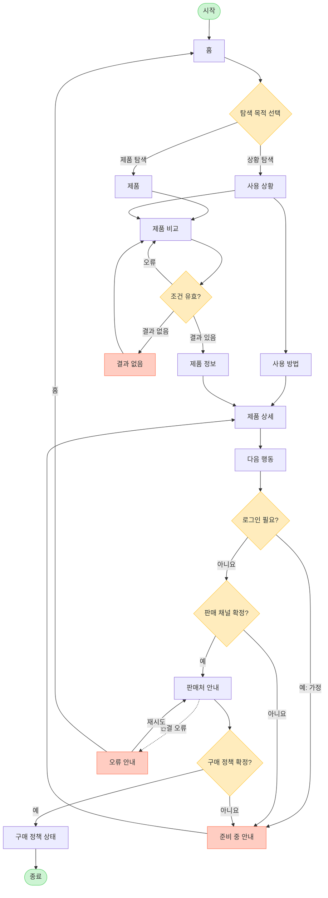

# YOVIA VC-004 서비스 흐름도

## 서비스 흐름 개요

핵심 흐름은 `상황 탐색 → 제품 선택·비교 → 제품 정보와 상세 확인 → 목적별 행동 → 결과 확인`이다. 상황 공감과 제품 탐색 경로가 제품 상세에서 합류하며, 판매 채널과 정책이 확정되지 않으면 준비 중 안내에서 상세로 복귀한다.

## 사용자 유형과 시작 조건

| 사용자 | 시작 조건 | 비고 |
|---|---|---|
| 바쁜 직장인·학생 | 홈에서 일상 상황 선택 | 핵심 사용자 |
| 제품 비교 사용자 | 제품 또는 제품 비교 직접 진입 | 옵션은 `가정` |
| 비회원 | 로그인 없이 탐색 | 확정 흐름 |
| 회원 | `가정`: 구매 과정 로그인 요구 시 | 별도 회원 화면 없음 |

## 핵심 정상 흐름

1. 홈에서 사용 상황 또는 제품 탐색을 선택한다.
2. 상황이면 사용 방법을, 제품이면 제품 비교를 확인한다.
3. 제품 정보와 제품 상세에서 선택 근거를 검토한다.
4. 다음 행동에서 목적이 구체적인 CTA를 선택한다.
5. 채널과 정책이 확정된 경우 판매처 안내와 구매 정책 상태를 확인하고 종료한다.

## 분기, 오류, 이탈, 재진입

- 로그인: 비회원 탐색이 기본. 로그인 요구는 `가정`이며 준비 중 안내로 이동.
- 입력 오류: 잘못된 비교 조건은 인라인 오류 후 제품 비교에 머묾.
- 결과 없음: 필터 초기화 후 제품 비교로 복귀.
- 채널·정책 미확정: 준비 중 안내 후 제품 상세로 복귀.
- 연결 오류: 오류 안내에서 판매처 안내 재시도 또는 홈 이동.
- 이전 단계: 각 화면에 이전 링크와 브라우저 뒤로 가기 제공.
- 재진입: 유효 URL 직접 접근을 허용하고 잘못된 경로는 오류 안내로 이동.

## 단계별 정의

| 단계 | 사용자 행동 | 시스템 처리 | 화면 | 다음 조건 |
|---|---|---|---|---|
| 1 | 진입·목적 선택 | 상황·제품 카드 표시 | 홈 | 상황/제품 |
| 2A | 생활 장면 선택 | 문제·가치 표시 | 사용 상황 | 방법/비교 |
| 3A | 행동 순서 확인 | 준비→휴대→취식→정리 표시 | 사용 방법 | 상세 |
| 2B | 제품 선택 | 제품 카드 표시 | 제품 | 비교/상세 |
| 3B | 조건 입력 | 값·결과 검사 | 제품 비교 | 오류/없음/있음 |
| 3C | 조건 수정 | 필터 초기화 | 결과 없음 | 비교 복귀 |
| 4 | 신뢰 정보 확인 | 사용성·성분·옵션 표시 | 제품 정보 | 상세 |
| 5 | 최종 검토 | 제품·방법·정보 통합 | 제품 상세 | 다음 행동 |
| 6 | 목적 CTA 선택 | 로그인·채널 상태 확인 | 다음 행동 | 판매처/준비 중 |
| 7 | 판매처 확인 | 목적지 제공 | 판매처 안내 | 정책 확인/오류 |
| 8 | 정책 확인 | 가격·배송·할인 상태 표시 | 구매 정책 상태 | 종료 |
| 9 | 대체 행동 | 미확정 안내 | 준비 중 안내 | 상세 |
| 10 | 재시도·홈 | 오류 복구 | 오류 안내 | 판매처/홈 |

## 전체 서비스 흐름도

