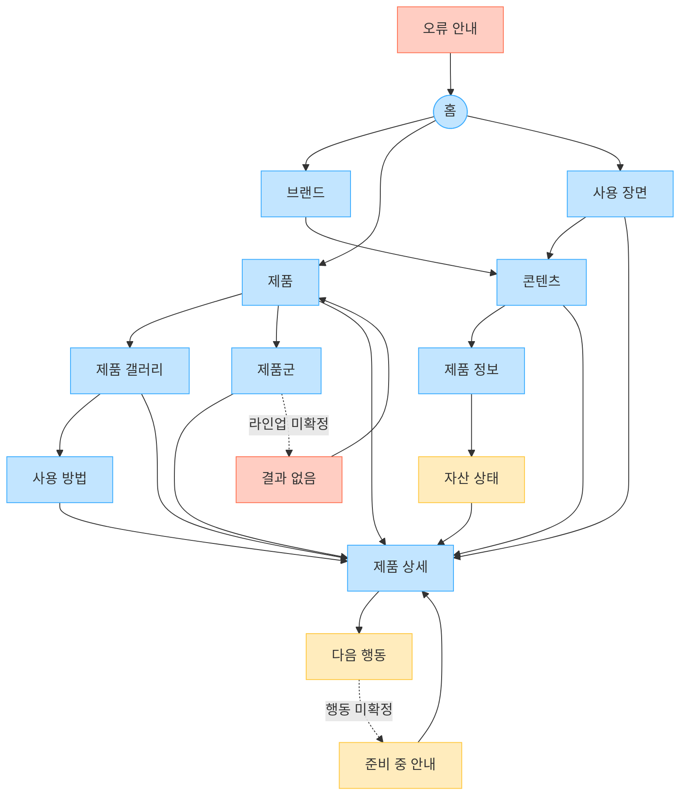

# YOVIA VC-005 사이트맵

## 프로젝트 개요

모바일·SNS에서 유입된 사용자가 실제 패키지·요거트 질감·토핑·개봉·섭취 과정을 먼저 이해하고, 사용 장면과 제품 신뢰 정보를 거쳐 확정 행동으로 이동하는 제품 중심 구조다. 최종 촬영 자산, 맛·제품군, 브랜드 컬러, 사용권, CTA가 미확정이므로 사실처럼 만들지 않는다.

## 설계 근거와 핵심 사용자 목표

| 목표 | 근거 | 반영 |
|---|---|---|
| 패키지·질감·토핑·과정 이해 | VC005-REQ-001 | 제품 갤러리와 사용 방법 |
| 밝고 현대적이되 제품 우선 | VC005-REQ-002 | 제품 중심 카드·짧은 브랜드 설명 |
| 컬러를 탐색 위계로 사용 | VC005-REQ-003 | 텍스트 병기 제품군 라벨(가정) |
| 실제 생활 장면과 제품 연결 | VC005-REQ-004 | 사용 장면→콘텐츠/상세 |
| 이미지가 설명·CTA를 밀지 않음 | VC005-REQ-005 | 대표 이미지→설명→상세 갤러리 |
| 미확정 비주얼 공개 통제 | VC005-REQ-006 | 자산 상태와 HOLD 처리 |

## 전역 내비게이션 구조

- 공통 GNB: 홈, 브랜드, 제품, 사용 방법, 사용 장면, 제품 정보, 콘텐츠
- 공통 유틸리티: 홈·이전 이동. 전체 검색·브레드크럼은 `가정`
- 회원 상태별 영역: 로그인·회원 요구가 없어 비회원 정보 탐색만 확정
- 조건부 영역: 제품군, 자산 상태, 다음 행동
- 예외 페이지: 준비 중 안내, 결과 없음, 오류 안내

## 계층형 사이트맵

```text
1차 홈
├─ 1차 브랜드
│  └─ 2차 콘텐츠
├─ 1차 제품
│  ├─ 2차 제품 갤러리
│  │  └─ 3차 사용 방법
│  ├─ 2차 제품군 [가정]
│  │  └─ 3차 결과 없음 [예외]
│  └─ 2차 제품 상세
│     └─ 3차 다음 행동 [조건부]
│        └─ 3차 준비 중 안내 [예외]
├─ 1차 사용 장면
├─ 1차 제품 정보
│  └─ 2차 자산 상태
└─ 1차 오류 안내 [예외]
```

## 페이지 정의

| 깊이 | 페이지 | 목적 | 핵심 콘텐츠 | 주요 기능 | 연결 페이지 |
|---|---|---|---|---|---|
| 1 | 홈 | 제품 인상과 탐색 진입 | 실제 대표 제품, 짧은 정의 | 이미지 순서 제어 | 브랜드, 제품, 사용 장면 |
| 1 | 브랜드 | 제품 중심 원칙 설명 | 밝음·현대성·젊음 | 관련 콘텐츠 이동 | 콘텐츠, 제품 |
| 1 | 제품 | 제품 탐색 허브 | 실제 제품 카드 | 제품 우선 카드 | 제품 갤러리, 제품군, 제품 상세 |
| 2 | 제품 갤러리 | 패키지·질감·토핑 확인 | 전·후면, 질감, 토핑 | 확대·전환·스와이프 | 사용 방법, 제품 상세 |
| 2 | 제품군 | 확정 라인업 탐색 | 제품군·컬러 의미 | 텍스트 라벨·필터 후보 | 제품 상세, 결과 없음 |
| 3 | 사용 방법 | 개봉·섭취 과정 확인 | 단계 이미지·짧은 설명 | 단계 전환 | 제품 상세 |
| 1 | 사용 장면 | 실제 일상 맥락 확인 | 출근·등교·업무·이동 | 상황 카드 | 콘텐츠, 제품 상세 |
| 1 | 제품 정보 | 구조·성분·주의·근거 확인 | 핵심 신뢰 정보 | 상세 펼치기 | 자산 상태, 제품 상세 |
| 2 | 자산 상태 | 실제·콘셉트·미검증 구분 | CONFIRMED·CONCEPT·NOT_VERIFIED·HOLD | 공개 통제 | 제품 정보, 제품 상세 |
| 2 | 콘텐츠 | 감성 장면을 제품 이해로 연결 | 생활 스토리·관련 제품 | 관련 제품 이동 | 제품 정보, 제품 상세 |
| 2 | 제품 상세 | 이미지·설명·신뢰·행동 통합 | 대표 이미지, 요약, 갤러리, 정보 | 모바일 밀도 제어 | 모든 정보 화면, 다음 행동 |
| 3 | 다음 행동 | 제품 이해 후 행동 선택 | CTA 목적·도착 정보 | 목적별 CTA 후보 | 제품 상세, 준비 중 안내 |
| 3 | 준비 중 안내 | 미확정 행동 복구 | CTA 미확정 상태 | 상세 복귀 | 제품 상세 |
| 3 | 결과 없음 | 미확정 라인업 복구 | 조건·상태 안내 | 제품으로 이동 | 제품, 제품군 |
| 1 | 오류 안내 | 경로·자산 실패 복구 | 오류 설명 | 재시도·홈 | 홈 |

`가정`: 제품군·맛 필터, 최종 컬러, CTA 목적지, 검색·브레드크럼. `NOT_VERIFIED/HOLD`: 최종 촬영·사용권·라인업·효능. 콘셉트 이미지는 `CONCEPT`로 명시한다.

## Mermaid 사이트맵


