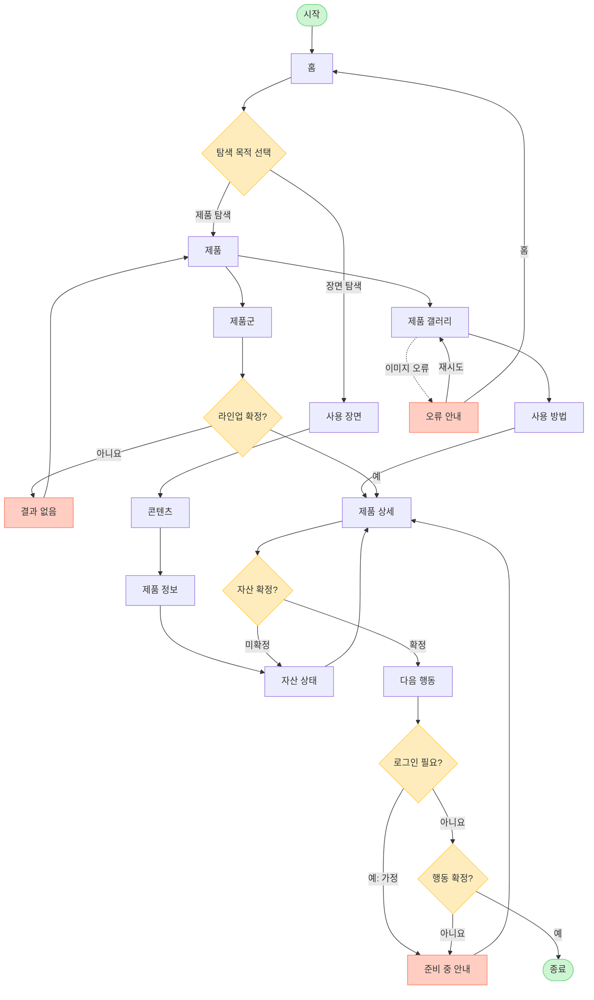

# YOVIA VC-005 서비스 흐름도

## 서비스 흐름 개요

`제품 또는 장면 탐색 → 시각 자산 선택 → 과정·정보 상세 확인 → 자산 상태 판정 → 핵심 행동 → 결과 확인` 흐름이다. 자산이 미확정이면 자산 상태에서 멈추며 실제 제품이나 CTA처럼 노출하지 않는다.

## 사용자 유형과 시작 조건

| 사용자 | 시작 조건 | 비고 |
|---|---|---|
| 모바일·SNS 발견 사용자 | 홈 또는 제품 상세 직접 진입 | 핵심 사용자 |
| 제품 시각 검토 사용자 | 제품 갤러리 진입 | 실제 자산 우선 |
| 비회원 | 로그인 없이 탐색 | 확정 흐름 |
| 회원 | `가정`: 행동에 로그인 필요 시 | 별도 회원 화면 없음 |

## 핵심 정상 흐름

1. 홈에서 제품 또는 사용 장면을 선택한다.
2. 제품 갤러리·사용 방법 또는 장면 콘텐츠를 확인한다.
3. 제품 정보와 자산 상태를 거쳐 제품 상세로 이동한다.
4. 대표 이미지→짧은 설명→상세 갤러리→신뢰 정보 순서로 검토한다.
5. 확정 자산과 행동만 다음 행동으로 연결한다.

## 분기, 오류, 이탈, 재진입

- 로그인: 정보 탐색은 비회원. 로그인 요구는 `가정`이며 준비 중 안내로 이동.
- 입력 오류: 제품군 필터 값 오류는 인라인 안내 후 제품군에 머묾.
- 결과 없음: 라인업 미확정 또는 결과 0건이면 제품으로 복귀.
- 자산 미확정: 자산 상태에서 CONCEPT·NOT_VERIFIED·HOLD 확인 후 상세로 복귀.
- 이미지 오류: 오류 안내에서 갤러리 재시도 또는 홈 이동.
- 이전 단계: 각 화면에 이전 링크와 브라우저 뒤로 가기 제공.
- 재진입: 유효 URL은 직접 진입, 잘못된 경로는 오류 안내.

## 단계별 정의

| 단계 | 사용자 행동 | 시스템 처리 | 화면 | 다음 조건 |
|---|---|---|---|---|
| 1 | 진입·목적 선택 | 대표 제품·장면 표시 | 홈 | 제품/장면 |
| 2A | 제품 선택 | 제품 카드 표시 | 제품 | 갤러리/제품군/상세 |
| 3A | 이미지 확인 | 전환·확대·대체 텍스트 제공 | 제품 갤러리 | 방법/상세/오류 |
| 3B | 라인업 조건 선택 | 값·결과 검사 | 제품군 | 확정/결과 없음 |
| 3C | 복구 | 조건 해제 | 결과 없음 | 제품 |
| 4A | 과정 확인 | 개봉·섭취 단계 표시 | 사용 방법 | 상세 |
| 2B | 생활 장면 선택 | 장면·제품 행동 표시 | 사용 장면 | 콘텐츠/상세 |
| 3D | 스토리 확인 | 관련 제품·정보 연결 | 콘텐츠 | 정보/상세 |
| 4B | 신뢰 정보 확인 | 구조·성분·주의 표시 | 제품 정보 | 자산 상태 |
| 5 | 공개 상태 확인 | 자산 공개 수준 판정 | 자산 상태 | 상세/재확인 |
| 6 | 최종 검토 | 이미지·설명·근거 통합 | 제품 상세 | 자산 판정 |
| 7 | 행동 선택 | 로그인·행동 상태 확인 | 다음 행동 | 종료/준비 중 |
| 8 | 대체 행동 | 미확정 상태 안내 | 준비 중 안내 | 상세 |
| 9 | 재시도·홈 | 이미지·경로 오류 복구 | 오류 안내 | 갤러리/홈 |

## 전체 서비스 흐름도

