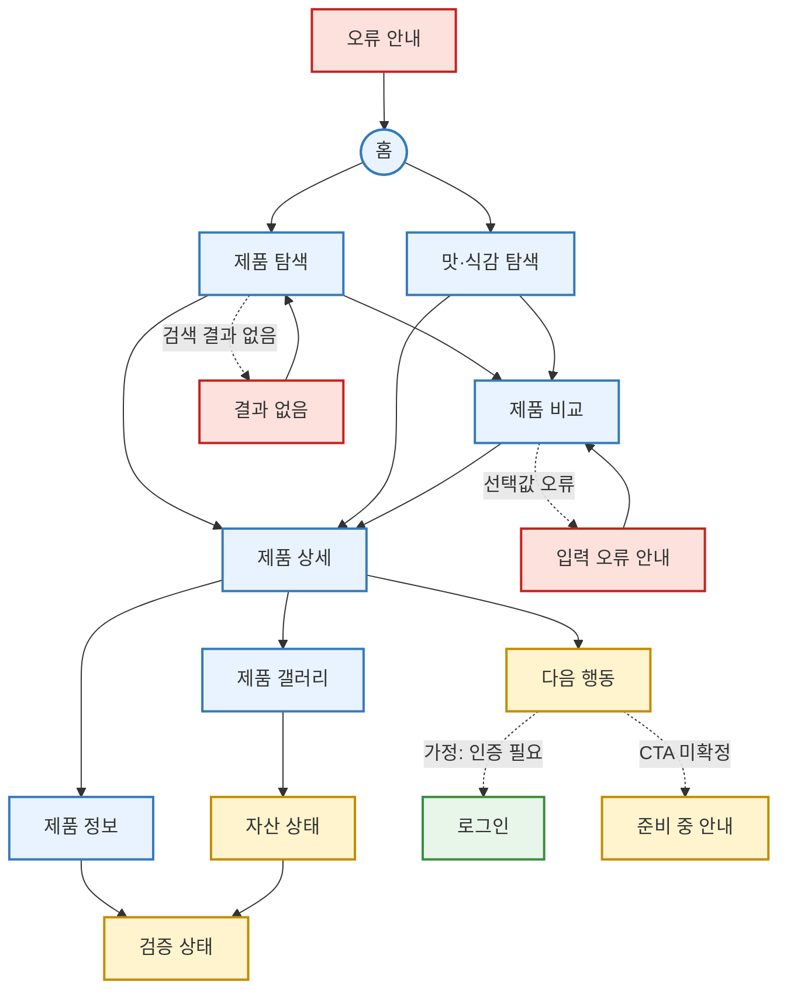

# YOVIA VC-006 정다은 사이트맵

## 프로젝트 개요

YOVIA의 실제 제품 자산을 기준으로 사용자가 맛·질감·토핑을 빠르게 이해하고 비교한 뒤 제품 상세와 확정 가능한 행동으로 이동하도록 구성한 모바일 우선 사이트맵이다. 분석 기준은 `VC006-REQ-001~006`이며, 타사 맛이나 미확정 라인업을 YOVIA 제품으로 확정하지 않는다.

## 설계 근거와 핵심 사용자 목표

| 근거 | 설계 반영 | 핵심 사용자 목표 |
|---|---|---|
| VC006-REQ-001 | 실제 자산 중심 갤러리와 감각 요약 | 실제 제품의 맛·질감·토핑 파악 |
| VC006-REQ-002 | `CONFIRMED`·`CONCEPT`·`NOT_VERIFIED` 상태 표시 | 실제 촬영과 콘셉트 구분 |
| VC006-REQ-003 | 감각 필터와 비교 화면 | 확정된 옵션 간 차이 비교 |
| VC006-REQ-004 | 색상과 맛 이름·상태 텍스트 병기 | 색상에 의존하지 않고 제품군 식별 |
| VC006-REQ-005 | 이미지→요약→근거→행동의 모바일 순서 | 작은 화면에서 핵심 정보 확인 |
| VC006-REQ-006 | 검증 상태 및 공개 통제 | 미확정 맛·효능을 사실로 오인하지 않기 |

## 전역 내비게이션 구조

- 공통 GNB: `홈`, `제품 탐색`, `맛·식감 탐색`
- 공통 보조 이동: `제품 비교`, `제품 상세`, `제품 정보`
- 상태·거버넌스: `자산 상태`, `검증 상태`
- 회원 상태별 영역: `로그인`은 핵심 행동에 인증이 필요할 경우에만 노출하는 **가정**이다. 회원 전용 기능은 입력에 없어 확정하지 않는다.
- 공통 푸터: 홈·제품 탐색·검증 상태·오류 복구 링크. 촬영 출처·사용권 문구는 운영 자료 확정 전 **가정**이다.

## 계층형 사이트맵

- 1차 — 홈
  - 2차 — 제품 탐색
    - 3차 — 제품 비교
    - 3차 — 제품 상세
    - 3차 — 결과 없음
  - 2차 — 맛·식감 탐색
    - 3차 — 제품 비교
    - 3차 — 제품 상세
- 1차 — 제품 상세
  - 2차 — 제품 갤러리
    - 3차 — 자산 상태
  - 2차 — 제품 정보
    - 3차 — 검증 상태
  - 2차 — 다음 행동
    - 3차 — 로그인 (**가정: 인증 필요 시**)
    - 3차 — 준비 중 안내
- 1차 — 예외 페이지
  - 2차 — 결과 없음
  - 2차 — 입력 오류 안내
  - 2차 — 오류 안내

`제품 비교`와 `제품 상세`는 두 탐색 허브에서 접근하는 공유 페이지이며 중복 생성하지 않는다.

## 페이지별 정의

| 깊이·영역 | 페이지 | 목적 | 핵심 콘텐츠 | 주요 기능 | 연결 페이지 |
|---|---|---|---|---|---|
| 1·공통 | 홈 | 실제 대표 제품으로 탐색 시작 | 대표 이미지, 확인된 감각 요약, 상태 라벨 | 탐색 진입 | 제품 탐색, 맛·식감 탐색 |
| 2·공통 | 제품 탐색 | 확정 제품 후보 탐색 | 제품 카드, 이름, 상태 | 필터, 카드 선택 | 제품 비교, 제품 상세, 결과 없음 |
| 2·공통 | 맛·식감 탐색 | 맛·질감·토핑 기준 탐색 | 감각 용어, 텍스트 범례 | 조건 선택, 초기화 | 제품 비교, 제품 상세 |
| 3·공통 | 제품 비교 | 확정 옵션 차이 확인 | 맛·질감·토핑 비교표 | 비교 항목 추가·제거 | 제품 상세, 입력 오류 안내 |
| 3·공통 | 제품 상세 | 제품 이해와 행동 통합 | 대표 이미지, 감각 요약, 상태, 근거 | 갤러리·정보·행동 이동 | 제품 갤러리, 제품 정보, 다음 행동 |
| 2·공통 | 제품 갤러리 | 실제 이미지 세부 확인 | 대표·상세 이미지, 대체 텍스트 | 확대, 전환, 스와이프 | 제품 상세, 자산 상태 |
| 2·공통 | 제품 정보 | 감각 정보의 근거 확인 | 적용 제품, 원료·영양 연결, 보류 항목 | 상세 펼치기 | 제품 상세, 검증 상태 |
| 3·조건부 | 자산 상태 | 실제·콘셉트·미검증 구분 | 상태 범례, 촬영 출처 | 상태별 보기 | 제품 갤러리, 검증 상태 |
| 3·조건부 | 검증 상태 | 공개 가능 정보와 HOLD 구분 | 확정·미검증·보류 목록 | 관련 제품 이동 | 제품 정보, 제품 상세 |
| 2·조건부 | 다음 행동 | 확인 완료 후 행동 선택 | 행동 목적, 도착 정보 | CTA 실행 | 로그인, 준비 중 안내 |
| 3·회원 가정 | 로그인 | 인증 필요 행동 지원 | 로그인 입력 | 입력 검증, 인증 | 다음 행동, 입력 오류 안내 |
| 3·조건부 | 준비 중 안내 | 미확정 CTA에서 안전하게 복구 | 준비 상태, 대체 경로 | 상세·탐색 복귀 | 제품 상세, 제품 탐색 |
| 2·예외 | 결과 없음 | 필터 결과가 없을 때 복구 | 적용 조건, 초기화 안내 | 조건 초기화 | 제품 탐색 |
| 2·예외 | 입력 오류 안내 | 잘못된 비교·로그인 입력 복구 | 오류 원인, 수정 안내 | 이전 단계 이동 | 제품 비교, 로그인 |
| 2·예외 | 오류 안내 | URL·데이터·이미지 오류 복구 | 오류 설명, 재시도 | 홈 이동, 재시도 | 홈, 제품 갤러리 |

## 주요 사용자 여정

`홈 → 제품 탐색 또는 맛·식감 탐색 → 제품 비교 → 제품 상세 → 다음 행동 → 결과 확인`을 기본 여정으로 한다. 근거 확인은 `제품 상세 → 제품 갤러리/제품 정보 → 자산 상태/검증 상태`로 분기한다.

## 가정 및 검토 결과

- **가정**: 다음 행동이 인증을 요구할 수 있어 `로그인`을 조건부로 둔다. 인증 정책과 실제 CTA는 미확정이다.
- **가정**: 제품 검색·비교는 최종 라인업 확정 후 활성화한다.
- `CONCEPT`·`NOT_VERIFIED` 항목은 구매·신청 행동에 연결하지 않는다.
- 모든 정상·조건부·예외 페이지는 홈 또는 직전 정상 흐름으로 복귀 가능하다.
- 동일 이름의 공유 페이지는 하나의 노드로 통합했으며 끊긴 페이지와 중복 페이지가 없다.

## Mermaid 사이트맵

