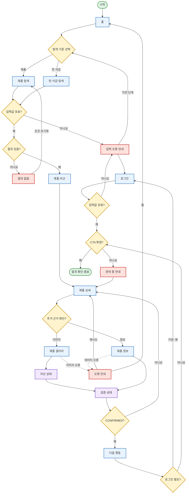

# YOVIA VC-006 정다은 서비스 흐름도

## 서비스 흐름 개요

사용자가 제품 또는 맛·식감 기준으로 탐색하고, 결과를 비교해 제품 상세를 확인한 뒤 실제 자산과 검증 상태를 확인하고 확정 가능한 행동의 결과까지 도달하는 흐름이다. 기본 순서는 `탐색 → 선택 → 상세 확인 → 핵심 행동 → 결과 확인`이며 미확정 자산은 행동에서 제외한다.

## 사용자 유형과 시작 조건

| 사용자 유형 | 시작 조건 | 주요 목표 |
|---|---|---|
| 감각 중심 탐색자 | 홈·SNS 링크에서 진입 | 맛·질감·토핑으로 후보 찾기 |
| 제품 중심 탐색자 | 제품명 또는 제품 카드로 진입 | 실제 제품 이미지와 상세 확인 |
| 근거 확인 사용자 | 제품 상세에서 상태 정보 선택 | 실제·콘셉트·미검증 구분 |
| 비회원 | 기본 상태 | 공개 정보 탐색과 비교 |
| 회원/인증 사용자 | **가정: 핵심 행동에 인증 필요** | 인증 후 확정 행동 수행 |
| 재진입 사용자 | 공유 링크·오류 복구·이전 단계 | 기존 맥락으로 복귀 |

## 핵심 정상 흐름

1. `홈`에서 `제품 탐색` 또는 `맛·식감 탐색`을 선택한다.
2. 유효한 조건으로 결과를 얻고 `제품 비교`에서 옵션을 선택한다.
3. `제품 상세`에서 대표 이미지, 감각 요약, 상태 라벨을 확인한다.
4. 필요하면 `제품 갤러리`·`제품 정보`와 `자산 상태`·`검증 상태`를 확인한다.
5. `CONFIRMED` 정보에 한해 `다음 행동`으로 이동한다.
6. 인증이 필요하지 않고 CTA가 확정되었다면 결과를 확인하고 종료한다.

## 분기·오류·이탈·재진입 흐름

- 로그인 여부: 인증 필요 여부는 **가정**이다. 필요하면 `로그인`, 아니면 행동 확정 판단으로 이동한다.
- 입력값 오류: 필터·비교·로그인 값이 유효하지 않으면 `입력 오류 안내`에서 수정 후 이전 화면으로 복귀한다.
- 결과 없음: `결과 없음`에서 조건을 초기화하여 `제품 탐색`으로 돌아간다.
- 미확정 자산: `검증 상태`가 `CONFIRMED`가 아니면 `제품 상세`로 복귀하고 CTA를 제공하지 않는다.
- CTA 미확정: `준비 중 안내`에서 제품 상세 또는 탐색으로 복귀한다.
- 로딩 오류: `오류 안내`에서 재시도하거나 `홈`으로 이동한다.
- 이전 단계 이동: 탐색 조건과 비교 선택은 가능한 범위에서 유지한다는 **가정**을 적용한다.

## 단계별 흐름

| 단계 | 사용자 행동 | 시스템 처리 | 화면 | 다음 조건 |
|---:|---|---|---|---|
| 1 | 서비스 진입 | 공개 홈 제공 | 홈 | 탐색 기준 선택 |
| 2 | 제품/감각 기준 선택 | 해당 탐색 UI 표시 | 제품 탐색 / 맛·식감 탐색 | 입력 검증 |
| 3 | 필터·조건 적용 | 입력 형식과 공개 가능 값 확인 | 제품 탐색 / 맛·식감 탐색 | 유효/오류 |
| 4 | 오류 확인·수정 | 원인과 수정 방법 표시 | 입력 오류 안내 | 이전 단계 |
| 5 | 결과 확인 | 확정된 제품만 반환 | 제품 탐색 | 결과 있음/없음 |
| 6 | 조건 초기화 | 필터 초기화 | 결과 없음 | 제품 탐색 |
| 7 | 후보 비교·선택 | 감각 차이와 상태 병기 | 제품 비교 | 제품 선택 |
| 8 | 상세 확인 | 대표 이미지·요약·상태 제공 | 제품 상세 | 근거 확인/행동 |
| 9 | 이미지 확인 | 확대·전환·대체 텍스트 제공 | 제품 갤러리 | 자산 상태 |
| 10 | 사실 정보 확인 | 적용 제품·근거·보류 항목 제공 | 제품 정보 | 검증 상태 |
| 11 | 자산 출처 확인 | 상태별 공개 가능성 표시 | 자산 상태 | 검증 상태 |
| 12 | 확정 여부 판단 | `CONFIRMED` 여부 판정 | 검증 상태 | 상세 복귀/다음 행동 |
| 13 | 핵심 행동 선택 | 인증 필요 여부 판단 | 다음 행동 | 로그인/CTA 판단 |
| 14 | **가정:** 로그인 | 입력 검증·인증 | 로그인 | 성공/입력 오류 |
| 15 | 준비 상태 확인 | 대체 경로 제공 | 준비 중 안내 | 제품 상세 |
| 16 | 오류 복구 | 재시도 또는 홈 이동 | 오류 안내 | 상세/홈 |
| 17 | 결과 확인 | 확정 행동 결과 제공 | 다음 행동 | 종료 |

## 연결성 검토

- 사이트맵의 15개 화면 이름을 그대로 사용했다.
- 모든 화면은 `홈`에서 도달하거나 정상 흐름 중 조건으로 도달한다.
- 예외 화면은 모두 이전 정상 화면 또는 홈으로 복귀한다.
- `CONFIRMED`가 아닌 자산은 핵심 행동으로 직접 연결되지 않는다.

## Mermaid 전체 서비스 흐름도

