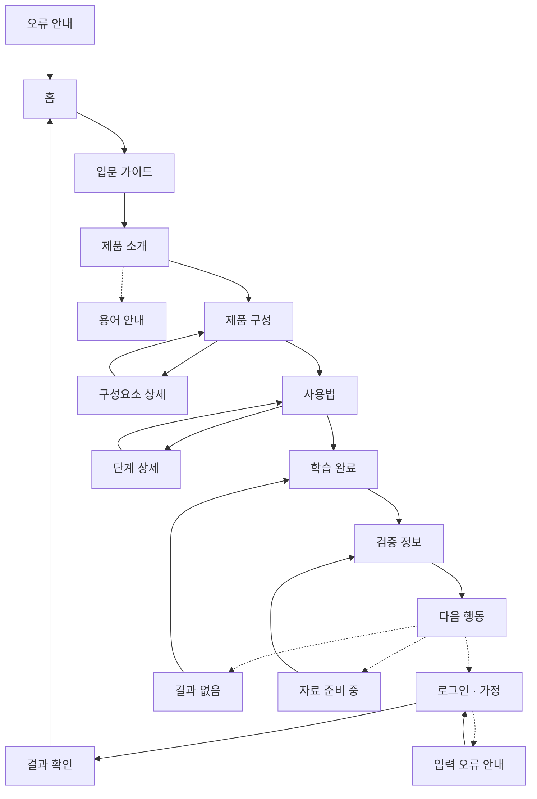

# YOVIA VC-011 사이트맵

## 프로젝트 개요
첫 방문자가 브랜드 정의 → 제품 구성 → 사용법 → 검증 정보 → 다음 행동 순서로 YOVIA를 이해하는 모바일 우선 교육형 웹사이트다. 미확정 사양은 가정, NOT_VERIFIED, HOLD로 구분한다.

## 설계 근거와 핵심 사용자 목표
| 목표 | 근거 | 설계 반영 |
|---|---|---|
| 정의와 편익 즉시 이해 | VC011-REQ-001 | 홈·제품 소개 |
| 파우치·스푼·토핑 관계 이해 | VC011-REQ-002 | 제품 구성·상세 |
| 낯선 용어 확인 | VC011-REQ-003 | 용어 안내 |
| 모바일 학습 순서 유지 | VC011-REQ-004 | 입문·단계 진행 |
| 교육 후 검증·행동 연결 | VC011-REQ-005 | 완료·검증·행동 |
| 미확정 사양 공개 금지 | VC011-REQ-006 | 준비 중·CTA 차단 |

## 전역 내비게이션 구조
- 공통: 홈, 제품 소개, 제품 구성, 사용법, 검증 정보
- 회원 상태: 교육 탐색은 비회원 가능. 로그인은 후속 행동에서만 가정
- 주요 여정: 홈→입문→소개→구성→사용법→완료→검증→행동
- 예외: 결과 없음, 입력 오류 안내, 자료 준비 중, 오류 안내
- 전체 검색과 제품 비교는 근거 부족으로 제외

## 계층형 사이트맵
```text
홈
├─ 입문 가이드
│  ├─ 제품 소개
│  ├─ 제품 구성
│  │  └─ 구성요소 상세
│  ├─ 사용법
│  │  └─ 단계 상세
│  └─ 학습 완료
│     ├─ 검증 정보
│     └─ 다음 행동 [조건부]
│        ├─ 로그인 [가정]
│        └─ 결과 확인 [조건부]
├─ 용어 안내
├─ 결과 없음 [예외]
├─ 입력 오류 안내 [예외]
├─ 자료 준비 중 [예외]
└─ 오류 안내 [예외]
```

## 페이지별 정의
| 깊이 | 페이지 | 목적 | 핵심 콘텐츠 | 기능 | 연결 |
|---|---|---|---|---|---|
| 1 | 홈 | 즉시 이해 | 정의·편익 | 입문 시작 | 입문 가이드 |
| 1 | 입문 가이드 | 순서 예고 | 4단계 개요 | 진행 시작 | 제품 소개 |
| 2 | 제품 소개 | 제품 범위 이해 | 정의·사용 맥락 | 용어 도움말 | 제품 구성·용어 안내 |
| 2 | 제품 구성 | 구성 관계 이해 | 파우치·스푼·토핑 | 요소 선택 | 구성요소 상세·사용법 |
| 3 | 구성요소 상세 | 역할 확인 | 명칭·역할·상태 | 요소 전환 | 제품 구성 |
| 2 | 사용법 | 순서 이해 | 열기·준비·즐기기·정리 | 단계 이동 | 단계 상세·학습 완료 |
| 3 | 단계 상세 | 행동 확인 | 행동·주의·상태 | 이전·다음 | 사용법 |
| 2 | 학습 완료 | 요약·선택 | 체크리스트 | 다시 보기 | 검증·다음 행동 |
| 1 | 용어 안내 | 용어 해소 | 쉬운 정의 | 호출 화면 복귀 | 소개·구성·사용법 |
| 1 | 검증 정보 | 상태 확인 | 근거·기준일 | 근거 확인 | 행동·준비 중 |
| 3 | 다음 행동 | 후속 선택 | 목적·조건 | 조건부 CTA | 로그인·결과 |
| 3 | 로그인 | 인증 | 입력 필드 | 유효성 검사 | 입력 오류·결과 |
| 3 | 결과 확인 | 결과 확인 | 결과·복귀 | 홈 이동 | 홈 |
| 3 | 결과 없음 | 0건 복구 | 조건·대안 | 완료 복귀 | 학습 완료 |
| 3 | 입력 오류 안내 | 입력 수정 | 원인·수정법 | 로그인 복귀 | 로그인 |
| 1 | 자료 준비 중 | 미확정 복구 | 이유·필요 자료 | 검증 복귀 | 검증 정보 |
| 1 | 오류 안내 | 실패 복구 | 오류·재시도 | 홈 이동 | 홈 |

## 검토
모든 정상 화면은 홈에서 도달 가능하고 예외 화면은 복구 경로가 있다. 로그인·결과 확인은 정책 미확정 가정이다.

## Mermaid 사이트맵

