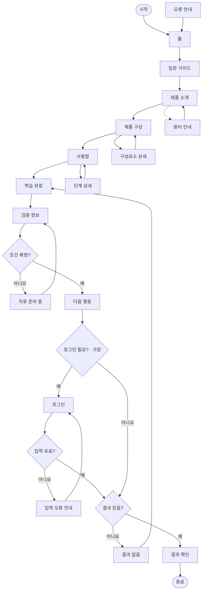

# YOVIA VC-011 서비스 흐름도

## 서비스 흐름 개요
첫 방문자는 제품을 순서대로 학습한 뒤 검증 상태를 확인하고 조건이 충족될 때만 다음 행동으로 이동한다.

## 사용자 유형과 시작 조건
| 사용자 | 시작 | 상태 |
|---|---|---|
| 첫 방문자 | 홈·외부 링크 | 핵심 사용자 |
| 중간 재방문자 | 유효 상세 URL | 현재 단계 표시 |
| 비회원 | 로그인 없이 교육 탐색 | 확정 |
| 회원 | 후속 행동에서 필요할 경우 | 가정 |

## 핵심 정상 흐름
1. 홈에서 입문을 시작한다.
2. 제품 소개와 구성을 확인한다.
3. 사용법을 학습하고 완료한다.
4. 검증 정보를 확인한다.
5. 조건이 확정되면 다음 행동을 선택한다.
6. 로그인 필요 여부를 판정하고 결과를 확인한다.

## 분기, 오류, 이탈, 재진입 흐름
- 용어 안내 후 호출 화면으로 복귀한다.
- 로그인은 가정이며 오류 시 입력 오류 안내에서 수정한다.
- 결과 없음은 학습 완료로 복귀한다.
- 정책 미확정은 자료 준비 중에서 검증 정보로 복귀한다.
- 경로·자산·연결 실패는 오류 안내에서 홈으로 복구한다.
- 유효 URL 재진입을 허용하고 잘못된 URL은 오류 안내로 보낸다.

## 단계별 정의
| 단계 | 행동 | 시스템 처리 | 화면 | 다음 조건 |
|---|---|---|---|---|
| 1 | 입문 시작 | 정의 표시 | 홈 | 입문 |
| 2 | 순서 확인 | 개요 표시 | 입문 가이드 | 시작 |
| 3 | 제품 이해 | 정의·맥락 표시 | 제품 소개 | 구성 |
| 4 | 요소 확인 | 역할·상태 표시 | 제품 구성·구성요소 상세 | 사용법 |
| 5 | 사용법 학습 | 단계 갱신 | 사용법·단계 상세 | 완료 |
| 6 | 학습 확인 | 요약 표시 | 학습 완료 | 검증 |
| 7 | 근거 확인 | 공개 조건 판정 | 검증 정보 | 확정 여부 |
| 8 | 행동 선택 | 로그인 판정 | 다음 행동 | 로그인·결과 |
| 9 | 인증 입력 | 유효성 검사 | 로그인 | 오류·결과 |
| 10 | 결과 확인 | 결과·복귀 제공 | 결과 확인 | 종료 |
| 예외 | 대안·복구 | 상태 유지 | 결과 없음·입력 오류 안내·자료 준비 중·오류 안내 | 이전·홈 |

## 연결성 검토
시작과 종료가 존재하고 모든 판단 분기에 목적지가 있다. 화면명은 사이트맵과 일치한다.

## Mermaid 전체 서비스 흐름도

