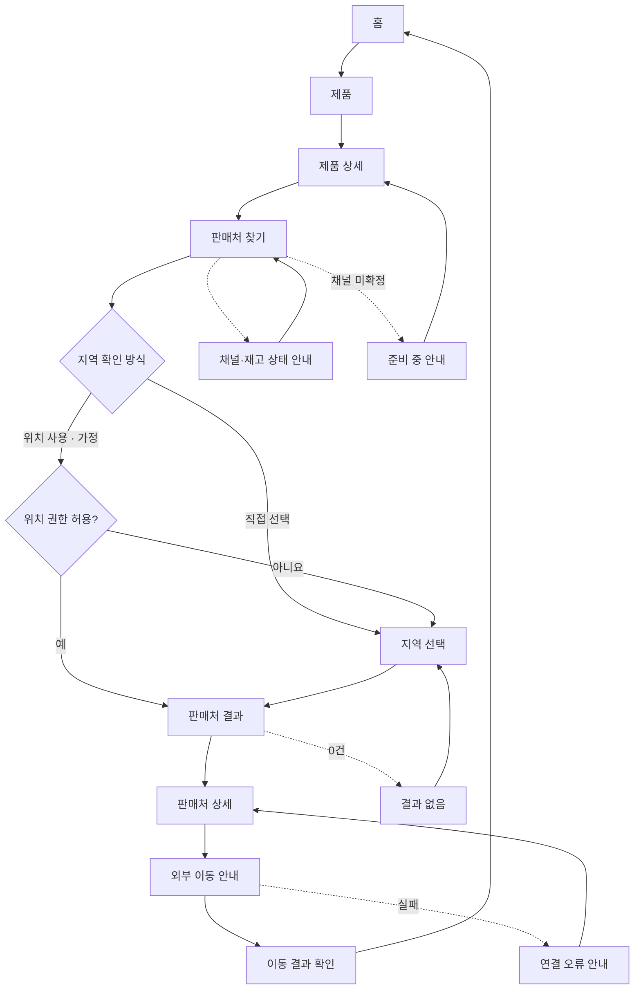

# YOVIA VC-012 사이트맵

## 프로젝트 개요
제품 맥락을 유지하며 확정 판매 채널과 지역별 판매처로 연결하는 모바일 우선 전환 구조다. 위치 권한 없이 지역을 직접 선택할 수 있고 재고·배송은 검증 전 약속하지 않는다.

## 설계 근거와 핵심 사용자 목표
| 목표 | 근거 | 설계 반영 |
|---|---|---|
| 제품별 확정 채널 연결 | VC012-REQ-001 | 제품 상세→판매처 찾기 |
| 채널·지역·재고 기준 표시 | VC012-REQ-002 | 상태 안내·기준일 |
| 위치 권한 없는 대안 | VC012-REQ-003 | 지역 직접 선택 |
| 0건·외부 이동·오류 설명 | VC012-REQ-004 | 독립 예외 화면 |
| 모바일 제품 맥락 유지 | VC012-REQ-005 | 선택 제품 요약 고정 |
| 미확정 재고·배송 약속 금지 | VC012-REQ-006 | 준비 중·HOLD |

## 전역 내비게이션 구조
- 공통: 홈, 제품, 판매처 찾기, 채널·상태 안내
- 제품 맥락: 판매처 흐름 전체에 선택 제품명·상태 유지
- 위치 상태: 권한 사용은 가정, 직접 지역 선택은 필수 대안
- 예외: 입력 오류, 결과 없음, 준비 중, 연결 오류
- 회원 로그인은 요구 근거가 없어 제외

## 계층형 사이트맵
```text
홈
├─ 제품
│  └─ 제품 상세
│     └─ 판매처 찾기
│        ├─ 지역 확인 방식
│        │  ├─ 지역 선택
│        │  └─ 위치 권한 [가정]
│        ├─ 판매처 결과
│        │  ├─ 판매처 상세
│        │  │  └─ 외부 이동 안내
│        │  │     └─ 이동 결과 확인
│        │  └─ 결과 없음 [예외]
│        ├─ 채널·재고 상태 안내
│        ├─ 입력 오류 안내 [예외]
│        ├─ 준비 중 안내 [예외]
│        └─ 연결 오류 안내 [예외]
```

## 페이지별 정의
| 깊이 | 페이지 | 목적 | 핵심 콘텐츠 | 주요 기능 | 연결 |
|---|---|---|---|---|---|
| 1 | 홈 | 제품·판매처 진입 | 브랜드·제품 요약 | 제품 이동 | 제품 |
| 1 | 제품 | 확정 제품 탐색 | 제품 카드·상태 | 제품 선택 | 제품 상세 |
| 2 | 제품 상세 | 제품 맥락 확인 | 제품 요약·채널 상태 | 판매처 시작 | 판매처 찾기 |
| 2 | 판매처 찾기 | 지역 탐색 시작 | 선택 제품·확인 범위 | 방식 선택 | 지역 선택·위치 권한 |
| 3 | 지역 확인 방식 | 지역 방식 선택 | 직접 선택·위치 사용 | 방식 선택 | 지역 선택·위치 권한 |
| 3 | 지역 선택 | 권한 없는 대안 | 지역 입력·최근 기준일 | 입력 검증 | 판매처 결과·입력 오류 |
| 3 | 위치 권한 | 위치 사용 동의 | 목적·거부 대안 | 허용·거부 | 판매처 결과·지역 선택 |
| 3 | 판매처 결과 | 조건별 결과 확인 | 채널·지역·기준일 | 결과 선택 | 판매처 상세·결과 없음 |
| 3 | 판매처 상세 | 채널·상태 확인 | 주소·채널·확인 범위 | 외부 이동 | 상태 안내·외부 이동 안내 |
| 3 | 채널·재고 상태 안내 | 상태 의미 설명 | CONFIRMED·NOT_VERIFIED·기준일 | 상세 복귀 | 판매처 상세 |
| 3 | 외부 이동 안내 | 외부 채널 고지 | 목적지·제품 맥락 | 이동 동의 | 이동 결과·연결 오류 |
| 3 | 이동 결과 확인 | 이동 완료 확인 | 결과·계속 탐색 | 홈 이동 | 홈 |
| 3 | 입력 오류 안내 | 지역값 수정 | 오류·수정법 | 입력 복귀 | 지역 선택 |
| 3 | 결과 없음 | 0건 복구 | 조건·대안 지역 | 조건 변경 | 지역 선택 |
| 3 | 준비 중 안내 | 미확정 채널 복구 | 미확정 이유 | 제품 복귀 | 제품 상세 |
| 3 | 연결 오류 안내 | 외부 실패 복구 | 오류·재시도 | 상세 복귀 | 판매처 상세 |

## 검토
모든 화면은 홈에서 도달 가능하며 모든 예외 화면에 복구 경로가 있다. 재고·배송 실시간 표시는 가정하지 않는다.

## Mermaid 사이트맵

