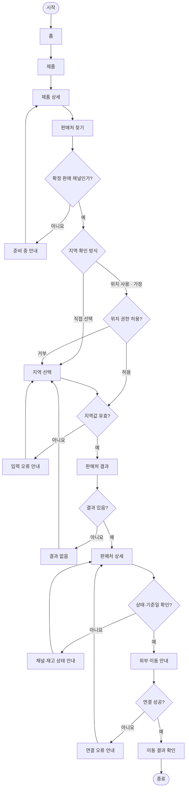

# YOVIA VC-012 서비스 흐름도

## 서비스 흐름 개요
사용자는 제품을 선택하고 확정 채널 여부를 확인한 뒤 직접 지역 선택 또는 선택적 위치 권한으로 판매처를 찾는다. 상태와 기준일을 확인한 뒤 외부 채널로 이동한다.

## 사용자 유형과 시작 조건
| 사용자 | 시작 조건 | 우선 처리 |
|---|---|---|
| 구매 관심 사용자 | 홈·제품 상세 | 선택 제품 유지 |
| 위치 권한 거부 사용자 | 판매처 찾기 | 직접 지역 선택 |
| 모바일 사용자 | 외부 링크·홈 | 1열·복귀 경로 |
| 비회원 | 로그인 없이 탐색 | 기본 흐름 |

## 핵심 정상 흐름
1. 제품을 선택한다.
2. 판매 채널 확정 여부를 판정한다.
3. 지역 확인 방식을 선택한다.
4. 지역을 검증하고 판매처 결과를 확인한다.
5. 판매처 상태·기준일·범위를 확인한다.
6. 외부 이동 안내 후 결과를 확인한다.

## 분기, 오류, 이탈, 재진입 흐름
- 위치 권한 거부 시 지역 선택으로 이동한다.
- 잘못된 지역값은 입력 오류 안내 후 수정한다.
- 결과 0건은 조건 변경으로 복구한다.
- 채널 미확정은 준비 중 안내 후 제품 상세로 복귀한다.
- 외부 연결 실패는 연결 오류 안내 후 판매처 상세로 복귀한다.
- 유효 URL 재진입 시 제품 맥락을 복원하고 없으면 제품 선택을 요구한다.

## 단계별 정의
| 단계 | 사용자 행동 | 시스템 처리 | 화면 | 다음 조건 |
|---|---|---|---|---|
| 1 | 제품 탐색 | 제품 상태 표시 | 홈·제품 | 상세 |
| 2 | 제품 선택 | 제품 맥락 유지 | 제품 상세 | 채널 확인 |
| 3 | 판매처 시작 | 확정 채널 판정 | 판매처 찾기 | 확정 여부 |
| 4 | 지역 방식 선택 | 권한·대안 표시 | 지역 확인 방식 | 직접·위치 |
| 5 | 지역 확인 | 값 유효성 검사 | 지역 선택·위치 권한 | 오류·결과 |
| 6 | 결과 탐색 | 지역·채널 결과 반환 | 판매처 결과 | 0건·상세 |
| 7 | 상태 확인 | 기준일·범위 표시 | 판매처 상세·상태 안내 | 외부 이동 |
| 8 | 외부 이동 | 목적지·연결 검사 | 외부 이동 안내 | 성공·오류 |
| 9 | 결과 확인 | 계속 탐색 제공 | 이동 결과 확인 | 종료 |
| 예외 | 조건 수정·복구 | 상태 보존 | 입력 오류·결과 없음·준비 중·연결 오류 | 이전 화면 |

## 연결성 검토
시작·종료와 모든 판단 분기가 연결되며 화면명은 사이트맵과 일치한다.

## Mermaid 전체 서비스 흐름도

