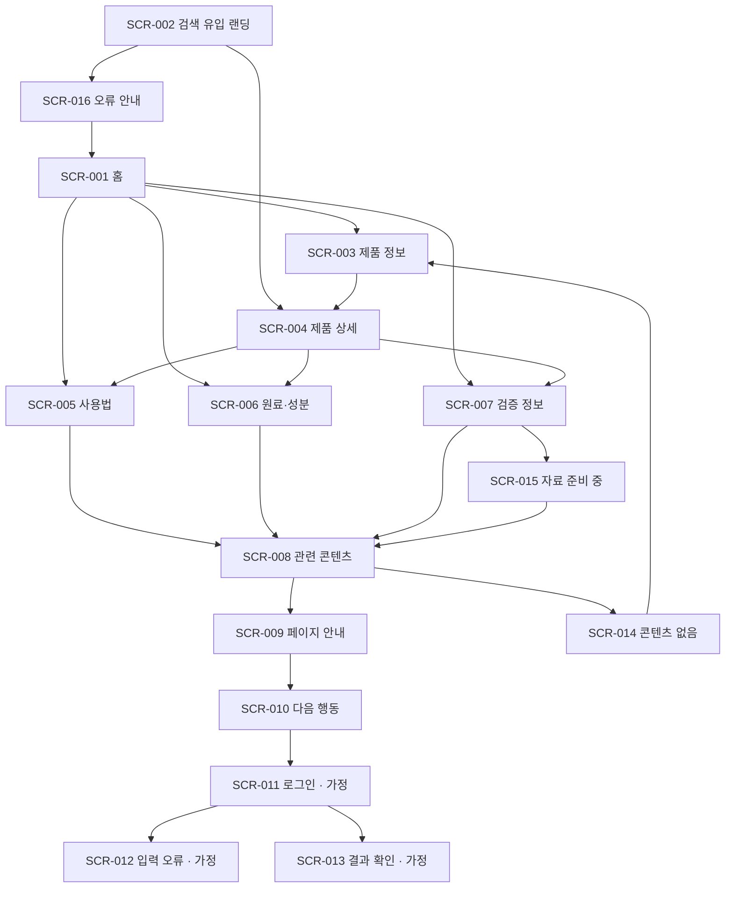

# VC-021 김서준 사이트맵

## 프로젝트 개요

외부 검색 또는 공유 링크로 직접 진입한 사용자가 페이지의 질문과 답을 즉시 확인하고 제품·사용법·원료·검증 정보로 이동하는 정보 구조다. 근거는 `VC021-REQ-001~006`이며 가격·재고·리뷰·효능은 확정 전 제외한다.

## 설계 근거와 핵심 사용자 목표

- 페이지별 질문·한 문장 답의 일치
- 고유 제목, 현재 위치, 탐색 목적의 유지
- 제품·사용법·원료·검증 정보의 맥락 연결
- 모바일 직접 진입 시 브랜드와 현재 정보 범위 제공
- 확인된 사실만 노출 후보로 분류

## 전역 내비게이션 구조

`제품 정보 / 사용법 / 원료·성분 / 검증 정보 / 관련 콘텐츠`를 전역 메뉴로 사용한다. 모든 상세 화면에는 홈, 현재 위치, 관련 정보 링크와 오류 복구 경로를 둔다. 로그인과 알림 신청은 입력 요구사항에 없는 `가정`이며 정보 열람과 분리한다.

## 계층형 사이트맵

- 1차 공통
  - SCR-001 홈
  - SCR-002 검색 유입 랜딩
  - SCR-009 페이지 안내
- 2차 핵심 정보
  - SCR-003 제품 정보
    - SCR-004 제품 상세
  - SCR-005 사용법
  - SCR-006 원료·성분
  - SCR-007 검증 정보
  - SCR-008 관련 콘텐츠
- 3차 행동·회원 상태 (`가정`)
  - SCR-010 다음 행동
  - SCR-011 로그인
  - SCR-012 입력 오류
  - SCR-013 결과 확인
- 예외
  - SCR-014 콘텐츠 없음
  - SCR-015 자료 준비 중
  - SCR-016 오류 안내

## 페이지 정의

| ID | 페이지 | 목적 | 핵심 콘텐츠·기능 | 주요 연결 |
|---|---|---|---|---|
| SCR-001 | 홈 | 브랜드와 정보 영역 소개 | YOVIA 정의, 전역 메뉴 | 003, 005, 006, 007 |
| SCR-002 | 검색 유입 랜딩 | 검색 질문과 답 일치 | 질문, 한 문장 답, 현재 위치 | 004, 016 |
| SCR-003 | 제품 정보 | 제품 정보 허브 | 제품 범위, 상태별 카드 | 004, 014 |
| SCR-004 | 제품 상세 | 제품별 핵심 사실 확인 | 요약, 근거, 관련 링크 | 005, 006, 007 |
| SCR-005 | 사용법 | 사용 순서 설명 | 단계, 주의, 관련 정보 | 008 |
| SCR-006 | 원료·성분 | 확정 정보 구분 | 원료 범위, 상태 라벨 | 008 |
| SCR-007 | 검증 정보 | 문서 상태 확인 | 기준일, 범위, 준비 중 분기 | 008, 015 |
| SCR-008 | 관련 콘텐츠 | 다음 질문으로 이동 | 설명형 링크 카드 | 009, 014 |
| SCR-009 | 페이지 안내 | 현재 위치와 목적 재확인 | 경로, 페이지 설명 | 010 |
| SCR-010 | 다음 행동 | 정보 확인 후 선택 | 계속 탐색, 알림 신청(가정) | 003, 011 |
| SCR-011 | 로그인 | 회원 여부 분기(가정) | 로그인·비회원 계속 | 012, 013 |
| SCR-012 | 입력 오류 | 잘못된 입력 복구(가정) | 오류 메시지, 수정 | 011 |
| SCR-013 | 결과 확인 | 신청 결과 표시(가정) | 완료, 다음 탐색 | 003 |
| SCR-014 | 콘텐츠 없음 | 결과 없음 복구 | 제품 허브·관련 콘텐츠 | 003, 008 |
| SCR-015 | 자료 준비 중 | 미확정 자료 통제 | 상태·대체 정보 | 008 |
| SCR-016 | 오류 안내 | 경로·시스템 오류 복구 | 재시도, 홈 이동 | 001, 002 |

## Mermaid 사이트맵

전체 화면은 최소 한 개 이상의 진입·복귀 연결을 가지며 중복 페이지는 없다.
