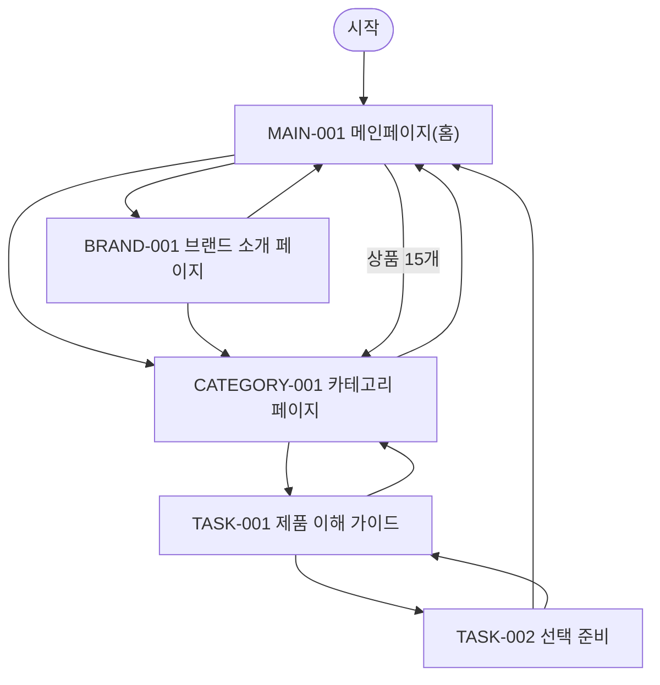

# VC-001 서하린 사이트맵
## 프로젝트 개요
YOVIA 설계를 **빠른 제품 이해** 관점에서 독립 구성한다. 공통 필수 화면 3개와 이 Client 전용 과업 화면 2개를 포함한다.
## 설계 근거와 사용자 목표
- **VC001-REQ-001** (높음): 첫 화면에서 그릭요거트 기반 간편 건강식과 바쁜 일상의 건강 습관을 함께 이해
- **VC001-REQ-002** (높음): 파우치·빌트인 스푼·토핑의 올인원 과정을 실제 제품 자산으로 설명
- **VC001-REQ-003** (높음): 출근·등교·이동·업무 중 준비와 정리 부담이 줄어드는 사용 상황 제시
- **VC001-REQ-004** (높음): 락토프리·무가당과 실제 원료·영양·알레르기 정보를 빠르게 탐색
- **VC001-REQ-005** (높음): 모바일에서 핵심 정보와 확정 CTA까지 짧고 명확하게 이동
- **VC001-REQ-006** (보통 이상): 제품 구조와 사용법을 단계적으로 보여주고 추가 도구·정리 부담 감소를 이해
- **VC001-REQ-007** (보통 이상): 밝고 현대적인 컬러와 명확한 위계, 제품보다 장식이 앞서지 않는 표현
- **VC001-REQ-008** (보통 이상): 성분·영양·건강 문구에 확인 가능한 근거만 사용하고 미검증 효능 제외
- **VC001-REQ-009** (보통 이상): 제품 선택지 확정 후 차이를 비교하기 쉬운 카드와 상태 표현 제공
- **VC001-REQ-010** (보통 이상): 판매 채널 확정 후 목적이 구체적인 구매·제품 확인 CTA 제공
- **VC001-REQ-011** (낮음): 누수·오염·폐기 부담의 검증 자료가 확보되면 신뢰 콘텐츠로 활용
- **VC001-REQ-012** (보류): 듀얼 챔버·스파우트·특수 실링은 확정 구조·시험 확인 전 채택 금지
- **VC001-REQ-013** (보류): 고단백 수치와 소화·장 건강·이너뷰티·붓기·목 보호 효능을 검증 전 가치·CTA로 사용 금지
- 대표 Site 근거: SITE-001, SITE-002, SITE-004, SITE-006, SITE-010, SITE-011, SITE-015, SITE-016
- 분석 이동 경로: 브랜드·제품 정의 → 제품 구조 → 사용 상황·방법 → 성분·영양·검증 정보 → 제품 비교·상세 → 확정 행동의 후보 흐름을 둔다. 모바일에서도 이 의미 순서를 유지한다 (`VC001-REQ-001~010`).
## 전역 내비게이션
메인페이지 · 카테고리 · 브랜드 소개 · 제품 이해 가이드 · 선택 준비
## 계층형 사이트맵
- MAIN-001 메인페이지(홈)
  - PRODUCT-001~PRODUCT-015 상품 슬롯
  - CATEGORY-001 카테고리 페이지
  - BRAND-001 브랜드 소개 페이지
- TASK-001 제품 이해 가이드
  - TASK-002 선택 준비
## 페이지 정의
| ID | 화면 | 목적 | 핵심 콘텐츠·기능 | 연결 화면 |
|---|---|---|---|---|
| MAIN-001 | 메인페이지(홈) | 빠른 제품 이해 관점의 브랜드·상품 탐색 시작 | 브랜드·제품 가치, 카테고리 진입, 상품 15개, 브랜드 소개 진입, 검증 상태 | CATEGORY-001, BRAND-001 |
| CATEGORY-001 | 카테고리 페이지 | 빠른 제품 이해 기준으로 상품 후보를 탐색 | 현재 위치, 정렬·필터 후보, 상품 결과, 결과 없음·복구 | TASK-001, MAIN-001 |
| BRAND-001 | 브랜드 소개 페이지 | YOVIA 정의와 빠른 제품 이해 관련 근거를 구분 | 브랜드 정의, 그릭요거트 기반 간편 건강식, 근거 상태, 관련 제품 탐색 | CATEGORY-001, MAIN-001 |
| TASK-001 | 제품 이해 가이드 | 빠른 제품 이해 핵심 과업 수행 | 핵심 요약 카드, 상황별 CTA | TASK-002, CATEGORY-001 |
| TASK-002 | 선택 준비 | 빠른 제품 이해 검증 상태와 다음 행동 확인 | 근거·기준일, 상태·조건, 다음 행동·복구 | MAIN-001, TASK-001 |
## 공통·상태·예외
로그인은 근거가 없어 강제하지 않는다. 로딩·빈 상태·오류·완료·NOT_VERIFIED·HOLD를 텍스트로 표시하고 재시도·이전 단계·홈 복귀를 제공한다.
## 상품 수량 계약
MAIN-001에는 PRODUCT-001~PRODUCT-015의 15개 슬롯이 있다. 실제 상품 데이터가 없으므로 모두 NOT_VERIFIED이며 가격·효능·재고를 확정하지 않는다.
## 가정·HOLD·제외
상품 상세은 TASK-001에 조건부 매핑한다. 실제 제품명·가격·용량·영양·효능·재고·판매 정책은 제외 또는 HOLD다.
## 연결성 검토
세 핵심 화면과 두 특화 화면은 시작점에서 도달 가능하고 상호 복귀한다.
## Mermaid
