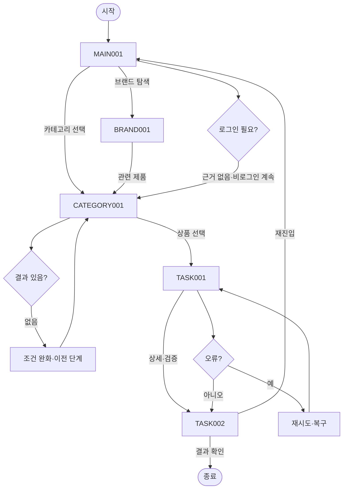

# VC-001 서하린 서비스 흐름도
## 개요와 사용자
빠른 제품 이해 요구를 가진 방문자가 로그인 없이 제품과 브랜드를 탐색한다.
## 시작·종료
시작은 MAIN-001이며 종료는 선택 준비 결과 확인 또는 유효 화면 복귀다.
## 정상 흐름
MAIN-001 → CATEGORY-001 → 상품 선택 → TASK-001 제품 이해 가이드 → TASK-002 선택 준비 → 결과 확인.
브랜드 흐름은 MAIN-001 → BRAND-001 → CATEGORY-001이다.
## 상품 행동
PRODUCT-001~PRODUCT-015는 모두 TASK-001 조건부 상세 후보로 연결하며 실제 상품 정보는 NOT_VERIFIED다.
## 분기·오류·이탈·재진입
결과 없음, 입력 오류, 외부·시스템 오류에 재시도·조건 완화·이전 단계·홈 복귀를 제공한다. 로그인은 정상 흐름에 강제하지 않는다.
## 단계별 처리
| 화면 | 행동 | 시스템 처리 | 다음 화면 | 실패·복구 |
|---|---|---|---|---|
| MAIN-001 메인페이지(홈) | 카테고리 보기 | 상태·조건 갱신 | CATEGORY-001, BRAND-001 | 오류 시 재시도·이전 단계 |
| CATEGORY-001 카테고리 페이지 | 상품 후보 확인 | 상태·조건 갱신 | TASK-001, MAIN-001 | 오류 시 재시도·이전 단계 |
| BRAND-001 브랜드 소개 페이지 | 관련 제품 보기 | 상태·조건 갱신 | CATEGORY-001, MAIN-001 | 오류 시 재시도·이전 단계 |
| TASK-001 제품 이해 가이드 | 선택 준비 보기 | 상태·조건 갱신 | TASK-002, CATEGORY-001 | 오류 시 재시도·이전 단계 |
| TASK-002 선택 준비 | 메인으로 | 상태·조건 갱신 | MAIN-001, TASK-001 | 오류 시 재시도·이전 단계 |
## Requirement 추적
- **VC001-REQ-001** (높음): 첫 화면에서 그릭요거트 기반 간편 건강식과 바쁜 일상의 건강 습관을 함께 이해
- **VC001-REQ-002** (높음): 파우치·빌트인 스푼·토핑의 올인원 과정을 실제 제품 자산으로 설명
- **VC001-REQ-003** (높음): 출근·등교·이동·업무 중 준비와 정리 부담이 줄어드는 사용 상황 제시
- **VC001-REQ-004** (높음): 락토프리·무가당과 실제 원료·영양·알레르기 정보를 빠르게 탐색
- **VC001-REQ-005** (높음): 모바일에서 핵심 정보와 확정 CTA까지 짧고 명확하게 이동
- **VC001-REQ-006** (보통 이상): 제품 구조와 사용법을 단계적으로 보여주고 추가 도구·정리 부담 감소를 이해
- **VC001-REQ-007** (보통 이상): 밝고 현대적인 컬러와 명확한 위계, 제품보다 장식이 앞서지 않는 표현
- **VC001-REQ-008** (보통 이상): 성분·영양·건강 문구에 확인 가능한 근거만 사용하고 미검증 효능 제외
- **VC001-REQ-009** (보통 이상): 제품 선택지 확정 후 차이를 비교하기 쉬운 카드와 상태 표현 제공
- **VC001-REQ-010** (보통 이상): 판매 채널 확정 후 목적이 구체적인 구매·제품 확인 CTA 제공
- **VC001-REQ-011** (낮음): 누수·오염·폐기 부담의 검증 자료가 확보되면 신뢰 콘텐츠로 활용
- **VC001-REQ-012** (보류): 듀얼 챔버·스파우트·특수 실링은 확정 구조·시험 확인 전 채택 금지
- **VC001-REQ-013** (보류): 고단백 수치와 소화·장 건강·이너뷰티·붓기·목 보호 효능을 검증 전 가치·CTA로 사용 금지
## 연결성 검토
세 핵심 화면과 특화 화면의 이름·ID는 사이트맵과 일치하며 끊긴 정상 흐름이 없다.
## Mermaid
