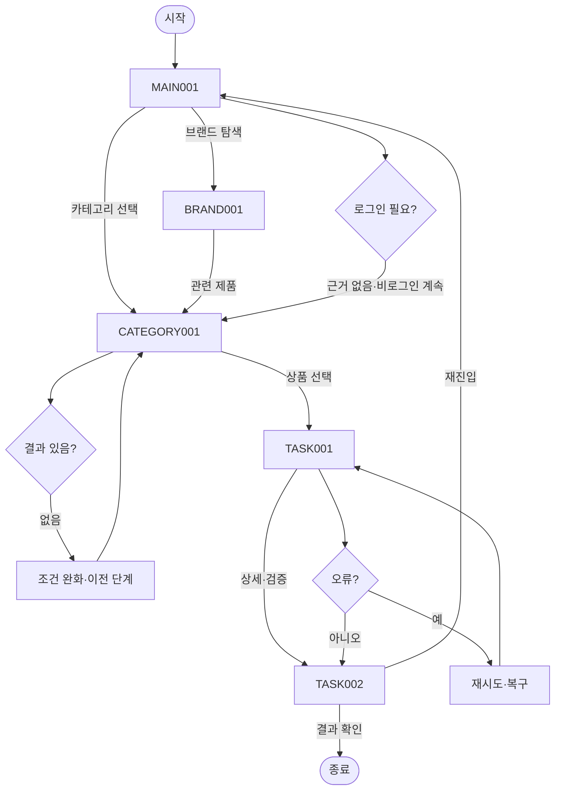

# VC-002 김도현 서비스 흐름도
## 개요와 사용자
패키지 사용 경험 요구를 가진 방문자가 로그인 없이 제품과 브랜드를 탐색한다.
## 시작·종료
시작은 MAIN-001이며 종료는 품질 근거 결과 확인 또는 유효 화면 복귀다.
## 정상 흐름
MAIN-001 → CATEGORY-001 → 상품 선택 → TASK-001 사용 단계 안내 → TASK-002 품질 근거 → 결과 확인.
브랜드 흐름은 MAIN-001 → BRAND-001 → CATEGORY-001이다.
## 상품 행동
PRODUCT-001~PRODUCT-015는 모두 TASK-001 조건부 상세 후보로 연결하며 실제 상품 정보는 NOT_VERIFIED다.
## 분기·오류·이탈·재진입
결과 없음, 입력 오류, 외부·시스템 오류에 재시도·조건 완화·이전 단계·홈 복귀를 제공한다. 로그인은 정상 흐름에 강제하지 않는다.
## 단계별 처리
| 화면 | 행동 | 시스템 처리 | 다음 화면 | 실패·복구 |
|---|---|---|---|---|
| MAIN-001 메인페이지(홈) | 카테고리 보기 | 상태·조건 갱신 | CATEGORY-001, BRAND-001 | 오류 시 재시도·이전 단계 |
| CATEGORY-001 카테고리 페이지 | 상품 후보 확인 | 상태·조건 갱신 | TASK-001, MAIN-001 | 오류 시 재시도·이전 단계 |
| BRAND-001 브랜드 소개 페이지 | 관련 제품 보기 | 상태·조건 갱신 | CATEGORY-001, MAIN-001 | 오류 시 재시도·이전 단계 |
| TASK-001 사용 단계 안내 | 품질 근거 보기 | 상태·조건 갱신 | TASK-002, CATEGORY-001 | 오류 시 재시도·이전 단계 |
| TASK-002 품질 근거 | 메인으로 | 상태·조건 갱신 | MAIN-001, TASK-001 | 오류 시 재시도·이전 단계 |
## Requirement 추적
- **VC002-REQ-001** (높음): 확정된 파우치·빌트인 스푼·토핑 관계를 실제 제품 중심으로 제시
- **VC002-REQ-002** (높음): 개봉부터 취식·정리까지 순서대로 이해할 수 있게 설명
- **VC002-REQ-003** (높음): 누수·내압·잔여물 감소는 검증 결과가 있을 때만 표시
- **VC002-REQ-004** (보통 이상): 모바일에서 부품·단계 명칭과 주의사항을 명확히 표시
- **VC002-REQ-005** (보통 이상): 사용 전후 상태와 정리 부담 감소를 검증 가능한 이미지로 설명
- **VC002-REQ-006** (보류): 듀얼 챔버·스파우트·특수 실링은 확정 전까지 대안으로만 보존
## 연결성 검토
세 핵심 화면과 특화 화면의 이름·ID는 사이트맵과 일치하며 끊긴 정상 흐름이 없다.
## Mermaid
