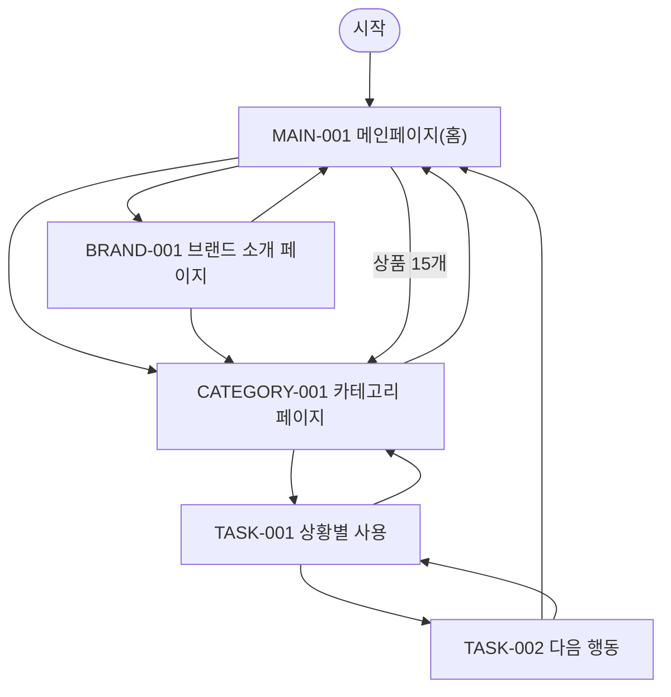

# VC-004 박지안 사이트맵
## 프로젝트 개요
YOVIA 설계를 **일상 전환** 관점에서 독립 구성한다. 공통 필수 화면 3개와 이 Client 전용 과업 화면 2개를 포함한다.
## 설계 근거와 사용자 목표
- **VC004-REQ-001** (높음): 출근·등교·업무·수업 사이에서 해결하는 준비·취식 문제를 빠르게 제시
- **VC004-REQ-002** (높음): 모바일에서 브랜드 이해부터 제품 검토와 확정 CTA까지 자연스럽게 연결
- **VC004-REQ-003** (높음): 가격·배송·구독·할인은 확정 정책이 있을 때만 표시
- **VC004-REQ-004** (보통 이상): 제품 옵션 확정 후 사용 상황과 선택 기준으로 비교
- **VC004-REQ-005** (보통 이상): ‘자세히 보기’보다 실제 다음 행동을 명확히 표현
- **VC004-REQ-006** (낮음): 반복 구매 구조 확정 후 루틴 유지 혜택과 관리 방식 설명
- 대표 Site 근거: SITE-001, SITE-006, SITE-015, SITE-016, SITE-017, SITE-018, SITE-020, SITE-036
- 분석 이동 경로: 상황 공감 → 사용 방법·핵심 제품 가치 → 상황·옵션 비교 → 신뢰 정보 → 제품 상세·판매처 등 확정 행동으로 이어지는 후보를 둔다. 모바일에서는 같은 순서를 1열로 보존한다 (`VC004-REQ-001`, `VC004-REQ-002`, `VC004-REQ-004`; `SITE-006`, `SITE-015`, `SITE-016`, `SITE-077`).
## 전역 내비게이션
메인페이지 · 카테고리 · 브랜드 소개 · 상황별 사용 · 다음 행동
## 계층형 사이트맵
- MAIN-001 메인페이지(홈)
  - PRODUCT-001~PRODUCT-015 상품 슬롯
  - CATEGORY-001 카테고리 페이지
  - BRAND-001 브랜드 소개 페이지
- TASK-001 상황별 사용
  - TASK-002 다음 행동
## 페이지 정의
| ID | 화면 | 목적 | 핵심 콘텐츠·기능 | 연결 화면 |
|---|---|---|---|---|
| MAIN-001 | 메인페이지(홈) | 일상 전환 관점의 브랜드·상품 탐색 시작 | 브랜드·제품 가치, 카테고리 진입, 상품 15개, 브랜드 소개 진입, 검증 상태 | CATEGORY-001, BRAND-001 |
| CATEGORY-001 | 카테고리 페이지 | 일상 전환 기준으로 상품 후보를 탐색 | 현재 위치, 정렬·필터 후보, 상품 결과, 결과 없음·복구 | TASK-001, MAIN-001 |
| BRAND-001 | 브랜드 소개 페이지 | YOVIA 정의와 일상 전환 관련 근거를 구분 | 브랜드 정의, 그릭요거트 기반 간편 건강식, 근거 상태, 관련 제품 탐색 | CATEGORY-001, MAIN-001 |
| TASK-001 | 상황별 사용 | 일상 전환 핵심 과업 수행 | 상황 카드, 고정 행동 바 | TASK-002, CATEGORY-001 |
| TASK-002 | 다음 행동 | 일상 전환 검증 상태와 다음 행동 확인 | 근거·기준일, 상태·조건, 다음 행동·복구 | MAIN-001, TASK-001 |
## 공통·상태·예외
로그인은 근거가 없어 강제하지 않는다. 로딩·빈 상태·오류·완료·NOT_VERIFIED·HOLD를 텍스트로 표시하고 재시도·이전 단계·홈 복귀를 제공한다.
## 상품 수량 계약
MAIN-001에는 PRODUCT-001~PRODUCT-015의 15개 슬롯이 있다. 실제 상품 데이터가 없으므로 모두 NOT_VERIFIED이며 가격·효능·재고를 확정하지 않는다.
## 가정·HOLD·제외
상품 상세은 TASK-001에 조건부 매핑한다. 실제 제품명·가격·용량·영양·효능·재고·판매 정책은 제외 또는 HOLD다.
## 연결성 검토
세 핵심 화면과 두 특화 화면은 시작점에서 도달 가능하고 상호 복귀한다.
## Mermaid
