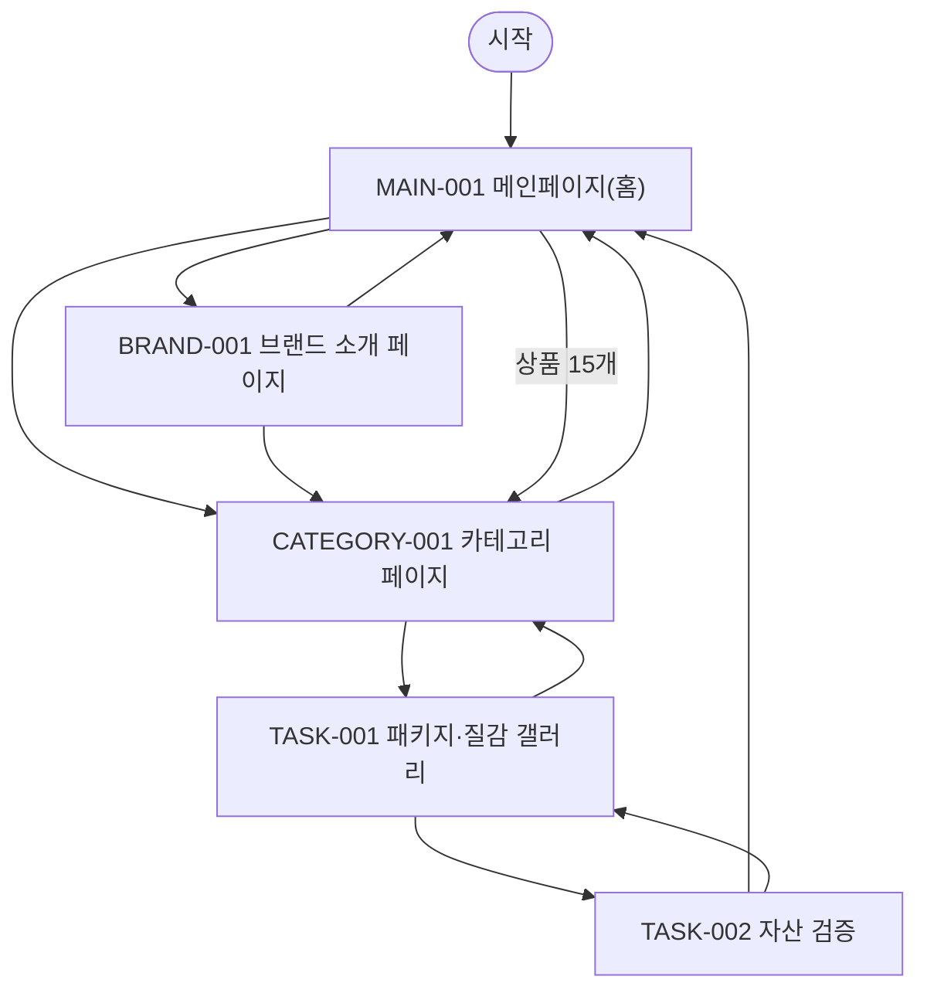

# VC-005 최예린 사이트맵
## 프로젝트 개요
YOVIA 설계를 **제품 중심 크리에이티브** 관점에서 독립 구성한다. 공통 필수 화면 3개와 이 Client 전용 과업 화면 2개를 포함한다.
## 설계 근거와 사용자 목표
- **VC005-REQ-001** (높음): 패키지·요거트 질감·토핑·개봉·섭취 과정을 핵심 시각 자산으로 사용
- **VC005-REQ-002** (높음): 밝고 현대적이며 젊은 인상을 유지하되 제품과 정보가 중심
- **VC005-REQ-003** (보통 이상): 확정 컬러를 장식이 아니라 정보 위계와 탐색 단서로 사용
- **VC005-REQ-004** (보통 이상): 출근·등교·업무 등 실제 사용 장면으로 브랜드 스토리와 편의성을 연결
- **VC005-REQ-005** (보통 이상): 모바일에서 이미지가 핵심 설명과 CTA를 밀어내지 않게 콘텐츠 밀도 조절
- **VC005-REQ-006** (보류·제약): 미확정 맛·기능·효능을 실제 제품처럼 보이게 하는 비주얼 금지
- 대표 Site 근거: SITE-001, SITE-004, SITE-015, SITE-016, SITE-020, SITE-036, SITE-063, SITE-113
- 분석 이동 경로: 제품 인상 → 패키지·질감·토핑 이해 → 개봉·섭취 또는 실제 사용 장면 → 제품 정보·신뢰 근거 → 확정 행동의 후보 흐름을 둔다 (`VC005-REQ-001`, `VC005-REQ-004`, `VC005-REQ-005`; `SITE-015`, `SITE-016`, `SITE-176`).
## 전역 내비게이션
메인페이지 · 카테고리 · 브랜드 소개 · 패키지·질감 갤러리 · 자산 검증
## 계층형 사이트맵
- MAIN-001 메인페이지(홈)
  - PRODUCT-001~PRODUCT-015 상품 슬롯
  - CATEGORY-001 카테고리 페이지
  - BRAND-001 브랜드 소개 페이지
- TASK-001 패키지·질감 갤러리
  - TASK-002 자산 검증
## 페이지 정의
| ID | 화면 | 목적 | 핵심 콘텐츠·기능 | 연결 화면 |
|---|---|---|---|---|
| MAIN-001 | 메인페이지(홈) | 제품 중심 크리에이티브 관점의 브랜드·상품 탐색 시작 | 브랜드·제품 가치, 카테고리 진입, 상품 15개, 브랜드 소개 진입, 검증 상태 | CATEGORY-001, BRAND-001 |
| CATEGORY-001 | 카테고리 페이지 | 제품 중심 크리에이티브 기준으로 상품 후보를 탐색 | 현재 위치, 정렬·필터 후보, 상품 결과, 결과 없음·복구 | TASK-001, MAIN-001 |
| BRAND-001 | 브랜드 소개 페이지 | YOVIA 정의와 제품 중심 크리에이티브 관련 근거를 구분 | 브랜드 정의, 그릭요거트 기반 간편 건강식, 근거 상태, 관련 제품 탐색 | CATEGORY-001, MAIN-001 |
| TASK-001 | 패키지·질감 갤러리 | 제품 중심 크리에이티브 핵심 과업 수행 | 비주얼 갤러리, 자산 유형 라벨 | TASK-002, CATEGORY-001 |
| TASK-002 | 자산 검증 | 제품 중심 크리에이티브 검증 상태와 다음 행동 확인 | 근거·기준일, 상태·조건, 다음 행동·복구 | MAIN-001, TASK-001 |
## 공통·상태·예외
로그인은 근거가 없어 강제하지 않는다. 로딩·빈 상태·오류·완료·NOT_VERIFIED·HOLD를 텍스트로 표시하고 재시도·이전 단계·홈 복귀를 제공한다.
## 상품 수량 계약
MAIN-001에는 PRODUCT-001~PRODUCT-015의 15개 슬롯이 있다. 실제 상품 데이터가 없으므로 모두 NOT_VERIFIED이며 가격·효능·재고를 확정하지 않는다.
## 가정·HOLD·제외
상품 상세은 TASK-001에 조건부 매핑한다. 실제 제품명·가격·용량·영양·효능·재고·판매 정책은 제외 또는 HOLD다.
## 연결성 검토
세 핵심 화면과 두 특화 화면은 시작점에서 도달 가능하고 상호 복귀한다.
## Mermaid
