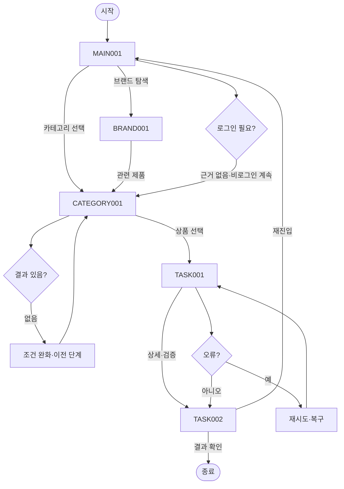

# VC-005 최예린 서비스 흐름도
## 개요와 사용자
제품 중심 크리에이티브 요구를 가진 방문자가 로그인 없이 제품과 브랜드를 탐색한다.
## 시작·종료
시작은 MAIN-001이며 종료는 자산 검증 결과 확인 또는 유효 화면 복귀다.
## 정상 흐름
MAIN-001 → CATEGORY-001 → 상품 선택 → TASK-001 패키지·질감 갤러리 → TASK-002 자산 검증 → 결과 확인.
브랜드 흐름은 MAIN-001 → BRAND-001 → CATEGORY-001이다.
## 상품 행동
PRODUCT-001~PRODUCT-015는 모두 TASK-001 조건부 상세 후보로 연결하며 실제 상품 정보는 NOT_VERIFIED다.
## 분기·오류·이탈·재진입
결과 없음, 입력 오류, 외부·시스템 오류에 재시도·조건 완화·이전 단계·홈 복귀를 제공한다. 로그인은 정상 흐름에 강제하지 않는다.
## 단계별 처리
| 화면 | 행동 | 시스템 처리 | 다음 화면 | 실패·복구 |
|---|---|---|---|---|
| MAIN-001 메인페이지(홈) | 카테고리 보기 | 상태·조건 갱신 | CATEGORY-001, BRAND-001 | 오류 시 재시도·이전 단계 |
| CATEGORY-001 카테고리 페이지 | 상품 후보 확인 | 상태·조건 갱신 | TASK-001, MAIN-001 | 오류 시 재시도·이전 단계 |
| BRAND-001 브랜드 소개 페이지 | 관련 제품 보기 | 상태·조건 갱신 | CATEGORY-001, MAIN-001 | 오류 시 재시도·이전 단계 |
| TASK-001 패키지·질감 갤러리 | 자산 검증 보기 | 상태·조건 갱신 | TASK-002, CATEGORY-001 | 오류 시 재시도·이전 단계 |
| TASK-002 자산 검증 | 메인으로 | 상태·조건 갱신 | MAIN-001, TASK-001 | 오류 시 재시도·이전 단계 |
## Requirement 추적
- **VC005-REQ-001** (높음): 패키지·요거트 질감·토핑·개봉·섭취 과정을 핵심 시각 자산으로 사용
- **VC005-REQ-002** (높음): 밝고 현대적이며 젊은 인상을 유지하되 제품과 정보가 중심
- **VC005-REQ-003** (보통 이상): 확정 컬러를 장식이 아니라 정보 위계와 탐색 단서로 사용
- **VC005-REQ-004** (보통 이상): 출근·등교·업무 등 실제 사용 장면으로 브랜드 스토리와 편의성을 연결
- **VC005-REQ-005** (보통 이상): 모바일에서 이미지가 핵심 설명과 CTA를 밀어내지 않게 콘텐츠 밀도 조절
- **VC005-REQ-006** (보류·제약): 미확정 맛·기능·효능을 실제 제품처럼 보이게 하는 비주얼 금지
## 연결성 검토
세 핵심 화면과 특화 화면의 이름·ID는 사이트맵과 일치하며 끊긴 정상 흐름이 없다.
## Mermaid
