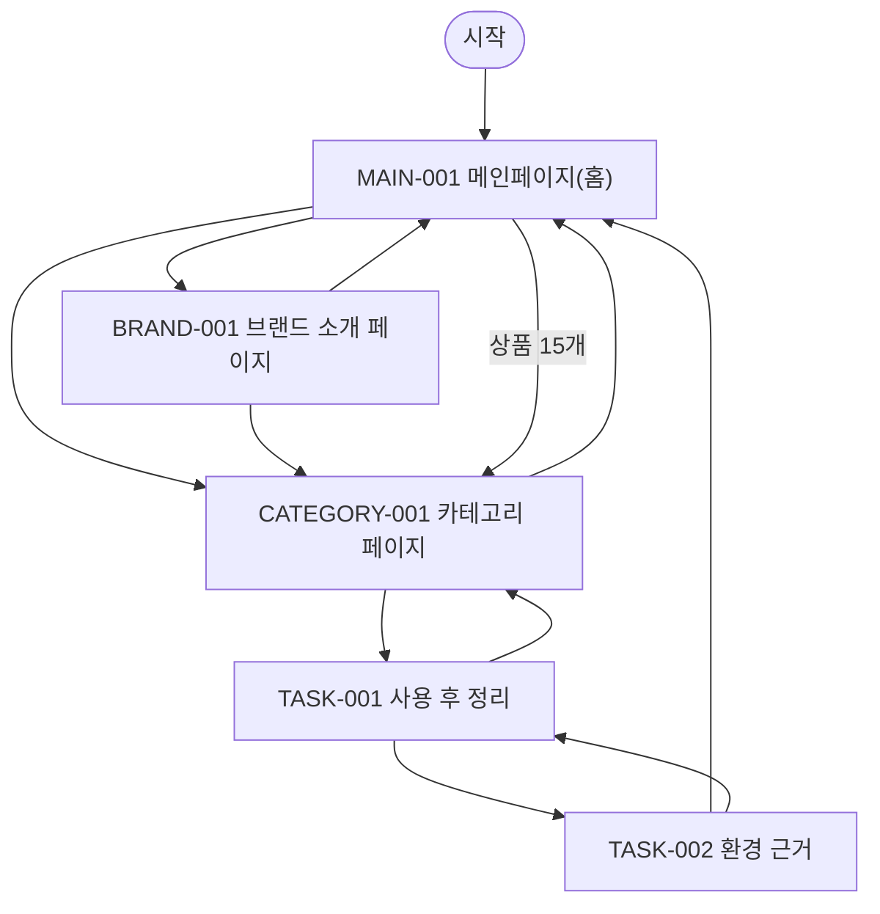

# VC-009 배서윤 사이트맵
## 프로젝트 개요
YOVIA 설계를 **정리·폐기 경험** 관점에서 독립 구성한다. 공통 필수 화면 3개와 이 Client 전용 과업 화면 2개를 포함한다.
## 설계 근거와 사용자 목표
- **VC009-REQ-001** (높음): 사용법에 정리·잔여물·폐기 포함
- **VC009-REQ-002** (높음): 소재·재활용·환경 효과는 근거만 표시
- **VC009-REQ-003** (보통 이상): 분리배출 적용 지역·조건 명시
- **VC009-REQ-004** (보통 이상): 환경 상태와 근거 링크
- **VC009-REQ-005** (보통 이상): 모바일 정리 과정 단계화
- **VC009-REQ-006** (보류): 친환경·생분해·폐기 감소 수치 금지
- 대표 Site 근거: SITE-001, SITE-003, SITE-013, SITE-014, SITE-015, SITE-016, SITE-018, SITE-019
- 분석 이동 경로: 사용→정리→폐기 조건→소재·환경 근거→제품 상세.
## 전역 내비게이션
메인페이지 · 카테고리 · 브랜드 소개 · 사용 후 정리 · 환경 근거
## 계층형 사이트맵
- MAIN-001 메인페이지(홈)
  - PRODUCT-001~PRODUCT-015 상품 슬롯
  - CATEGORY-001 카테고리 페이지
  - BRAND-001 브랜드 소개 페이지
- TASK-001 사용 후 정리
  - TASK-002 환경 근거
## 페이지 정의
| ID | 화면 | 목적 | 핵심 콘텐츠·기능 | 연결 화면 |
|---|---|---|---|---|
| MAIN-001 | 메인페이지(홈) | 정리·폐기 경험 관점의 브랜드·상품 탐색 시작 | 브랜드·제품 가치, 카테고리 진입, 상품 15개, 브랜드 소개 진입, 검증 상태 | CATEGORY-001, BRAND-001 |
| CATEGORY-001 | 카테고리 페이지 | 정리·폐기 경험 기준으로 상품 후보를 탐색 | 현재 위치, 정렬·필터 후보, 상품 결과, 결과 없음·복구 | TASK-001, MAIN-001 |
| BRAND-001 | 브랜드 소개 페이지 | YOVIA 정의와 정리·폐기 경험 관련 근거를 구분 | 브랜드 정의, 그릭요거트 기반 간편 건강식, 근거 상태, 관련 제품 탐색 | CATEGORY-001, MAIN-001 |
| TASK-001 | 사용 후 정리 | 정리·폐기 경험 핵심 과업 수행 | 폐기 단계표, 지역 조건 패널 | TASK-002, CATEGORY-001 |
| TASK-002 | 환경 근거 | 정리·폐기 경험 검증 상태와 다음 행동 확인 | 근거·기준일, 상태·조건, 다음 행동·복구 | MAIN-001, TASK-001 |
## 공통·상태·예외
로그인은 근거가 없어 강제하지 않는다. 로딩·빈 상태·오류·완료·NOT_VERIFIED·HOLD를 텍스트로 표시하고 재시도·이전 단계·홈 복귀를 제공한다.
## 상품 수량 계약
MAIN-001에는 PRODUCT-001~PRODUCT-015의 15개 슬롯이 있다. 실제 상품 데이터가 없으므로 모두 NOT_VERIFIED이며 가격·효능·재고를 확정하지 않는다.
## 가정·HOLD·제외
상품 상세은 TASK-001에 조건부 매핑한다. 실제 제품명·가격·용량·영양·효능·재고·판매 정책은 제외 또는 HOLD다.
## 연결성 검토
세 핵심 화면과 두 특화 화면은 시작점에서 도달 가능하고 상호 복귀한다.
## Mermaid
