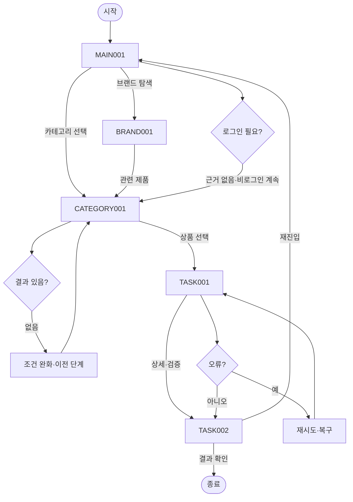

# VC-013 윤가은 서비스 흐름도
## 개요와 사용자
FAQ·고객지원 요구를 가진 방문자가 로그인 없이 제품과 브랜드를 탐색한다.
## 시작·종료
시작은 MAIN-001이며 종료는 문의 처리 결과 확인 또는 유효 화면 복귀다.
## 정상 흐름
MAIN-001 → CATEGORY-001 → 상품 선택 → TASK-001 FAQ → TASK-002 문의 처리 → 결과 확인.
브랜드 흐름은 MAIN-001 → BRAND-001 → CATEGORY-001이다.
## 상품 행동
PRODUCT-001~PRODUCT-015는 모두 TASK-001 조건부 상세 후보로 연결하며 실제 상품 정보는 NOT_VERIFIED다.
## 분기·오류·이탈·재진입
결과 없음, 입력 오류, 외부·시스템 오류에 재시도·조건 완화·이전 단계·홈 복귀를 제공한다. 로그인은 정상 흐름에 강제하지 않는다.
## 단계별 처리
| 화면 | 행동 | 시스템 처리 | 다음 화면 | 실패·복구 |
|---|---|---|---|---|
| MAIN-001 메인페이지(홈) | 카테고리 보기 | 상태·조건 갱신 | CATEGORY-001, BRAND-001 | 오류 시 재시도·이전 단계 |
| CATEGORY-001 카테고리 페이지 | 상품 후보 확인 | 상태·조건 갱신 | TASK-001, MAIN-001 | 오류 시 재시도·이전 단계 |
| BRAND-001 브랜드 소개 페이지 | 관련 제품 보기 | 상태·조건 갱신 | CATEGORY-001, MAIN-001 | 오류 시 재시도·이전 단계 |
| TASK-001 FAQ | 문의 처리 보기 | 상태·조건 갱신 | TASK-002, CATEGORY-001 | 오류 시 재시도·이전 단계 |
| TASK-002 문의 처리 | 메인으로 | 상태·조건 갱신 | MAIN-001, TASK-001 | 오류 시 재시도·이전 단계 |
## Requirement 추적
- **VC013-REQ-001** (높음): 사용법·보관·성분·구매 질문을 검증 답변으로 분류
- **VC013-REQ-002** (높음): 답변으로 해결되지 않는 문제에 책임 있는 문의 경로 제공
- **VC013-REQ-003** (보통 이상): FAQ 검색·필터는 실제 문서량이 충분할 때만 적용
- **VC013-REQ-004** (보통 이상): 중요 알레르기·주의 정보는 접힌 답변에만 숨기지 않음
- **VC013-REQ-005** (보통 이상): 문의 접수·오류·완료 상태와 복귀 행동을 표시
- **VC013-REQ-006** (보류): 승인되지 않은 보관·효능·품질 답변 공개 금지
## 연결성 검토
세 핵심 화면과 특화 화면의 이름·ID는 사이트맵과 일치하며 끊긴 정상 흐름이 없다.
## Mermaid
