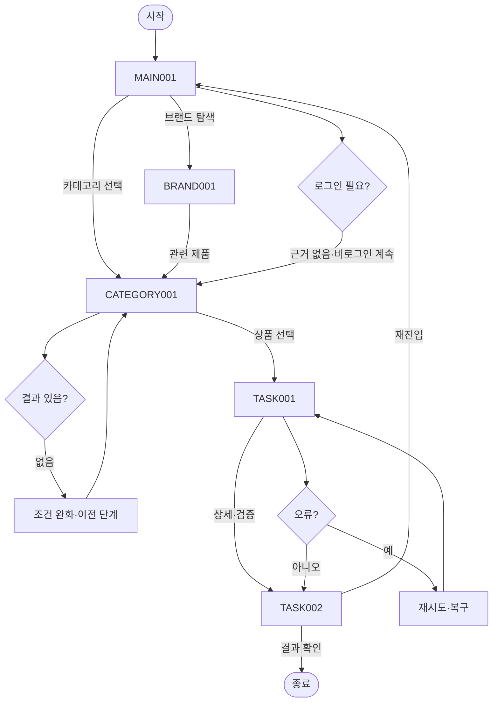

# VC-021 김서준 서비스 흐름도
## 개요와 사용자
운영 검토 요구를 가진 방문자가 로그인 없이 제품과 브랜드를 탐색한다.
## 시작·종료
시작은 MAIN-001이며 종료는 승인·복구 결과 확인 또는 유효 화면 복귀다.
## 정상 흐름
MAIN-001 → CATEGORY-001 → 상품 선택 → TASK-001 운영 상태 → TASK-002 승인·복구 → 결과 확인.
브랜드 흐름은 MAIN-001 → BRAND-001 → CATEGORY-001이다.
## 상품 행동
PRODUCT-001~PRODUCT-015는 모두 TASK-001 조건부 상세 후보로 연결하며 실제 상품 정보는 NOT_VERIFIED다.
## 분기·오류·이탈·재진입
결과 없음, 입력 오류, 외부·시스템 오류에 재시도·조건 완화·이전 단계·홈 복귀를 제공한다. 로그인은 정상 흐름에 강제하지 않는다.
## 단계별 처리
| 화면 | 행동 | 시스템 처리 | 다음 화면 | 실패·복구 |
|---|---|---|---|---|
| MAIN-001 메인페이지(홈) | 카테고리 보기 | 상태·조건 갱신 | CATEGORY-001, BRAND-001 | 오류 시 재시도·이전 단계 |
| CATEGORY-001 카테고리 페이지 | 상품 후보 확인 | 상태·조건 갱신 | TASK-001, MAIN-001 | 오류 시 재시도·이전 단계 |
| BRAND-001 브랜드 소개 페이지 | 관련 제품 보기 | 상태·조건 갱신 | CATEGORY-001, MAIN-001 | 오류 시 재시도·이전 단계 |
| TASK-001 운영 상태 | 승인·복구 보기 | 상태·조건 갱신 | TASK-002, CATEGORY-001 | 오류 시 재시도·이전 단계 |
| TASK-002 승인·복구 | 메인으로 | 상태·조건 갱신 | MAIN-001, TASK-001 | 오류 시 재시도·이전 단계 |
## Requirement 추적
- **VC021-REQ-001** (검색 유입 랜딩과 상세 페이지 상단에 질문·한 문장 답 배치): 검색 질문과 도착 답변이 일치해야 한다.
- **VC021-REQ-002** (고유 화면명, 제목, 현재 위치, 페이지 안내 제공): 페이지 식별과 탐색 목적이 고유해야 한다.
- **VC021-REQ-003** (상세 하단에 다음 관련 정보와 복귀 링크 제공): 정보가 고립되지 않아야 한다.
- **VC021-REQ-004** (축약 헤더, 현재 위치, 브랜드 설명 순서 고정): 모바일 직접 진입도 맥락을 잃지 않아야 한다.
- **VC021-REQ-005** (검증 정보와 콘텐츠 상태 화면 분리): 확인된 사실만 노출 후보가 된다.
- **VC021-REQ-006** (가격·재고·리뷰·효능 UI 및 데이터 제외): 미확정 상업·효능 데이터는 만들지 않는다.
## 연결성 검토
세 핵심 화면과 특화 화면의 이름·ID는 사이트맵과 일치하며 끊긴 정상 흐름이 없다.
## Mermaid
