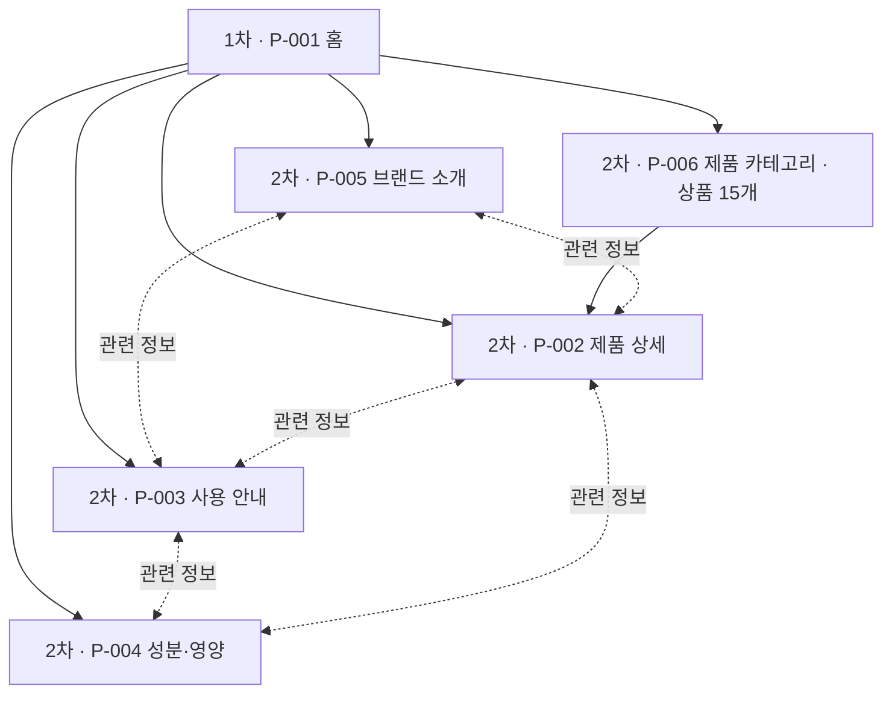

# VC-001 서하린 — 사이트맵

## 프로젝트 개요

YOVIA를 처음 접하는 바쁜 20~30대 직장인·대학생이 제품의 정체와 구조를 이해하고, 사용 상황·방법 및 신뢰 정보를 확인하는 모바일 우선 정보 사이트다.

- 입력: `가상 클라이언트 분석 결과/VC_001_서하린.md`
- 설계 상태: 후보 설계
- 사용자: 첫 방문자, 제품 정보 탐색자, 사용법 탐색자, 성분·영양 검토자
- 핵심 목표: 제품 이해 → 사용 가능성 판단 → 근거 정보 확인
- 가정: 실제 제품 이미지·사양·원료·영양 자료는 추후 제공된다.
- 보류: 제품 옵션, 가격, 판매 채널, 구매 CTA, 품질 시험, 건강 효능

## 설계 근거와 핵심 사용자 목표

| Requirement | 핵심 목표 또는 통제 조건 | 설계 반영 |
|---|---|---|
| `VC001-REQ-001` | 첫 화면에서 제품과 일상 편익 이해 | P-001 히어로·핵심 가치 |
| `VC001-REQ-002` | 실제 패키지 구조 확인 | P-002 구조·부품 영역과 자산 상태 |
| `VC001-REQ-003` | 출근·등교·이동·업무 상황 확인 | P-003 상황 선택 |
| `VC001-REQ-004` | 원료·영양·알레르기 탐색 | P-004 요약·상세 펼치기 |
| `VC001-REQ-005` | 모바일에서 짧고 명확한 이동 | 공통 내비게이션과 목적형 CTA |
| `VC001-REQ-006` | 개봉부터 정리까지 단계 확인 | P-003 단계 전환 |
| `VC001-REQ-007` | 명확한 시각 위계 | 제품 우선 배치와 상태 텍스트 병기 |
| `VC001-REQ-008` | 근거 있는 정보만 사용 | P-002·P-004 검증 상태 |
| `VC001-REQ-009` | 옵션 확정 후 비교 | 현재 화면 미생성, 보류 요구로 기록 |
| `VC001-REQ-010` | 채널 확정 후 판매 CTA | 현재 화면·링크 미생성 |
| `VC001-REQ-011` | 시험 자료 확보 후 품질 콘텐츠 | 예외·보류 상태로 기록 |
| `VC001-REQ-012` | 미확정 패키지 구조 사용 금지 | 가정과 확인 필요 상태로 통제 |
| `VC001-REQ-013` | 미검증 수치·효능 사용 금지 | P-004에서 미확정 상태 제공 |

## 전역 내비게이션 구조

| 구분 | 항목 | 적용 상태 |
|---|---|---|
| 공통 헤더 | 홈, 제품 카테고리, 브랜드 소개, 제품 상세, 사용 안내, 성분·영양 | 모든 화면 |
| 공통 본문 | 화면 ID·제목, 현재 상태, 관련 화면 CTA | 모든 화면 |
| 공통 푸터 | 후보 설계 안내, 홈 복귀 | 모든 화면 |
| 회원 상태별 영역 | 없음 | 로그인·회원 요구가 없어 `해당 없음` |
| 예외 페이지 | 없음 | 로딩·빈·오류는 각 화면 상태로 처리 |

## 깊이별 계층 구조

| 깊이 | 화면 | 상위 | 역할 |
|---|---|---|---|
| 1차 | P-001 홈 | 없음 | 전체 서비스 진입 |
| 2차 | P-002 제품 상세 | P-001 | 제품 이해 |
| 2차 | P-003 사용 안내 | P-001 | 사용 상황·방법 확인 |
| 2차 | P-004 성분·영양 | P-001 | 신뢰 정보 확인 |
| 2차 | P-005 브랜드 소개 | P-001 | 브랜드 정체성·탄생 배경·가치 이해 |
| 2차 | P-006 제품 카테고리 | P-001 | 15개 상품 슬롯의 유형·상태 탐색 |
| 3차 | 없음 | 해당 없음 | 현재 콘텐츠 규모에서 추가 분리하지 않음 |

관련 정보 이동은 계층이 아니라 교차 링크로 관리한다: P-002 ↔ P-003 ↔ P-004, P-005 ↔ P-002·P-003.

## 주요 사용자 여정

1. P-001 홈에서 제품의 정체를 이해한다.
2. P-006 제품 카테고리에서 15개 상품의 유형과 기획 상태를 탐색한다.
3. P-005 브랜드 소개에서 브랜드 정의·탄생 배경·미션·핵심 가치와 검증 상태를 확인한다.
4. P-002 제품 상세에서 구조와 특징을 확인한다.
5. P-003 사용 안내에서 상황과 단계를 선택한다.
6. P-004 성분·영양에서 근거 상태를 확인한다.
7. 필요한 정보를 모두 확인하거나 관련 화면으로 되돌아간다.

## 페이지 정의

| ID | 페이지 | 목적 | 핵심 콘텐츠 | 주요 기능 | 연결 페이지 |
|---|---|---|---|---|---|
| P-001 | 홈 | 제품 정체와 사용 가치 이해 | 제품 정의, 대표 이미지, 핵심 가치 | 정보 탐색 카드, 상태 확인 | P-002, P-003, P-004, P-005, P-006 |
| P-002 | 제품 상세 | 제품 구조와 확인된 특징 검토 | 구조 이미지, 부품 역할, 검증 상태 | 구조 항목 선택, 상태 전환 | P-001, P-003, P-004 |
| P-003 | 사용 안내 | 사용 상황과 단계별 방법 확인 | 상황 카드, 개봉·준비·섭취·정리 | 상황 선택, 이전·다음 단계, 상태 전환 | P-001, P-002, P-004 |
| P-004 | 성분·영양 | 원료·영양·알레르기와 근거 확인 | 정보 요약, 상세, 출처·기준일 | 상세 펼치기, 상태 전환 | P-001, P-002, P-003 |
| P-005 | 브랜드 소개 | yovia의 정체성·출발점·지향 가치 이해 | 브랜드 정의, 탄생 배경, 미션, 핵심 가치, 차별화 방향, 검증 상태 | 근거 상태 확인, 제품·사용 안내 이동, 상태 전환 | P-001, P-002, P-003 |
| P-006 | 제품 카테고리 | 15개 상품 슬롯을 제품군별로 탐색 | 기본 제품 3, 퓨레 5, 토핑 3, 시그니처·스타터 4 | 카테고리 필터, 상품 카드 확인, 상세 이동 | P-001, P-002, P-005 |

## 가정·보류·예외 처리

| 항목 | 판정 | 처리 |
|---|---|---|
| 실제 제품 이미지·사양 | 가정 | 플레이스홀더와 확인 필요 상태 |
| 회원·로그인 | 입력 근거 없음 | 회원 영역과 로그인 분기 없음으로 명시 |
| 입력 폼 | 입력 근거 없음 | 입력값 오류 대신 자료 오류 상태 적용 |
| 검색 결과 없음 | 검색 기능 없음 | 화면별 빈 상태로 대체 |
| 제품 비교·판매처 | 보류 | 화면·링크를 생성하지 않음 |

## 연결 검토

- 6개 화면 모두 홈과 공통 내비게이션에서 접근 가능하다.
- P-006에는 `PRODUCT-001`~`PRODUCT-015`가 각각 독립 카드로 존재한다. 퓨레·토핑의 미확정 세부명은 HOLD로 표시한다.
- 화면 ID와 페이지명은 중복되지 않는다.
- 교차 링크와 계층 관계를 분리했다.
- 회원·입력·예외 페이지의 적용 여부를 명시했다.

## Mermaid 사이트맵

## 생성 파일 안내

- `사이트맵.md`: 설계 근거·계층·페이지 정의와 Mermaid 원본을 함께 확인한다.
- `사이트맵.mmd`: Mermaid 렌더러에서 재사용한다.
- `사이트맵.svg`: 확대 가능한 벡터 사이트맵이다.
