# VC-001 서하린 — YOVIA 사이트맵

## 1. 프로젝트 개요

| 항목 | 내용 |
|---|---|
| 대상 | YOVIA 반응형 웹 |
| 사용자 | 시간 부족을 겪는 20~30대 직장인·대학생 |
| 목표 | 브랜드·제품 정의를 빠르게 이해하고 제품 구조, 사용법, 신뢰 정보를 확인한 뒤 유효한 다음 행동으로 이동 |
| 입력 | `가상 클라이언트 분석 결과/VC_001_서하린.md`, `Md_Skill/output/04_virtual_clients/clients/VC_001.md` |
| 작성 기준 | `설계 프롬프트/설계프롬프트.txt`의 사이트맵 제작 규칙 |
| 미확정 처리 | 실제 상품명·이미지·가격·용량·영양·효능·재고·판매 채널은 `NOT_VERIFIED` |

## 2. 설계 근거와 핵심 사용자 목표

1. 첫 화면에서 YOVIA가 그릭요거트 기반 간편 건강식임을 이해한다. (`VC001-REQ-001`)
2. 파우치·빌트인 스푼·토핑의 관계와 사용 단계를 실제 자산 중심으로 확인한다. (`VC001-REQ-002`, `VC001-REQ-006`)
3. 출근·등교·이동·업무 상황에서의 사용 맥락을 살핀다. (`VC001-REQ-003`)
4. 원료·영양·알레르기와 정보의 검증 상태를 빠르게 찾는다. (`VC001-REQ-004`, `VC001-REQ-008`)
5. 제품 선택지와 판매 채널이 확정된 경우에만 비교·상세·구매 관련 행동으로 이동한다. (`VC001-REQ-005`, `VC001-REQ-009`, `VC001-REQ-010`)

누수·오염·잔여물·폐기 시험, 대체 패키지 구조, 건강·효능 주장은 직접 근거가 없으므로 공개 페이지로 확정하지 않는다. (`VC001-REQ-011~013`)

## 3. 전역 내비게이션 구조

| 순서 | 1차 화면 | 탐색 목적 | 주요 연결 |
|---|---|---|---|
| 1 | `MAIN-001` 메인페이지(홈) | 브랜드·제품 가치와 주요 경로를 한 번에 파악 | 카테고리, 브랜드 소개, 올인원 경험, 제품 정보 |
| 2 | `CATEGORY-001` 카테고리 페이지 | 제품 후보와 상태를 탐색 | 홈, 조건부 상품 상세 |
| 3 | `BRAND-001` 브랜드 소개 페이지 | 검증된 브랜드 정의와 가치 범위를 확인 | 홈, 카테고리 |
| 4 | `EXPERIENCE-001` 올인원 경험 | 구조·사용 방법·사용 상황을 이해 | 제품 구조, 사용 방법, 사용 상황 |
| 5 | `INFO-001` 제품 정보 | 원료·영양·알레르기·근거 상태 확인 | 정보별 상세 목적지 |

모바일에서는 위 의미 순서를 유지하되 메뉴 표현과 배치는 화면 설계 단계에서 확정한다.

## 4. 계층형 사이트맵

- 1차 `MAIN-001` 메인페이지(홈)
  - 2차 `PRODUCT-001~PRODUCT-015` 상품 슬롯 15개
  - 2차 `CATEGORY-001` 카테고리 페이지
    - 3차 `DETAIL-001` 상품 상세 후보 — 조건부
    - 3차 `STATE-EMPTY` 결과 없음
    - 3차 `STATE-ERROR` 오류·복구
  - 2차 `BRAND-001` 브랜드 소개 페이지
  - 2차 `EXPERIENCE-001` 올인원 경험
    - 3차 `STRUCTURE-001` 제품 구조
    - 3차 `HOWTO-001` 사용 방법
    - 3차 `OCCASION-001` 사용 상황
  - 2차 `INFO-001` 제품 정보
    - 3차 `INGREDIENT-001` 원료·성분
    - 3차 `NUTRITION-001` 영양 정보
    - 3차 `ALLERGEN-001` 알레르기 정보
    - 3차 `EVIDENCE-001` 근거·검증 상태

## 5. 페이지별 정의

| 깊이 | ID | 화면 | 목적 | 핵심 콘텐츠 | 주요 기능 | 연결 페이지 | 상태 |
|---|---|---|---|---|---|---|---|
| 1 | MAIN-001 | 메인페이지(홈) | 제품과 사용 이유를 빠르게 이해 | 브랜드·제품 가치, 주요 경로, 상품 슬롯 15개, 검증 안내 | 핵심 경로 이동, 상품 선택 | CATEGORY-001, BRAND-001, EXPERIENCE-001, INFO-001 | 필수 |
| 1 | CATEGORY-001 | 카테고리 페이지 | 제품 후보 탐색 | 카테고리 맥락, 상품 결과, 상태 정보 | 정렬·필터 후보, 빈 상태·오류 복구 | MAIN-001, DETAIL-001 | 필수·상품 데이터 미확정 |
| 1 | BRAND-001 | 브랜드 소개 페이지 | 검증된 브랜드 범위 확인 | YOVIA 정의, 그릭요거트 기반 간편 건강식, 가치·근거 상태 | 관련 제품 탐색, 홈 복귀 | MAIN-001, CATEGORY-001 | 필수 |
| 2 | EXPERIENCE-001 | 올인원 경험 | 제품 구조·사용·상황을 함께 이해 | 파우치·스푼·토핑 관계와 사용 맥락 | 세부 목적지 이동 | STRUCTURE-001, HOWTO-001, OCCASION-001 | 필수 |
| 3 | STRUCTURE-001 | 제품 구조 | 구성 요소와 역할 확인 | 실제 제품 이미지, 부품명·역할 | 갤러리, 확대, 라벨 | DETAIL-001, HOWTO-001 | 자산 검증 필요 |
| 3 | HOWTO-001 | 사용 방법 | 사용 순서와 주의 확인 | 개봉·결합·섭취·정리 단계 | 단계 탐색, 이미지 전환 | STRUCTURE-001, INFO-001 | 실제 동선 검증 필요 |
| 3 | OCCASION-001 | 사용 상황 | 일상 맥락에서 적합성 확인 | 출근·등교·이동·업무 카드 | 관련 제품 연결 | CATEGORY-001, EXPERIENCE-001 | 필수 |
| 2 | INFO-001 | 제품 정보 | 신뢰 판단 정보 탐색 | 원료·영양·알레르기·검증 상태 요약 | 상세 펼치기, 상태 라벨 | 정보 상세 4개 | 필수 |
| 3 | INGREDIENT-001 | 원료·성분 | 실제 원료와 적용 범위 확인 | 승인 원료, 적용 제품, 기준일 | 상세 펼치기, 출처 연결 | INFO-001, EVIDENCE-001 | 자료 검증 필요 |
| 3 | NUTRITION-001 | 영양 정보 | 승인된 영양 수치 확인 | 기준량, 적용 제품, 출처 | 상태 표시, 출처 연결 | INFO-001, EVIDENCE-001 | 자료 없으면 빈 상태 |
| 3 | ALLERGEN-001 | 알레르기 정보 | 섭취 전 주의 확인 | 알레르기·교차접촉 정보 | 주의 표시, 출처 연결 | INFO-001, EVIDENCE-001 | 자료 검증 필요 |
| 3 | EVIDENCE-001 | 근거·검증 상태 | 확정·미확정 정보 구분 | 출처, 기준일, 적용 범위, 금지 주장 | `CONFIRMED`·`NOT_VERIFIED`·`HOLD` 표시 | INFO-001 | 필수 |
| 3 | DETAIL-001 | 상품 상세 후보 | 선택 상품의 전체 정보 확인 | 이미지·구조·사용법·신뢰 정보·CTA 상태 | 세부 정보 이동, 카테고리 복귀 | CATEGORY-001, STRUCTURE-001, HOWTO-001, INFO-001 | 조건부 |
| 예외 | STATE-EMPTY | 결과 없음 | 탐색 복구 | 결과 없음 이유와 조건 안내 | 조건 초기화, 카테고리 복귀 | CATEGORY-001 | 필수 예외 |
| 예외 | STATE-ERROR | 오류·복구 | 실패 후 재진입 | 오류 원인, 보존 상태, 복구 안내 | 재시도, 이전 단계, 홈 복귀 | DETAIL-001, CATEGORY-001, MAIN-001 | 필수 예외 |

## 6. 메인페이지 상품 슬롯 계약

실제 상품 데이터가 없으므로 15개 슬롯 모두 설계 자리표시자이며 판매 상품으로 확정하지 않는다.

| ID | 상품명 상태 | 이미지 상태·대체 텍스트 | 핵심 정보 상태 | 주요 행동 | 이동 대상 | 검증 상태 |
|---|---|---|---|---|---|---|
| PRODUCT-001 | NOT_VERIFIED | NOT_VERIFIED · 상품 001 이미지 미확정 | NOT_VERIFIED | 상품 상세 확인 | DETAIL-001 조건부 | NOT_VERIFIED |
| PRODUCT-002 | NOT_VERIFIED | NOT_VERIFIED · 상품 002 이미지 미확정 | NOT_VERIFIED | 상품 상세 확인 | DETAIL-001 조건부 | NOT_VERIFIED |
| PRODUCT-003 | NOT_VERIFIED | NOT_VERIFIED · 상품 003 이미지 미확정 | NOT_VERIFIED | 상품 상세 확인 | DETAIL-001 조건부 | NOT_VERIFIED |
| PRODUCT-004 | NOT_VERIFIED | NOT_VERIFIED · 상품 004 이미지 미확정 | NOT_VERIFIED | 상품 상세 확인 | DETAIL-001 조건부 | NOT_VERIFIED |
| PRODUCT-005 | NOT_VERIFIED | NOT_VERIFIED · 상품 005 이미지 미확정 | NOT_VERIFIED | 상품 상세 확인 | DETAIL-001 조건부 | NOT_VERIFIED |
| PRODUCT-006 | NOT_VERIFIED | NOT_VERIFIED · 상품 006 이미지 미확정 | NOT_VERIFIED | 상품 상세 확인 | DETAIL-001 조건부 | NOT_VERIFIED |
| PRODUCT-007 | NOT_VERIFIED | NOT_VERIFIED · 상품 007 이미지 미확정 | NOT_VERIFIED | 상품 상세 확인 | DETAIL-001 조건부 | NOT_VERIFIED |
| PRODUCT-008 | NOT_VERIFIED | NOT_VERIFIED · 상품 008 이미지 미확정 | NOT_VERIFIED | 상품 상세 확인 | DETAIL-001 조건부 | NOT_VERIFIED |
| PRODUCT-009 | NOT_VERIFIED | NOT_VERIFIED · 상품 009 이미지 미확정 | NOT_VERIFIED | 상품 상세 확인 | DETAIL-001 조건부 | NOT_VERIFIED |
| PRODUCT-010 | NOT_VERIFIED | NOT_VERIFIED · 상품 010 이미지 미확정 | NOT_VERIFIED | 상품 상세 확인 | DETAIL-001 조건부 | NOT_VERIFIED |
| PRODUCT-011 | NOT_VERIFIED | NOT_VERIFIED · 상품 011 이미지 미확정 | NOT_VERIFIED | 상품 상세 확인 | DETAIL-001 조건부 | NOT_VERIFIED |
| PRODUCT-012 | NOT_VERIFIED | NOT_VERIFIED · 상품 012 이미지 미확정 | NOT_VERIFIED | 상품 상세 확인 | DETAIL-001 조건부 | NOT_VERIFIED |
| PRODUCT-013 | NOT_VERIFIED | NOT_VERIFIED · 상품 013 이미지 미확정 | NOT_VERIFIED | 상품 상세 확인 | DETAIL-001 조건부 | NOT_VERIFIED |
| PRODUCT-014 | NOT_VERIFIED | NOT_VERIFIED · 상품 014 이미지 미확정 | NOT_VERIFIED | 상품 상세 확인 | DETAIL-001 조건부 | NOT_VERIFIED |
| PRODUCT-015 | NOT_VERIFIED | NOT_VERIFIED · 상품 015 이미지 미확정 | NOT_VERIFIED | 상품 상세 확인 | DETAIL-001 조건부 | NOT_VERIFIED |

모바일·태블릿·PC에서 위 PRODUCT ID와 읽기 순서를 유지한다.

## 7. 공통·회원 상태·주요 여정·예외

### 공통 영역

- 헤더: 홈, 카테고리, 브랜드 소개, 올인원 경험, 제품 정보 진입 후보
- 본문 바로가기와 현재 위치 정보
- 검증 상태를 색상만이 아닌 텍스트로 표시
- 푸터의 판매·배송·정책 링크는 정책 확정 전 `NOT_VERIFIED`

### 회원 상태

로그인·회원 기능은 VC-001 입력에서 확인되지 않았다. 비회원 탐색을 기본으로 하며 회원 전용 페이지는 생성하지 않는다.

### 주요 사용자 여정

- 제품 이해: `MAIN-001 → CATEGORY-001 → 상품 선택 → DETAIL-001 → 정보 확인 → CATEGORY-001 또는 이전 단계`
- 브랜드 탐색: `MAIN-001 → BRAND-001 → CATEGORY-001 또는 MAIN-001`
- 사용 이해: `MAIN-001 → EXPERIENCE-001 → STRUCTURE-001 / HOWTO-001 / OCCASION-001`
- 신뢰 확인: `MAIN-001 또는 DETAIL-001 → INFO-001 → 정보 상세 → EVIDENCE-001`

### 예외와 복구

- 상품 결과 없음: `CATEGORY-001 → STATE-EMPTY → 조건 초기화 → CATEGORY-001`
- 입력·시스템 오류: `DETAIL-001 → STATE-ERROR → 재시도 또는 이전 단계`
- 상품 상세 데이터 없음: CTA 비활성화, `NOT_VERIFIED` 안내 후 카테고리 복귀

## 8. 가정·HOLD·제외

| 항목 | 판정 | 처리 |
|---|---|---|
| 상품 상세 | 조건부 | 제품 단위 정보와 자산 확보 후 확정 |
| 정렬·필터 | 가정 | 제품 옵션 확정 후 기준 결정 |
| 판매처·구매 CTA | NOT_VERIFIED | 채널과 정책 확정 전 비활성 |
| 누수·오염·잔여물·폐기 시험 | HOLD | 시험 조건·결과·출처 확보 후 검토 |
| 듀얼 챔버·스파우트·특수 실링 | HOLD | 확정 구조·시험 전 공개 금지 |
| 가격·구독·인증·건강 효능 | 제외 | 승인된 직접 근거 없이는 생성 금지 |

## 9. 연결성 및 중복 검토

- `MAIN-001`, `CATEGORY-001`, `BRAND-001`은 시작점에서 도달 가능하다.
- 메인에서 카테고리와 브랜드 소개로 이동하고 두 화면 모두 메인 또는 제품 탐색으로 복귀한다.
- 15개 상품 슬롯은 각각 조건부 상세 이동을 갖고, 상세가 미확정임을 명시한다.
- 제품 구조·사용 방법·사용 상황은 서로 다른 사용자 질문과 콘텐츠 책임을 가져 중복 페이지가 아니다.
- 모든 정상 페이지는 홈에서 도달 가능하며 예외 상태는 유효 화면으로 복구된다.

### Requirement 추적성

| Requirement ID | 반영 위치 | 판정 |
|---|---|---|
| VC001-REQ-001 | MAIN-001, BRAND-001 | 필수 |
| VC001-REQ-002 | EXPERIENCE-001, STRUCTURE-001 | 필수·자산 검증 필요 |
| VC001-REQ-003 | MAIN-001, OCCASION-001 | 필수 |
| VC001-REQ-004 | INFO-001과 정보 상세 화면 | 필수·자료 검증 필요 |
| VC001-REQ-005 | 메인에서 상세·정보까지의 모바일 우선 경로 | 필수 |
| VC001-REQ-006 | STRUCTURE-001, HOWTO-001 | 필수·실제 동선 검증 필요 |
| VC001-REQ-007 | 전체 정보 위계와 제품 우선 표현 | 화면 설계 단계 적용 |
| VC001-REQ-008 | EVIDENCE-001 | 필수 |
| VC001-REQ-009 | CATEGORY-001, PRODUCT-001~015 | 실제 옵션 확정 전 조건부 |
| VC001-REQ-010 | DETAIL-001의 CTA | 판매 채널 확정 전 조건부 |
| VC001-REQ-011 | EVIDENCE-001 | 시험 자료 확보 전 HOLD |
| VC001-REQ-012 | STRUCTURE-001 | 구조·시험 확인 전 HOLD |
| VC001-REQ-013 | NUTRITION-001, EVIDENCE-001 | 승인 근거 전 수치·효능 제외 |

## 10. Mermaid 사이트맵

```mermaid
flowchart TD
  MAIN["MAIN-001 메인페이지(홈)"]
  CATEGORY["CATEGORY-001 카테고리 페이지"]
  BRAND["BRAND-001 브랜드 소개 페이지"]
  EXPERIENCE["EXPERIENCE-001 올인원 경험"]
  STRUCTURE["STRUCTURE-001 제품 구조"]
  HOWTO["HOWTO-001 사용 방법"]
  OCCASION["OCCASION-001 사용 상황"]
  INFO["INFO-001 제품 정보"]
  INGREDIENT["INGREDIENT-001 원료·성분"]
  NUTRITION["NUTRITION-001 영양 정보"]
  ALLERGEN["ALLERGEN-001 알레르기 정보"]
  EVIDENCE["EVIDENCE-001 근거·검증 상태"]
  DETAIL["DETAIL-001 상품 상세 후보 · 조건부"]
  EMPTY["STATE-EMPTY 결과 없음"]
  ERROR["STATE-ERROR 오류·복구"]
  MAIN --> CATEGORY
  MAIN --> BRAND
  MAIN --> EXPERIENCE
  MAIN --> INFO
  BRAND --> CATEGORY
  CATEGORY --> MAIN
  CATEGORY -. "상품 선택" .-> DETAIL
  DETAIL --> CATEGORY
  DETAIL --> STRUCTURE
  DETAIL --> HOWTO
  DETAIL --> INFO
  EXPERIENCE --> STRUCTURE
  EXPERIENCE --> HOWTO
  EXPERIENCE --> OCCASION
  OCCASION --> CATEGORY
  INFO --> INGREDIENT
  INFO --> NUTRITION
  INFO --> ALLERGEN
  INFO --> EVIDENCE
  CATEGORY -. "결과 없음" .-> EMPTY
  EMPTY --> CATEGORY
  DETAIL -. "입력·시스템 오류" .-> ERROR
  ERROR --> DETAIL
  MAIN --> P001["PRODUCT-001 NOT_VERIFIED"]
  MAIN --> P002["PRODUCT-002 NOT_VERIFIED"]
  MAIN --> P003["PRODUCT-003 NOT_VERIFIED"]
  MAIN --> P004["PRODUCT-004 NOT_VERIFIED"]
  MAIN --> P005["PRODUCT-005 NOT_VERIFIED"]
  MAIN --> P006["PRODUCT-006 NOT_VERIFIED"]
  MAIN --> P007["PRODUCT-007 NOT_VERIFIED"]
  MAIN --> P008["PRODUCT-008 NOT_VERIFIED"]
  MAIN --> P009["PRODUCT-009 NOT_VERIFIED"]
  MAIN --> P010["PRODUCT-010 NOT_VERIFIED"]
  MAIN --> P011["PRODUCT-011 NOT_VERIFIED"]
  MAIN --> P012["PRODUCT-012 NOT_VERIFIED"]
  MAIN --> P013["PRODUCT-013 NOT_VERIFIED"]
  MAIN --> P014["PRODUCT-014 NOT_VERIFIED"]
  MAIN --> P015["PRODUCT-015 NOT_VERIFIED"]
  P001 -.-> DETAIL
  P002 -.-> DETAIL
  P003 -.-> DETAIL
  P004 -.-> DETAIL
  P005 -.-> DETAIL
  P006 -.-> DETAIL
  P007 -.-> DETAIL
  P008 -.-> DETAIL
  P009 -.-> DETAIL
  P010 -.-> DETAIL
  P011 -.-> DETAIL
  P012 -.-> DETAIL
  P013 -.-> DETAIL
  P014 -.-> DETAIL
  P015 -.-> DETAIL
```

