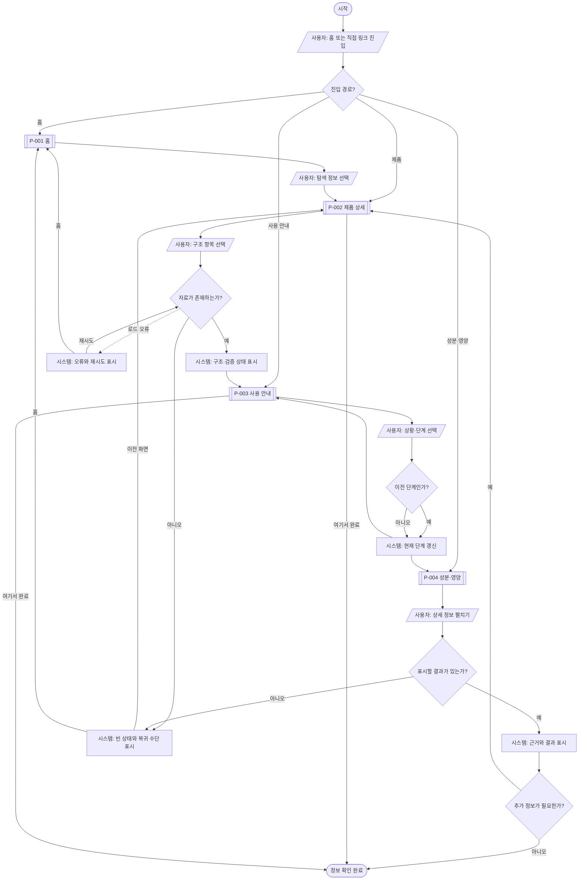

# VC-001 서하린 — 서비스 흐름도

## 서비스 흐름 개요

사용자가 홈 또는 직접 링크로 진입하여 정보를 탐색·선택하고, 제품 상세와 사용 방법을 확인한 뒤 성분·영양 검토를 완료하는 흐름이다. 로그인과 입력 폼은 요구사항에 없으므로 실제 흐름에 포함하지 않는다.

## 사용자 유형과 시작 조건

| 사용자 | 시작 조건 | 목표 |
|---|---|---|
| 첫 방문자 | P-001 | 제품의 정체 파악 |
| 제품 관심 사용자 | P-002 직접 진입 | 구조와 특징 확인 |
| 사용법 탐색 사용자 | P-003 직접 진입 | 상황과 단계 확인 |
| 정보 검토 사용자 | P-004 직접 진입 | 원료·영양·알레르기 확인 |

## 핵심 정상 흐름

```text
탐색(P-001)
→ 선택(제품 정보)
→ 상세 확인(P-002)
→ 핵심 행동(상황·단계 선택, P-003)
→ 결과 확인(성분·영양 및 근거, P-004)
→ 완료
```

## 필수 분기 적용 판단

| 프롬프트 필수 분기 | 적용 판단 | 처리 |
|---|---|---|
| 로그인 여부 | 적용 대상 아님 | 회원 기능이 없어 흐름에서 제외 |
| 입력값 오류 | 적용 대상 아님 | 입력 폼이 없어 흐름에서 제외 |
| 결과 없음 | 적용 | 화면별 빈 상태 → 이전 화면 또는 홈 |
| 이전 단계 이동 | 적용 | P-003 단계 이전, 모든 화면의 관련 화면·홈 복귀 |

## 단계별 사용자 행동과 시스템 처리

| 단계 | 사용자 행동 | 시스템 처리 | 화면 | 다음 조건 |
|---|---|---|---|---|
| 1 탐색 | 홈 또는 직접 링크 진입 | 현재 화면과 공통 내비게이션 표시 | P-001~P-004 | 탐색 목적 선택 |
| 2 선택 | 제품 상세·사용 안내·성분 정보를 선택 | 선택 대상 화면과 기본 상태 표시 | P-001 | 자료 존재 여부 판단 |
| 3 상세 확인 | 구조 항목 선택 | 선택한 부품 설명과 검증 상태 갱신 | P-002 | 사용 방법 확인 여부 |
| 4 핵심 행동 | 상황 선택, 이전·다음 단계 실행 | 선택 상태와 현재 단계 갱신 | P-003 | 결과 정보 확인 여부 |
| 5 결과 확인 | 성분·영양 상세 펼치기 | 근거 상태와 세부 내용 표시 | P-004 | 추가 정보 필요 여부 |
| 6 종료 | 탐색 완료 또는 관련 화면 복귀 | 완료 상태 또는 선택 화면 표시 | P-001~P-004 | 종료·재탐색 |

## 오류·빈 상태·이탈·재진입

| 상황 | 시스템 처리 | 사용자 선택 | 목적지 |
|---|---|---|---|
| 이미지·자료 로딩 | 진행 상태와 텍스트 대안 표시 | 기다리기 또는 다른 정보 이동 | 현재 화면·관련 화면 |
| 결과 없음 | 자료 미확정 이유 표시 | 이전 화면 또는 홈 | P-001~P-004 |
| 자료 오류 | 오류 원인과 복구 수단 표시 | 재시도 또는 홈 | 현재 화면·P-001 |
| 이전 단계 | 현재 단계보다 앞 단계 활성화 | 계속 확인 | P-003 |
| 외부 이탈 | URL 해시로 화면 상태 유지 | 재진입 | 이탈한 화면 |
| 직접 재진입 | 공통 맥락과 현재 위치 표시 | 탐색 계속 | 현재 화면 |

## 도달성 검토

- START에서 P-001~P-004 직접 진입이 가능하다.
- 모든 화면에서 완료 또는 홈 복귀가 가능하다.
- 빈·오류 상태에서 재시도·이전·홈 중 하나를 선택할 수 있다.
- 로그인·입력 폼은 적용 대상이 아니며 실제 흐름 노드에서 제외했다.

## Mermaid 전체 흐름도



## 생성 파일 안내

- `서비스_흐름도.md`: 정상·분기·오류·재진입 흐름과 Mermaid 원본을 확인한다.
- `서비스_흐름도.mmd`: Mermaid 렌더러에서 재사용한다.
- `서비스_흐름도.svg`: 행동·처리·판단 도형을 구분한 벡터 흐름도다.
